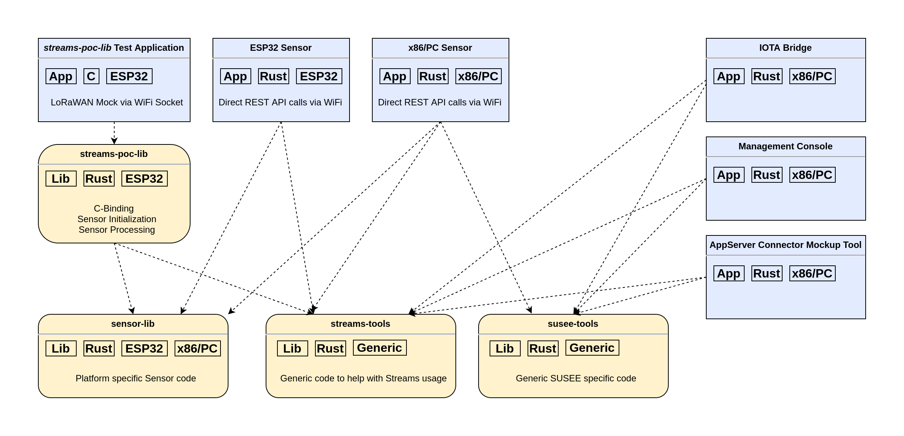

# SUSEE Streams POC

## About
This repository provides a static library for the ESP32-C3 platform,
called the *Streams POC Library*, which can be used to encrypt and
sign *Sensor* messages using *IOTA Streams*.

Additionally, five test command line interface (CLI) applications
and a *SUSEE Node* docker compose setup are provided to run the
needed backend services and to develop, test
and evaluate the contained source code.

All contained applications and libraries use the IOTA Stardust protocol.

The code in this repository has ben developed during the SUSEE project
to evaluate the needed *IOTA Streams* functionality.

Here is an overview of the SW components that are used in the SUSEE project;


<br>

For more details regarding the general workflows, actors,
roles and technical components of the SUSEE project please see below in the 
<a href="#workflow-model">Workflow Model</a> section.

Following applications and libraries are contained in this repository:

* [IOTA Bridge](iota-bridge)<br>
  * Needed by all Sensor applications to access the IOTA Tangle
    * Provides an http rest api used by the *Sensor* applications to access the tangle<br>
    * Attaches the *Streams* packages received from the *Sensor* applications to the tangle
  * Forwards remote control commands from the *Management Console* to the Sensor applications
  * Forwards command confirmations from Sensor applications to the *Management Console*
* [x86/PC Sensor](sensor/main-rust)<br>
  * *Sensor* application for the x86/PC platform
  * Imitates a *Sensor* application on x86/PC
  * Can be used to test *SUSEE Streams POC* code without ESP32-C3 devices
* [streams-poc-lib](sensor/streams-poc-lib)<br>
  * Provides C bindings to build a *Sensor* application on the ESP32-C3 platform with C
  * Can be used with Espressifs
    [ESP-IDF](https://docs.espressif.com/projects/esp-idf/en/stable/esp32/get-started/index.html)
    build process for ESP32-C3 devices
  * Includes a test application written in C to test the library functionality
    using a WIFI socket instead of a LoRaWAN connection
* [AppServer Connector Mockup Tool](app-srv-connector-mock)<br>
  * Acts as [*Application Server Connector*](#technical-components)
    for the *streams-poc-lib* test application
  * Receives & sends binary packages from/to the streams-poc-lib test application
    via a socket connection and transmits these packages to the *IOTA Bridge*
    via its `lorawan-rest` API functions.
* [Management Console](management-console)<br>
  * [Admin](#roles)-Tool to process workflows needed for *Initialization* of the *Sensor* and the monitoring of *Sensor Processing*
  * Manages the *Add/Remove Subscriber* workflows
  * Manages multiple channels resp. *Sensors* using a local SQLite3 database
  * Provides a [Message Explorer](management-console#run-message-explorer) to explore the *Sensor* messages 
* [ESP32 Sensor](sensor/main-rust-esp-rs)<br>
  * Historical application project that is now deprecated
  * Has been used to imitate processes running in the *Sensor* on the ESP32-C3 platform
    before the *streams-poc-lib* existed
  * Can still be used to compile 
    [ESP-IDF](https://docs.espressif.com/projects/esp-idf/en/stable/esp32/get-started/index.html)
    code using the RUST cargo build toolchain but can't be flashed and run anymore

###### Why is IOTA Streams used?

*IOTA Streams* is a library that has been developed by the IOTA Foundation
to ease decentralized access control for data streams that are
communicated via public permissionless distributed ledgers.

*IOTA Streams* provides the following features:
* Structuring of message streams using *Streams Channels* and *Message Branches*
* Secure private encrypted data transmissions
* Automatic secure authentication of participants through
  asymmetric cryptography (private & public key pair)
* Simple signing of messages by participants
* Can be used with any transport media
* Navigation within the message lists (a.k.a. *Message Branches*)
* Access control via write and read rights of participants

###### "Proof of Inclusion" or why is IOTA Distributed Ledger used?

Sending *Sensor* messages via the *IOTA Distributed Ledger* (DL) allows to prove 
the authenticity and broadcasting time of the messages using a
*Proof of Inclusion* (PoI).

Generally spoken, a PoI allows to prove that a block (containing the *Sensor*
message as payload) has been referenced by a
[milestone](https://wiki.iota.org/learn/protocols/coordinator/)
even when the block data have already been pruned from the *IOTA Nodes*
of the *IOTA DL*.

To allow this, a PoI contains a 
[proof of membership](https://medium.com/crypto-0-nite/merkle-proofs-explained-6dd429623dc5)
of the 
[Merkle Tree](https://en.wikipedia.org/wiki/Merkle_tree)
that has been build for the *IOTA DL* for the specific milestone.

The PoI must be stored together with the block data in your own data backend.
This way the PoI and block data can be validated later on using an *IOTA Node*
instance that runs the
[INX Proof of Inclusion](https://github.com/iotaledger/inx-poi)
plugin.

The [*SUSEE Node*](susee-node/README.md), contained in this repository,
provides an *INX Proof of Inclusion* plugin and stores the block data together with their
PoIs.

###### How is IOTA Streams used?
The *Streams Channel* used for the SUSEE project generally can be described as follows:
* One single branch per *Sensor*
* The Sensor will be a subscriber and will be the only publishing actor in the single branch
* The energy provider will be the author of the *Streams Channel*
* Additional stakeholders (e.g. home owner) could be added as reading subscribers to the single branch
* Handshake:
  * The *Sensor Initialization* (initial handshake consisting of announcement/subscription/keyload) between
    *Sensor* and the channel author will be done before a *Sensor* is installed in a home, which means for
    the initial handshake the limitations of LoRaWAN don't apply
  * If anything changes in the single branch channel setup, e.g. the addition of a new reading subscriber,
    the *Sensor* will have to be able to receive new keyload information downstream via LoRaWAN 

## Build Prerequisites

### For x86/PC

To build the applications for x86/PC platforms, you need the following:
- Rust - Please use the [official install script from rust-lang.org](https://www.rust-lang.org/tools/install)
  to have an up to date rust compiler (rustc). Do not use install packages provided with you OS because your
  rustc could be too old to build this project.

- (Optional) An IDE that supports Rust autocompletion. We recommend [Visual Studio Code](https://code.visualstudio.com/Download) with the [rust-analyzer](https://marketplace.visualstudio.com/items?itemName=matklad.rust-analyzer) extension

We also recommend updating Rust to the [latest stable version](https://github.com/rust-lang/rustup.rs#keeping-rust-up-to-date):

```bash
rustup update stable
```

### For ESP32

Please follow the steps described in the ESP32 specific application projects:
* [ESP32 Sensor](sensor/main-rust-esp-rs#prerequisites)
* [streams-poc-lib](sensor/streams-poc-lib#prerequisites)
* [PlatformIO Example for streams-poc-lib](sensor/main-streams-poc-lib-pio#prerequisites-and-build)

### For Docker
Please follow the official
[docker install instructions](https://docs.docker.com/get-docker/). 

## Build

### For x86/PC

Build as usual using `build` or `run` with or without `--release`.

In the workspace root folder:
```bash
cargo build
```

Every application has its own crate so you might want to build only one application like this:

In the workspace root folder:
```bash
cargo build --package management-console  # alternatively 'sensor' or "iota-bridge"
```
All built applications are located in the `target/debug` or `target/release` subfolders of 
the workspace root folder.

The *ESP32 Sensor* is not build if `cargo build` is started in the workspace root folder.
The next section describes how to build it.

### For ESP32

Please follow the steps described in the ESP32 specific application projects:
* [streams-poc-lib](sensor/streams-poc-lib#build)
* [PlatformIO Example for streams-poc-lib](sensor/main-streams-poc-lib-pio#prerequisites-and-build)
* [ESP32 Sensor](sensor/main-rust-esp-rs#build)

### Docker build
Most applications described here can be run in docker containers
that can be build using a Dockerfile and can be run using docker compose.
Have a look into the [Docker folder README](./docker/README.md)
for more details.

*IOTA Bridge*, *Management Console* and other services are provided by the
[SUSEE Node](#reliable-susee-node-backend) which is needed to run
the *SUSEE Streams POC* Applications.
There are several options to set up and deploy a *SUSEE Node*.
Have a look into the [SUSEE Node](./susee-node)
README for more details. 

## Folders, Libraries and Project Dependencies 

Here is a commented folder structure for this repository:

* [app-srv-connector-mock](./app-srv-connector-mock)<br>
  Application project for the *AppServer Connector Mockup Tool*
* [docker](./docker)<br>
  Resources to run the *SUSEE Streams POC* Applications with docker compose
* [iota-bridge](./iota-bridge)<br>
  Application project for the *IOTA Bridge*
* [management-console](./management-console)<br>
  Application project for the *Management Console*
* [sensor](./sensor)<br>
  Several projects to build *Sensor* applications:
  * [main-rust-esp-rs](./sensor/main-rust-esp-rs)<br>
    Application project for the deprecated *ESP32 Sensor*
  * [main-rust](./sensor/main-rust)<br>
    Application project for the *x86/PC Sensor*
  * [main-streams-poc-lib-pio](./sensor/main-streams-poc-lib-pio)<br>
    Example application to use the *Streams POC Library* with
    [PlatformIO](https://platformio.org/)
  * [sensor-lib](./sensor/sensor-lib)<br>
    A shared static library project to gather code used for *Sensor*
    applications and the *Streams POC Library*
  * [streams-poc-lib](./sensor/streams-poc-lib)<br>
    Library project for the *Streams POC Library*
* [streams-tools](./streams-tools)<br>
  A shared static library project to facilitate IOTA Streams usage in general
* [susee-node](./susee-node)<br>
  Resources to setup *SUSEE Nodes*
* [susee-tools](./susee-tools)<br>
  A shared static library project to gather SUSEE specific code
* [test](./test)<br>
  Test resources

The static shared libraries and applications contained in this repository
build the following dependency structure:



## CLI API and file persistence 

The main parts of the CLI API and most of the application specific details are
documented in the application specific README files:
* [Management Console CLI](management-console/README.md#management-console-cli)
* [CLI of the Sensor Applications](sensor/README.md#cli-of-the-sensor-applications)
* [IOTA-Bridge Console CLI](iota-bridge/README.md#iota-bridge-console-cli)
* [AppServer Connector Mockup Tool CLI](app-srv-connector-mock/README.md#appserver-connector-mockup-tool-cli)

This section documents only those aspects of the *SUSEE Streams POC*
applications that are used in general resp. are shared by several of
these applications.

### Common CLI options

Using the --help option of all four x86/PC applications will show the app specific help text:
```bash
target/release/management-console --help # Use 'sensor', 'app-srv-connector-mock' or "iota-bridge" instead of 'management-console' for the other apps
```

All four x86/PC applications provide the following options except
of `--wallet-file`. 
*IOTA Bridge* and *AppServer Connector Mockup Tool* are not
using `--wallet-file` as these applications do not need a wallet:

    -h, --help
            Print help information

    -V, --version
            Print version information

    -w, --wallet-file <WALLET_FILE_PATH_AND_NAME>
            Specifies the wallet file to use.
            Set this to path and name of the wallet file.
            If this option is not used:
            * A file 'wallet-{APPLICATION-NAME}.txt' is used if existing
            * If 'wallet-{APPLICATION-NAME}.txt' does not exist:
              A new seed is created and written into a new file
              'wallet-{APPLICATION-NAME}.txt'.

Additionally, *IOTA Bridge* and *Management Console* provide an option to control
the location of stored data. The default value for the data location is the path
`./data/{APPLICATION-NAME}`:

    -d, --data-dir <DATA_DIR>
            The folder where all data files are stored.
            This also applies for the location of the default wallet file
            (if --wallet-file argument is not used).
            Examples:
                --data-dir="my_data/timestamp"
                --data-dir="/home/admin/a_folder"
             [default: ./data/{APPLICATION-NAME}]

The following section explains which data are stored in this location.

### Common file persistence

The *Management Console* and the [*Sensor* applications](./sensor/README.md) use the
following files for persistence:

* Wallet file for the user seed and *Initialization Count*

  *x86/PC*<br>
  The applications are using a plain text wallet that stores the automatically
  generated seed in a text file.
  If option '--wallet-file' is not used, a default filename
  'wallet-{APPLICATION-NAME}.txt' is used.
  If the file does not exist, a new seed is created and stored in
  a new wallet file. Otherwise the seed stored
  in the wallet file is used.<br>
  
  As the wallet file contains the plain text seed (not encrypted) 
  make absolutely sure to<br>
  **DO NOT USE THIS WALLET FOR PRODUCTION PURPOSES**<br>
  Instead implement the [SimpleWallet trait](streams-tools/src/wallet/plain_text_wallet.rs)
  using a secure wallet library like [stronghold](https://github.com/iotaledger/stronghold.rs).
  <br><br>
  The *Management Console* uses the seed to derive seeds for 
  each managed channel.
  The channel seed is derived from the main seed, stored in 
  the wallet file, and a seed-derivation-phrase,
  stored in the local SQLite3 database file.<br>
  
  *Sensor* Applications also use the wallet file to store the
  [Initialization Count](./sensor/README.md#initialization-count).
  
  *ESP32*<br>
  The text file used for the plain text wallet is stored using
  [VFS](https://docs.espressif.com/projects/esp-idf/en/latest/esp32/api-reference/storage/vfs.html?highlight=vfs)
  and [FAT paths](https://docs.espressif.com/projects/esp-idf/en/latest/esp32/api-reference/storage/fatfs.html).
  For production purposes the seed needs to be stored in
  [encrypted flash or NVM storage](https://docs.espressif.com/projects/esp-jumpstart/en/latest/security.html).

* *Streams Client State*<br>
  The *Streams Client State* needs to be stored on the device that uses Streams
  to encrypt/decrypt and sign *Sensor* messages. It is updated after each
  send message and every time a command is received from the *IOTA Bridge*.

  *x86/PC*<br>
  On application start the current *Streams Client State* is loaded from 
  a file named 'client-state-{APPLICATION-NAME}.bin'.
  On application exit the current *Streams Client State* is written into 
  this file.
  <br><br>
  The *Management Console* stores the *Streams Client States* of all managed 
  channels in the local SQLite3 database file.
  <br><br>
  *ESP32*<br>
  The *Streams POC Library* offers two options to store the latest
  *Streams Client State* that are documented in the C interface header file
  [streams_poc_lib.h](./sensor/streams-poc-lib/components/streams-poc-lib/include/streams_poc_lib.h)
  for the StreamsClientDataStorageType:
  * CLIENT_DATA_STORAGE_VFS_FAT:<br>
    The *Streams POC Library* reads and persists its 
    *Streams Client State* like the wallet text file in a
    VFS-FAT partition located in the SPI flash memory of the ESP32 device.
    There are several options how the VFS-FAT partition is mounted which are
    documented for the VfsFatManagement type in the streams_poc_lib.h file.
  * CLIENT_DATA_STORAGE_CALL_BACK:<br>
    The *Sensor* Application provides the latest *Streams Client State* data via
    an initial buffer and receives updated states via a callback function.
    This way the *Sensor* Application is responsible to store the
    *Streams Client State* and fully controls how it's done.
<br>  

**IOTA Bridge**<br>
The *IOTA Bridge* stores a map of LoraWAN DevEUIs and *Streams Channel* IDs in a local SQLite3
database "iota-bridge.sqlite3". More details can be found in the 
[Compressed Streams Messages](sensor/README.md#deveuis-and-compressed-streams-messages)
section.

## Reliable SUSEE-Node backend

To run the *SUSEE Streams POC* Applications a [*SUSEE Node*](./susee-node)
needs to be run.

Until the *Stardust* version of the IOTA protocol has been released
in the IOTA mainnet, the *SUSEE Streams POC* Applications
could be used without any self deployed server infrastructure.

Since the *Stardust* update on the 4th of October 2023 a self hosted indexing service
is needed to allow the retrieval of the *IOTA Streams* messages.

The provided solution, integrated in the *SUSEE Node*, is based on the
[INX Collector](https://github.com/teleconsys/inx-collector) by
[Teleconsys](https://www.teleconsys.it/) and also acts as a 
*Selective Permanode*. A *Selective Permanode* would have been
needed before the *Stardust* protocol update anyway, because data
blocks resp. messages have always been pruned after some time from
the *IOTA Nodes*. A *Selective Permanode* filters SUSEE specific
blocks out of the 
[IOTA Tangle](https://wiki.iota.org/get-started/introduction/iota/introduction/#the-tangle)
and stores these blocks in a distributed self owned
database (cloud or onpremise).

If usual appliances (cloud hosted or onpremise, VPS or physical) are used
to host the *SUSEE Node*, it is recommended to have
redundant services because these appliances can have downtimes
of several minutes per week.
The *SUSEE Node* therefore provides a very simple
[primary, secondary redundancy with failover](https://www.cloudflare.com/learning/performance/what-is-server-failover/)
to achieve higher availability. 

More Details about the *SUSEE Node* contained in this repository can be found
in the [SUSEE Node README](./susee-node).

## Test

Automatic tests and examples for manually performed workflows are described in the [README
of the test folder](./test/README.md).
You can also use the
[provided docker images](./docker/README.md)
to run tests.

#### Restrictions of the provided tests

A LoRaWAN communication infrastructure for test purposes is often not available.
Therefore the current POC *Sensor* applications (*x86/PC Sensor* and the 
*streams-poc-lib* test application) are using WiFi to connect to the *IOTA Bridge*
or the *AppServer Connector Mockup Tool*. This implies that the provided test
applications cannot simulate a real world system due to the different
communication channel behaviors.  

###### Regarding *Sensor Initialization*:
* As described <a href="#initialization">below</a> the *Sensor* connection speed for the
  *Sensor Initialization* can be assumed as *"normal online connection"*.
  A WiFi connection therefore provides typical communication channel behavior and the tests
  should be close to real world usage.
* A WiFi connection is similar to a wired SLIP (Serial Line Internet
  Protocol) connection that might be used for automated hardware tests.
  
###### Regarding *Sensor Processing*:
The LoRaWan connection used in a real world scenario is different from the WiFi connection used
for the POC tests:
  * LoRaWan is much slower resp. the package transfer time can be of seconds magnitude.
  * Large packages will be split and automatically rejoined by the SUSEE LoRaWAN communication
    software stack. Although this allows larger packet sizes than using plain LoRaWAN connections, the payload
    size should be as low as possible.<br>
    As a rule of thumb:
    * Smaller than 512 bytes
    * Better are packages smaller than 256 bytes
    * Ideally smaller than 128 bytes
  * The [LoRaWAN Duty Cycle is restricted](https://www.thethingsnetwork.org/docs/lorawan/duty-cycle/)
    to allow public and permissionless usage of the used radio channels.
    [The *Fair Use Policy* of *The Things Network*](https://www.thethingsnetwork.org/docs/lorawan/duty-cycle/#fair-use-policy)
    provides a simplified rule to well behave as a a user of these radio channels:
    * Uplink Airtime is limited to 30 seconds per day (24 hours) per *Sensor*
    * Downlink messages are limited to 10 messages per day (24 hours) per *Sensor*.
* *streams-poc-lib* test application:<br>
  The slower connection speed is handled by the LoRaWAN network, so that the payload data can be assumed
  to be available at the *LoRaWAN Application Server* in one binary package (BLOB) at an unknown time in
  the future.<br>
  As long as the time span between the *Sensor Send Process* and the finished *LoRaWAN Application Server Receive
  Process* are not relevant for the overall information process, the poorer LoRaWAN communication speed
  has no impact on the *IOTA Bridge* and *Management Console*, and on the *streams-poc-lib* functionality.

## Workflow Model

In the SUSEE project the *Sensor* lifecycle consists of the following workflows:
* [Sensor Initialization](#initialization)
* [Sensor Processing](#sensor-processing)
* [Add/Remove Subscriber](#addremove-subscriber)
* [Sensor Reinitialization](#sensor-reinitialization)

In the next sections these workflows, the roles of the participating actors
and the software used to fulfill the associated activities are described in more detail. As this README focuses on the technical
implementation using the *IOTA Streams* library, only those aspects that
have an impact on the way *IOTA Streams* is used are described.    

### Actors

* End Customer<br>
  Energy consumer that can also be an energy producer (a.k.a. Prosumer).
  Has a contract with an energy provider or metering point operator.
  Usually the *Sensor* (a.k.a. smart meter) is located at the facility
  (house, company site, ...) of the *End Customer*.
* Energy provider or metering point operator<br>
  The company that runs the smart meter at the facility of the *End Customer*
  and is responsible that the metering complies to all regulatory standards. 
* Sensor Manufacturer<br>
  Produces the Sensor hardware.

### Roles

Here are the roles of the *SUSEE Workflows* that are impacted by *IOTA Streams*:
* *Sensor*
  * Sends meter data messages as encrypted *IOTA Streams* packages via LoRaWAN
  * Is the only participant in an *IOTA Streams Channel*
    that sends meter data, so it uses a communication channel that is dedicated to it
  * Stores the identity of the *End Customer*
  * Allows the *End Customer* to directly manage the participation in the data transfer
    (e.g. to activate or cancel the participation)
  * Sends and receives control data (*Commands* and *Confirmations*)
    to participate in the management of the used *IOTA Streams Channel* (these
    control data are not transfered via the *IOTA Streams Channel*) 
* *Read Only Participant*<br>
  Can read meter data messages from a *Sensor* specific *IOTA Streams Channel*
  (this could be for example the *End Customer* where the *Sensor* is installed)
* *Admin*
  * Administrates the *IOTA Streams Channel* for each *Sensor*
  * Inserts or removes *Sensors* from the administrative system and creates
    dedicated *IOTA Streams Channels* for them
  * Inserts or removes *Read Only Participants* to/from the Sensor dedicated *IOTA Streams Channel*

### Technical Components

The following technical components are needed for the SUSEE system to implement the workflows:

* *Sensor*
  * Behaves as been described for the *Sensor* role (see above)
  * Runs on an embedded MCU which can be the smart meter device itself, or a
    closely connected extension unit (e.g. the SUSEE Module)
* *Management Console*
  * Application used by the *Admin* role, providing all needed functionality
    (described for the *Admin* role) to manage the *IOTA Streams Channels*
    of all *Sensors* of an *Energy provider or metering point operator*
  * Runs at the *Energy provider or metering point operator*
* *LoRaWAN Application Server*
  * Handles the LoRaWAN application layer payloads from and to the Sensor
  * Provides data received via LoRaWAN from a *Sensor*
  * Sends data to a *Sensor* via LoRaWAN
  * Part of the LoRaWAN infrastructure that is run by the
    *Energy provider or metering point operator*
  * End point of the LoRaWAN network infrastructure from application layer perspective
    resp. *IOTA Streams* usage perspective
* *IOTA Bridge*
  * Receives encrypted Streams packages and sends them into the *IOTA Tangle*
  * Receives Tangle messages from the *IOTA Tangle* and sends them to the Sensor
  * Transfers control data between the Sensor
    and the *Management-Console*
  * When used for [Sensor Processing](#sensor-processing):<br>
    * Closely connected to the *Application Server Connector*
      (same device or intranet or at least a very fast connection to it)
    * Receives meter data messages as encrypted *IOTA Streams* packages
      from the *Sensor* via the *LoRaWAN Application Server* and the
      *Application Server Connector* and sends *IOTA Tangle* messages in
      the opposite direction vice versa
    * Transfers control data in the same way as *IOTA Streams* packages and
      *IOTA Tangle* messages are transferred 
    * Offers a REST API for the *Application Server Connector*
      to manage the *IOTA Streams* package and *IOTA Tangle* message transfer
  * When used for [Sensor Initialization](#initialization):<br>
    * Runs at the actor which is responsible for the *Sensor Initialization*
      (energy provider, metering point operator, *Sensor* producer, ...)
    * Offers a REST API to receive *IOTA Streams* packages and send
      *IOTA Tangle* messages directly from resp. to the *Sensor* 
    * Offers a REST API to transfer control data directly from resp. to
      the *Sensor* and the *Management Console*
* *Application Server Connector*
  * A service connecting the *LoRaWAN Application Server* and the *IOTA Bridge*
  * Only used for the [Sensor Processing](#sensor-processing) workflow
  * Closely connected to the *LoRaWAN Application Server*
    (same device or intranet or at least a very fast connection to it)
  * Receives LoRaWAN payloads from the *LoRaWAN Application Server*
    (e.g. via MQTT) and provides the data to the *IOTA Bridge* using the
    REST API provided by the *IOTA Bridge* for this purpose
  * Sends LoRaWAN payloads to the *LoRaWAN Application Server* (e.g. via MQTT)
    that it has received by the *IOTA Bridge*
* [IOTA Tangle](https://wiki.iota.org/learn/about-iota/tangle/)
  * A distributed ledger consisting of a Directed Acyclic Graph (DAG)
    of [messages](https://wiki.iota.org/learn/about-iota/messages/)
    (a.k.a. blocks) that can bee accessed via *IOTA Nodes*

This code repository provides [console applications](#about) for several of the
components listed above (*Sensor*, *Management Console* and *IOTA Bridge*) to evaluate
the needed functionality in terms of technical feasibility.
Additionally, the [AppServer Connector Mockup Tool](app-srv-connector-mock) is provided to
act as an *Application Server Connector* for *Streams POC Library* tests.

Due to different target platforms and online access the roles resp. applications
underlay the following restrictions:

* *Sensor*
  * Connectivity
    * *Initialization*: Wifi or wired using peripherals (e.g. usb).
    * *Sensor Processing*: Wireless via LoRaWAN.
    * *Add/Remove Subscriber*: Wireless via LoRaWAN.
    * *Sensor Reinitialization*: Wifi or wired using peripherals (e.g. usb), eventually LoRaWAN .
  * Platform: Embedded low cost MCU.
    * Low processing capabilities.<br>
      Due to the low processing capabilities the *Sensor* does not send the streams packages
      to the tangle directly but sends the packages to the *IOTA Bridge*.
      This way it does not need to process the adaptive POW.<br>
      *Streams* packages coming from the tangle are also received via the *IOTA Bridge*.<br>
      This applies to all workflows (*Initialization*, *Sensor Processing*, *Add/Remove Subscriber*,
      *Sensor Reinitialization*) and for incoming and outgoing packages.
 * *Management Console*
    * Connectivity:<br>
      Fast (typical office online access).
    * Platform: X86/PC, standard PC hardware.
    * No hardware or performance restrictions for all workflows.
 * *IOTA Bridge*
   * Connectivity:<br>
     * For connections to the *Application Server Connector* and *Management Console*:<br>
       Fast (at least typical office online access).
     * For connections to the *Sensor*:<br>
       For *Sensor Processing* and *Add/Remove Subscriber* workflows, the *IOTA Bridge*
       and the *Sensor* communicate via the *LoRaWAN Application Server* and the
       *Application Server Connector*. Therefore the
       [LoRaWAN restrictions](#restrictions-of-the-provided-tests)
       regarding payload size, message count and message delays apply here.<br>
       As the communication with the *Application Server Connector* is fast,
       the time needed to transfer request- and response-packages is normal.
       Long lasting connections can be a problem for web servers in general,
       as the server needs to handle each request in a dedicated thread
       (e.g. GPRS mobile clients).
       Due to the fast connection to the *Application Server Connector*
       no measures have to be taken to handle slow clients
       (e.g. no nginx proxy needed).
       For the *IOTA Bridge* the connection timespan is mainly impacted
       by the communication with the *IOTA Tangle*.<a>
       During the *Initialization* workflow a fast Wifi or wired connection
       is given.
    * Platform: X86/PC, standard server or edge computing hardware depending
      on the chosen topology. 
    * In the current POC implementation the *IOTA Bridge* forwards remote 
      control data (*Commands* and *Confirmations*) from the *Sensor*
      to the remote control (*x86/PC Sensor* or *Management Console*).
      In a later production system for the *Sensor Processing* workflow
      this service will probably be implemented as an independent service
      while for the *Initialization* workflow an integration
      of Tangle- and Command-Communication can be of advantage.

### Workflows

Following workflows will exist for each *IOTA Streams*
channel. Every *Sensor* uses its own exclusive channel:

#### Initialization

The *Sensor Initialization* is the initial handshake between *Management Console*
and *Sensor*. It will be done before a *Sensor* is installed in an
*End Customers* facility and is controlled by the *Admin* role.

Regarding the *IOTA Streams Channel* that is used to manage the communication
between all communication participants, the following *Streams* specific actions have to be performed:

| Module               | Streams Action                                                                 | Result        |
| -------------------- | ------------------------------------------------------------------------------ | ------------- |
| *Management Console* | Create a new *IOTA Streams Channel*                                            | *Announcement Link* |
| *Sensor*             | Subscribe to the channel using the *Announcement Link*                         | *Subscription Link*, *Public Key* |
| *Management Console* | Add the Sensor to the channel using its *Subscription Link* and *Public Key*   | *Keyload Message* |
| *Sensor*             | Register the *Keyload Message* which specifies all participants of the channel | - |
<br>

Dataflow of the *Initialization Workflow*:


Although in the above diagram the *IOTA Bridge* and *Management Console* are used on the same system,
both components could be connected using the internet. For example, the *IOTA Bridge* could be located
at the *Sensor Manufacturer* and the *Management Console* could be located and controlled by the
*Energy provider or metering point operator*.
  
#### Sensor Processing

Meter data are send by the *Sensor* to the *IOTA Tangle*. The *Sensor* is typically
located at the *End Customer*.

The meter data messages are created and encrypted into *IOTA Streams* packages by the *Sensor*.
The encrypted packages are send via LoRaWAN to the *LoRaWAN Application Server*.
An *Application Server Connector* receives the packages from the *LoRaWAN Application Server*
e.g. using MQTT. The *Application Server Connector*
transfers the packages to the *IOTA Bridge* using its `lorawan-rest` API endpoints.

The *Application Server Connector* and *Application Server Connector* are controlled by the
*Energy provider or metering point operator*.

Dataflow of the *Sensor Processing Workflow*:


To allow the [Reinitialization](#sensor-reinitialization) and
[Add/Remove Subscriber](#addremove-subscriber) workflows the SUSEE application
protocoll needs to provide the ability to switch between *Sensor Processing*,
*Add/Remove Subscriber* and *Sensor Reinitialization* workflows on demand.
The dynamic switch from *Sensor Processing* workflow to 
*Reinitialization* or *Add/Remove Subscriber* workflow is currently not implemented.

#### Add/Remove Subscriber

Participants of the *Sensors* *IOTA Streams Channel* are added or removed by the *Admin*.
For this purpose a new *Keyload Message* message is send from the *Management-Console* to the *Sensor*.

Contrary to the *Initialization* workflow, here LoRaWAN is also used for a back channel from the
*LoRaWAN Application Server* to the *Sensor*.

The dataflow matches the dataflow of the *Sensor Processing* workflow.

This workflow is currently not implemented.

#### Sensor Reinitialization

When an already used *Sensor* hardware shall be reused for a different *End Customer*
(e.g. in the same building where the *Sensor* is already installed),
the best data privacy can be achieved by using different *IOTA Streams Channels* for the
old and the new *End Customer*.

During a *Sensor Reinitialization*, the *Streams Channel* of an already initialized
*Sensor* is replaced by a new one, while the *Sensors* DevEUI is maintained.

Due to the use of
[Compressed Messages](./sensor/README.md#deveuis-and-compressed-streams-messages)
between *Sensor* and *IOTA Bridge*,
the [initialization-count](./sensor/README.md#initialization-count)
must be incremented during a *Sensor Reinitialization*. 

Otherwise, an *IOTA Bridge*, having cached an outdated *IOTA Streams Channel*-id,
would have no possibility to detect that a new *Streams Channel* is used.
This would result in  the *IOTA Bridge* using a wrong *Streams Channel*-id
for the *Sensor* in case compressed messages are used.

After a *Sensor Reinitialization* all evtl. needed *Read Only Participants* have to subscribe to the
new channel again:
* In case all channel participants shall have no access to *Sensor* messages of the
  old *Sensor* (pre reinitialization messages) participants must be subscribed with
  new identities (key pairs).
* In case a participant needs access to old and new massages (e.g. *Admin* role) an
  already existing identity must be reused.

Currently, it is not clear if LoRaWAN can be used for *Sensor Reinitialization*.

More details regarding *Sensor Reinitialization* can be found here:
* [Sensor - Initialization Count Documentation](./sensor/README.md#initialization-count)
* [Streams POC Library - Initialization vs Reinitialization](./sensor/streams-poc-lib/README.md#sensor-initialization-vs-reinitialization)
* [Test - Sensor Initialization Documentation](./Test/README.md#sensor-initialization)

