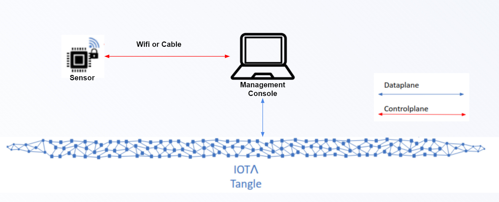
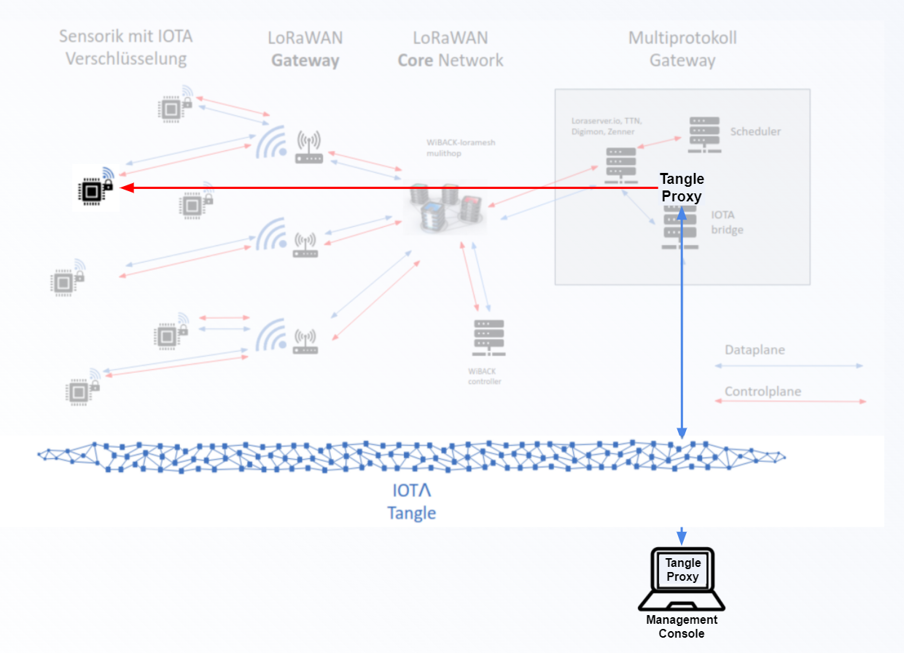
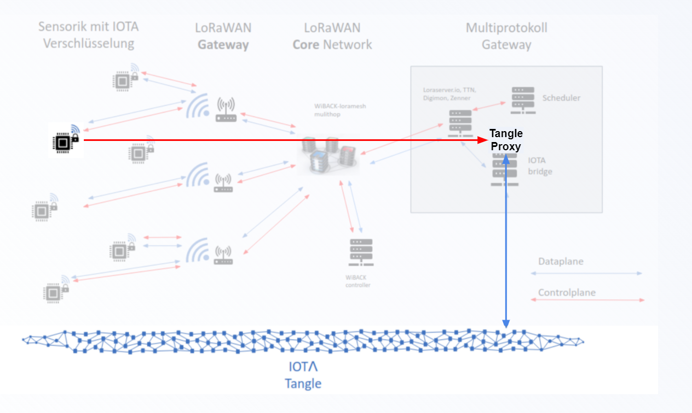

# Susee Streams POC

## About
This project contains five test applications providing command line interfaces (CLI) to evaluate the iota streams
functionality. Additionally the static library *streams-poc-lib* provides C bindings for the most relevant *Sensor* 
specific functionality for the SUSEE project.

Following test applications are contained. For more details please see below in the 
<a href="#applications-and-workflows">Applications and workflows</a> section:
* *ESP32 Sensor*<br>
  * Imitates the processes running in the smart meter (a.k.a. *Sensor*)
  * Runs on ESP32 devices
  * Can only be used together with a running *IOTA Bridge* instance
  * Currently only ESP32-C3 is provided
* *streams-poc-lib*<br>
  * provides C bindings for most functionalities of the *ESP32 Sensor*
  * includes a test application written in C to test the library functionality using a WIFI socket instead of
    a LoRaWAN connection
* *LoraWan AppServer Mockup Tool*<br>
  * test tool to receive & send binary packages from/to the streams-poc-lib test application via a socket
    connection and transmit these packages to the *IOTA-Bridge* via its `lorawan-rest` API functions.
  * a real world service would run on the LoRaWAN Application Server (or tightly connected to it).
    Like this test tool it would transceive binary packages from a LoRaWan connection to the *IOTA-Bridge*.
* *Sensor remote control*<br>
  * Used to send commands to the *ESP32 Sensor*
  * Can also be used as a standalone *Sensor* app to be run on x86/PC targets
  * Like the *ESP32 Sensor* application it can only be used together with a running *IOTA Bridge* instance
* *Management Console*<br>
  * Imitates the processes needed for *Initialization* of the sensor and the monitoring of *Sensor Processing*
  * Manages the *Add/Remove Subscriber* workflows
* *IOTA Bridge*<br>
  * Imitates processes
    * in the Susee Application Server (*Sensor Processing*) and
    * processes used by the initialization software that performs the Sensor *Initialization*
      that will probably run at the Susee-Module manufacturer<br>
  * Provides an http rest api used by the *Sensor* applications to access the tangle<br>
  * Attaches the Streams packages received from the *Sensor* applications to the tangle
  * Forwards remote control commands from the *Sensor remote control* or *Management Console* to the *ESP32 Sensor*
  * Forwards command confirmations from the *ESP32 Sensor* or *Sensor* app to *Sensor remote control* or *Management Console*
   

The Streams Channel used for the SUSEE project generally can be described as follows:
* One single branch per sensor
* Sensor will be a subscriber and will be the only publishing actor in the single branch
* Energy provider will be the author
* Additional stakeholders (e.g. home owner) could be added as reading subscribers to the single branch
* Handshake:
  * The *Sensor* initialization (initial handshake consisting of announcement/subscription/keyload) between sensor
    and the channel author will be done before a sensor is installed in a home, which means for the inital handshake
    the limitations of lorawan don't apply
  * If anything changes in the single branch channel setup, e.g. the addition of a new reading subscriber, the sensor
    will have to be able to receive new keyload information downstream via lorawan
* The current POC versions of the *ESP32 Sensor* and the *streams-poc-lib* test application are using WiFi
  to connect to the *IOTA Bridge*.
  * For *Sensor* *Initialization* this is similar to a wired SLIP (Serial Line Internet Protocol)
    connection that might be used.
  * For *Sensor Processing* it has to be taken into account that the LoRaWan connection used in production
    will be much slower than the WiFi connection used for the POC.

## Prerequisites

### For x86/PC

To build the applications for x86/PC platforms, you need the following:
- Rust - Please use the [official install script from rust-lang.org](https://www.rust-lang.org/tools/install)
  to have an up to date rust compiler (rustc). Do not use install packages provided with you OS because your
  rustc could be too old to build this project.

- (Optional) An IDE that supports Rust autocompletion. We recommend [Visual Studio Code](https://code.visualstudio.com/Download) with the [rust-analyzer](https://marketplace.visualstudio.com/items?itemName=matklad.rust-analyzer) extension

We also recommend updating Rust to the [latest stable version](https://github.com/rust-lang/rustup.rs#keeping-rust-up-to-date):

```bash
rustup update stable
```

### For ESP32

To build the *ESP32 Sensor* application for ESP32 platforms (currently only ESP32-C3 provided), you need the following:

* If you want to flash the *Sensor* app on an ESP32-C3 device you need to install the Espressif software development environment.
  This is not needed if you only want to build the *ESP32 Sensor* app into an ELF file that can be flashed later on. 
  The Rust based build process for the *ESP32 Sensor* app uses its own copy of the needed Espressif tools that is
  automatically downloaded.<br>
  These are the main steps to install the Espressif software development environment:
  * Please follow the *Espressif Install Guide* for
    [manual instalation](https://docs.espressif.com/projects/esp-idf/en/latest/esp32c3/get-started/linux-macos-setup.html)
    or via [IDE install](https://docs.espressif.com/projects/esp-idf/en/latest/esp32c3/get-started/index.html#ide)
    for the ESP32-C3 - master branch(latest).
  * If you have not flashed an ESP32 application before you should also follow the
    [First Steps on ESP-IDF](https://docs.espressif.com/projects/esp-idf/en/latest/esp32c3/get-started/linux-macos-setup.html#get-started-first-steps)
    section of the 
    [Espressif Get Startet](https://docs.espressif.com/projects/esp-idf/en/latest/esp32c3/get-started/index.html#) guide
  * You should also [Check your serial port on Linux and macOS](https://docs.espressif.com/projects/esp-idf/en/latest/esp32c3/get-started/establish-serial-connection.html#check-port-on-linux-and-macos)
    to find out how to access the serial port connection to the ESP32. Please replace the port identifier `/dev/ttyYOURPORT`
    used in this readme always with your port identifier.
* Make sure your installed python3 version is >= 3.8 and pip is already installed
  (`sudo apt install python3-pip`).
* Check that your rustc version is >= 1.58.0 (see Rust install hints in the section above).
* Use the stock nightly Rust compiler:
```bash
    rustup install nightly
    rustup default nightly
    # For future daily/weekly updates
    rustup update
```
* We also need rust-src to install cargo-espflash in one of the next steps
```bash
    rustup component add rust-src --toolchain nightly-x86_64-unknown-linux-gnu
```
* Install clang version >= 12
```bash
    sudo apt-get update
    sudo apt-get install clang-12 --install-suggests
```
* Install [Cargo-Espflash](https://github.com/esp-rs/espflash)
```bash
    sudo apt-get install libudev-dev
    sudo apt-get install pkg-config
    cargo install cargo-espflash
    cargo install espflash
```
* Install [ldproxy](https://github.com/esp-rs/embuild/tree/master/ldproxy)
```bash
    cargo install ldproxy
```

The fundamentals of these build Prerequisites are taken from the
[Rust on ESP32 STD demo app](https://github.com/ivmarkov/rust-esp32-std-demo) project by Ivan Markov.
If you want to build the *ESP32 Sensor* for other ESP32 devices than ESP32-C3 you can try to follow the
instructions there to build for Extensa core based MCUs (ESP32-C3 is a Risc-V core based MCU).

## Build

### For x86/PC

Build as usual using `build` or `run` with or without `--release`.

In the workspace root folder:
```bash
cargo build
```

Every application has its own crate so you might want to build only one application like this:

In the workspace root folder:
```bash
cargo build --package management-console  # alternatively 'sensor' or "iota-bridge"
```
The *ESP32 Sensor* is not build if `cargo build` is started in the workspace root folder.
The next section describes how to build it.

### For ESP32

The *ESP32 Sensor* project is contained in the folder [sensor/main-rust-esp-rs](sensor/main-rust-esp-rs). All build steps must be
executed in this project folder:
```bash
cd sensor/main-rust-esp-rs/
```
Before building we need to specify the WiFi SSID, the WiFi password and the url of the used *IOTA-Bridge* as
environment variables. These variables will be hard coded into the *ESP32 Sensor*.
Currently this is the only way to initiate a socket connection to the ESP32.
This also means that currently you need to compile the ESP32 sensor app yourself to test it:
```bash
export SENSOR_MAIN_POC_WIFI_SSID=NameOfMyWifiGoesHere
export SENSOR_MAIN_POC_WIFI_PASS=SecureWifiPassword
export SENSOR_MAIN_POC_IOTA_BRIDGE_URL="http://192.168.47.11:50000" 
```

If you have no ESP32-C3 device you can just start the build using cargo-espflash.
The ELF file will be created in the project folder.
```bash
cargo espflash save-image sensor-esp-rs.elf
```

If you have an ESP32-C3 device you can plug in the usb (or other serial bus) cable of your board
and start the build (with or without `--release`):
```bash
cargo espflash --monitor --partition-table="partitions.csv" --release
```
Given you already installed all needed drivers to access the serial port of your board, the port will be
detected automatically by cargo-espflash. After the application has been build and flashed the log output
of the *ESP32 Sensor* app is displayed on the console. This is controlled by the `--monitor` option used above. 

### For the *streams-poc-lib*
Have a look into the [streams-poc-lib README](sensor/streams-poc-lib/README.md)

## CLI API reference

### Common CLI options and i/o files

Using the --help option of all four x86/PC applications will show the app specific help text:
```bash
target/release/management-console --help # Use 'sensor', 'lora-app-srv-mock' or "iota-bridge" instead of 'management-console' for the other apps
```

*Management Console* and *Sensor* provide the following options.
*IOTA-Bridge* and *LoraWan AppServer Mockup Tool* are using the same options expect `--wallet-file`
as these applications do not need a wallet:

    -h, --help
            Print help information

    -V, --version
            Print version information

    -w, --wallet-file <WALLET_FILE_PATH_AND_NAME>
            Specifies the wallet file to use.
            Set this to path and name of the wallet file.
            If this option is not used:
            * A file 'wallet-<APPLICATION-NAME>.txt' is used if existing
            * If 'wallet-<APPLICATION-NAME>.txt' does not exist:
              A new seed is created and written into a new file
              'wallet-<APPLICATION-NAME>.txt'.

*Management Console* and *Sensor* use the following files for persistence
* Wallet for the user seed<br><br>
  *x86/PC*<br>
  The applications are using a plain text wallet that stores the automatically generated seed in a text file.
  If option '--wallet-file' is not used a default filename 'wallet-<APPLICATION-NAME>.txt' is used.
  If the file does not exist a new seed is created and stored in a new wallet file. Otherwise the seed stored
  in the wallet file is used.<br>
  As the wallet file contains the plain text seed (not encrypted) make absolutely sure to<br>
  **DO NOT USE THIS WALLET FOR PRODUCTION PURPOSES**<br>
  Instead implement the [SimpleWallet trait](streams-tools/src/plain_text_wallet.rs)
  using a secure wallet library like [stronghold](https://github.com/iotaledger/stronghold.rs).
  <br><br>
  *ESP32 Sensor*<br>
  Currently a dummy wallet providing a static seed phrase is used. For production purposes this needs to be
  replaced with a randomly generated seed that is stored in
  [encrypted flash or NVM storage](https://docs.espressif.com/projects/esp-jumpstart/en/latest/security.html).  

* User state<br>
  *x86/PC*<br>
  On application start the current user state is loaded from a file named 'user-state-[APPLICATION-NAME].bin'.
  On application exit the current user state is written into this file.
  <br><br>
  *ESP32*<br>
  The *ESP32 Sensor* reads and persists its user state every time a command is received from the *IOTA-Bridge*.
  The state is persisted in a FAT partition located in the SPI flash memory of the ESP32 board.
  This way the user state is secured against power outages of the ESP32.

### Management Console CLI

    -c, --create-channel
            Use this option to create (announce) the channel.
            The announcement link will be logged to the console.

    -k, --subscription-pub-key <SUBSCRIPTION_PUB_KEY>
            Public key of the sensor subscriber.
            Will be logged to console by the sensor app.

    -l, --subscription-link <SUBSCRIPTION_LINK>
            Subscription message link for the sensor subscriber.
            Will be logged to console by the sensor app.

    -n, --node <NODE_URL>
            The url of the iota node to connect to.
            Use 'https://chrysalis-nodes.iota.org' for the mainnet.
            
            As there are several testnets have a look at
                https://wiki.iota.org/learn/networks/testnets
            for alternative testnet urls.
            
            Example:
                The iota chrysalis devnet:
                https://api.lb-0.h.chrysalis-devnet.iota.cafe
             [default: https://chrysalis-nodes.iota.org]
            
    -i, --init-sensor
            Initialize the streams channel of a remote sensor.
            The whole channel initialization is done automatically following the process described
            below. Management-console and remote sensor are communicating via the IOTA-Bridge.
            Therefore you also need to use the '--iota-bridge' option to connect the management-
            console to a running IOTA-Bridge.
            
            Example:
            
              > ./management-console --init-sensor --iota-bridge-url="http://192.168.47.11:50000"
            
            Please make sure that the remote sensor and the management-console have a working
            connection to the running iota-bridge.
            
            Initialization Process
            ----------------------
            The below mentioned Commands and Confirmations are used for process communication
            with the remote sensor via the IOTA-Bridge and are defined in the binary_persist
            module of the streams-tools library:
            
             * management-console: --create-channel
                --> Announcement Link       # Send to the sensor using the SubscribeToAnnouncement
                                            # Command
             * sensor: --subscribe-announcement-link
                --> Subscription Link       # Send to the management-console using
                --> Public Key              # the SubscribeToAnnouncement Confirmation
            
             * management-console: --subscription-link --subscription-pub-key
                --> Keyload Link            # Send to the sensor using the RegisterKeyloadMessage
                                            # Command
            
             * sensor: --register-keyload-msg
                                            # Successful keyload registration is acknowledged with
                                            # a KEYLOAD_REGISTRATION Confirmation

    -b, --iota-bridge-url <IOTA_BRIDGE_URL>
            The url of the iota-bridge to connect to.
            See --init-sensor for further information.
            Default value is http://localhost:50000
            
            Example: iota-bridge-url="http://192.168.47.11:50000"


The SUBSCRIPTION_PUB_KEY and SUBSCRIPTION_LINK will be logged to the console by the *Sensor* app when the 
CLI command --subscribe-announcement-link of the *Sensor* app is used. This applies to the x86/PC version 
of the *Sensor* app (*Sensor remote control*) and to the *ESP32 Sensor* application. In case of the *ESP32 Sensor*
these properties are also logged to the console of the *Sensor* app that is used as *Sensor remote control*.

To allow fully automated channel initializations the SUSEE Streams POC applications and the streams-poc-lib
are using an own communication protocol consisting of `commands` and `confirmations` where a `confirmation`
always carries the relevant data resulting from a command executed by a remote sensor.

Alternatively to see the log output of the *ESP32 Sensor* app you can use a serial port monitor like `idf.py monitor`
or [cargo espmonitor](https://github.com/esp-rs/espmonitor).

If you use the `--init-sensor` option all relevant Streams channel properties like announcement-link,
subscription_pub_key, ... are logged to the console of the *Management Console* app equivalent to
the usage of the *Sensor* app when it's used as a *Sensor remote control*. 

### Sensor CLI

Both Sensor applications (x86/PC and ESP32 version) provide CLI commands to manage the Streams usage:
 
    -s, --subscribe-announcement-link <SUBSCRIBE_ANNOUNCEMENT_LINK>
            Subscribe to the channel via the specified announcement link.
            
    -r, --register-keyload-msg <KEYLOAD_MSG_LINK>
            Register the specified keyload message so that it can be used
            as root of the branch used to send messages later on.

    -f, --file-to-send <FILE_TO_SEND>...
            A message file that will be encrypted and send using the streams channel.
            If needed you can use this option multiple times to specify several message files.
            
    -p, --println-subscriber-status
            Print information about the current client status of the sensor.
            In streams the sensor is a subscriber so that this client status is called subscriber
            status.
            
        --clear-client-state
            Deletes the current client status of the sensor so that
            all subscriptions get lost and the sensor can be used to subscribe to a new Streams
            channel.
            TODO: In future versions the seed will also be replaced by a new generated seed.
            TODO: -----------------------------
                  --------  WARNING  ---------- Currently there is no confirmation cli dialog
                  -----------------------------       use this option carefully!
                              
The x86/PC version (a.k.a *Sensor remote control*) additionally provides following CLI commands to manage the
remote control functionality:

    -t, --iota-bridge-url <IOTA_BRIDGE_URL>
            The url of the iota-bridge to connect to.
            Default value is http://localhost:50000
            
            Example: iota-bridge-url="http://192.168.47.11:50000"

    -c, --act-as-remote-control
            Use this argument to remotely control a running sensor application on
            an embedded device. For example this
            
              > ./sensor --subscribe-announcement-link "c67551dade.....6daff2"\
                         --act-as-remote-control
            
            will make the remote sensor subscribe the channel via the specified
            announcement-link. This sensor app instance communicates with the remote sensor
            app via the iota-bridge application. Please make sure that both sensor
            app instances have a working connection to the running iota-bridge.
            
            If sensor and iota-bridge run on the same machine they can communicate over the
            loopback IP address (localhost). This is not possible in case the sensor runs on an
            external device (embedded MCU). In this case the iota-bridge needs to listen to
            the ip address of the network interface (the ip address of the device that runs
            the iota-bridge) so that the embedded sensor can access the iota-bridge.
            Therefore in case you are using 'act-as-remote-control' you will also need to use
            the 'iota-bridge' option to connect to the iota-bridge.

### LoraWan AppServer Mockup Tool

Additionally to those commands described in the
<a href="#common-cli-options-and-io-files">Common CLI options section</a> section the
*LoraWan AppServer Mockup Tool* provides these CLI commands:

    -b, --iota-bridge-url <IOTA_BRIDGE_URL>
            The url of the iota-bridge to connect to.
            Default value is http://localhost:50000
            Example: iota-bridge-url="http://192.168.47.11:50000" [default: http://localhost:50000]

    -l, --listener-ip-address <LISTENER_IP_ADDRESS_PORT>
            IP address and port to listen to.
            Example: listener-ip-address="192.168.47.11:50001"
            
            DO NOT USE THE SAME PORT FOR THE IOTA-BRIDGE AND THIS APPLICATION
             [default: localhost:50001]

For further details please also have a look into the 
[README of the *LoraWan AppServer Mockup Tool*](lora-app-srv-mock/README.md) project.

### IOTA Bridge CLI

The *IOTA Bridge* acts as a proxy for messages from/to the
* *Management Console* and *Sensor* applications
* *ESP32 Sensor*
* IOTA Tangle

It provides a REST API to:
* send/receive streams packages that will_be/are attached to the tangle using an IOTA Node
* Send remote control commands from the *Sensor* or *Management Console* application to the *ESP32 Sensor*
* Send remote control confirmations from the *ESP32 Sensor* to the *Sensor* or *Management Console* application
* receive IotaBridgeRequests containing one of the above described REST API requests as binary serialized package
  which can be used to use the IOTA Bridge e.g. via LoRaWAN

Additionally to those commands described in the
<a href="#common-cli-options-and-io-files">Common CLI options section</a> section the
*IOTA Bridge* provides these CLI commands:

    -l, --listener-ip-address <LISTENER_IP_ADDRESS_PORT>
            IP address and port to listen to.
            Example: listener-ip-address="192.168.47.11:50000"
            

    -n, --node <NODE_URL>
            The url of the iota node to connect to.
            Use 'https://chrysalis-nodes.iota.org' for the mainnet.
            
            As there are several testnets have a look at
                https://wiki.iota.org/learn/networks/testnets
            for alternative testnet urls.
            
            Example:
                The iota chrysalis devnet:
                https://api.lb-0.h.chrysalis-devnet.iota.cafe
             [default: https://chrysalis-nodes.iota.org]
            
## IOTA Bridge REST API
Most of the REST API is used internally by the accompanying susee-streams-poc applications. The only endpoint relevant
for public use is the IotaBridgeRequests API which can be called via the `lorawan-rest/binary_request` endpoints.

To demonstrate the usage of the API here is a cURL example:
```bash
    curl --location --request POST 'http://192.168.47.11:50000/lorawan-rest/binary_request?deveui=4711' \
         --header 'Content-Type: application/octet-stream' \
         --data-binary '@~/path-to-my-develop-folder/susee-streams-poc/test/iota-bridge/request_parts.bin'
```

Underlying usecase: Given you are using the streams-poc-lib function
[send_message()](sensor/streams-poc-lib/components/streams-poc-lib/include/streams_poc_lib.h)
in your C code you will receive a binary package via the `lorawan_send_callback` callback function that you need
to specify to call this function. You'll transmit this binary package e.g. via LoRaWAN. In your LoRaWAN Application
Server you can use the `lorawan-rest/binary_request` endpoint of the *IOTA Bridge* to hand the binary package over to it. 

The body of the resulting HTTP Resonse needs to be returned to the *ESP32 Sensor* via the `response_callback`
function that is provided by the streams-poc-lib.

Have a look into the following documentation for more details:

* Interface of the streams-poc-lib: 
  [streams_poc_lib.h](sensor/streams-poc-lib/components/streams-poc-lib/include/streams_poc_lib.h)
* Readme of the [streams-poc-lib](sensor/streams-poc-lib/README.md)

The *LoraWan AppServer Mockup Tool* implements this process but uses a WIFI
socket connection instead of a LoRaWAN connection. For further details please
have a look into the
[*LoraWan AppServer Mockup Tool* README](lora-app-srv-mock/README.md).

## Example Workflows
There are two ways to initialize a sensor. The easiest way is to use the `--init-sensor` option of
the *Management Console* application which will perform an automatic sensor initialization.

If you prefer to have a more insights into the initialization process you can do the sensor initialization
manually using the *Management Console* application CLI.

### Automatic Sensor Initialization

To automatically initialize a sensor we need to use the `--init-sensor` option of
the *Management Console* application:

* Start the *Sensor*, *ESP32 Sensor* or *streams-poc-lib* test application with an unitialized streams channel.
  * *Sensor* and *ESP32 Sensor*:<br>
    If the sensor has already been initialized use the ` --clear-client-state` option of the
    *Sensor* app to set its state back to an uninitialized state (use the the `--act-as-remote-control`
    option in case of an *ESP32 Sensor*).
  * *streams-poc-lib* test application:<br>
    If the sensor has already been initialized you need to run `idf.py erase-flash` and to flash the
    *streams-poc-lib* test application again.
* Start the *IOTA Bridge*
  * *Sensor* and *ESP32 Sensor*:<br>
    Start the *IOTA Bridge* as been described in the
    <a href="#subscribe-the-sensor---x86pc-version">Subscribe the Sensor - x86/PC version</a> or
    <a href="#subscribe-the-sensor---esp32-version">Subscribe the Sensor - ESP32 version</a>
    section
  * *streams-poc-lib* test application:<br>
    Start the *IOTA Bridge* as been described in the
    <a href="#subscribe-the-sensor---esp32-version">Subscribe the Sensor - ESP32 version</a>
    section
* Run the *Management Console* with the following options
```bash
    > ./management-console --init-sensor --iota-bridge-url "http://192.168.47.11:50000"
```

The *Management Console* then will perform all the steps described below fully automatically.
See the <a href="#management-console-cli">CLI help for the `--init-sensor` option</a> or
of the *Management Console* for further details.

### Manual Sensor Initialization

#### Create the channel using the *Management Console*

In the `/target/debug` or `/target/release` folder:
```bash
    > ./management-console --create-channel
    >
    > [Management Console] Using node 'https://chrysalis-nodes.iota.org' for tangle connection
    > [Management Console] A channel has been created with the following announcement link:
    >                      Announcement Link: c67551dade4858b8d1e7ff099c8097e0feda9c8584489ccdbdd046d1953798500000000000000000:56bc12247881ff94606daff2
    >                           Tangle Index: 491e1459e1bc6200b741fdc90fac8058bacc9c37f6c56ed4d1ce38ef3493f13e
```
#### Subscribe the *Sensor* - x86/PC version

To use a *Sensor* application we need to start the *IOTA Bridge* first. To use it together with a local x86/PC
sensor start it like this:
```bash
    > ./iota-bridge
    > 
    > [IOTA Bridge] Using node 'https://chrysalis-nodes.iota.org' for tangle connection
    > Listening on http://127.0.0.1:50000
```

Now the subscription message can be created using the announcement link from the console log of the *Management Console* above.<br>
Using a local x86/PC *Sensor* app just enter this in a second command shell in the `/target/debug` or `/target/release` folder:
```bash
    > ./sensor --subscribe-announcement-link\
             "c67551dade4858b8d1e7ff099c8097e0feda9c8584489ccdbdd046d1953798500000000000000000:56bc12247881ff94606daff2"
    > 
    > [Sensor] Using node 'https://chrysalis-nodes.iota.org' for tangle connection
    > [HttpClient.new_from_url()] Initializing instance with options:
    > HttpClientOptions: http_url: http://localhost:50000
    > 
    > [HttpClient.recv_message] Receiving message with 151 bytes tangle-message-payload:
    > @c67551dade4858b8d1e7ff099c8097e0feda9c8584489ccdbdd046d1953798500000000000000000:56bc12247881ff94606daff2[000000010400000000000000000000000000c67551dade4858b8d1e7ff099c8097e0feda9c8584489ccdbdd046d1953798500e000001c67551dade4858b8d1e7ff099c8097e0feda9c8584489ccdbdd046d195379850003cfa4c38fe060b13252e5b89cc00b893c127ea716a387e5b035e029fc2141e009c080e08b3d6214383ad27718581b60cf36935b5a3e23825d0ceb0afe6aa8c0d]->00000000000000000000000000000000000000000000000000000000000000000000000000000000:000000000000000000000000
    > 
    > [HttpClient.send_message] Sending message with 279 bytes tangle-message-payload:
    > @c67551dade4858b8d1e7ff099c8097e0feda9c8584489ccdbdd046d1953798500000000000000000:aa5fc8814ca5a81c0dbf2b7e[00005001040000000134c67551dade4858b8d1e7ff099c8097e0feda9c8584489ccdbdd046d195379850000000000000000056bc12247881ff94606daff2000000000000000000399dc641cec739093ef6f0ecbac881d5f80b049fe1e2d46bc84cb5aff505f66b0e00000156bc12247881ff94606daff2d874444633bd857b36bb47869a5b52e4ff212d21c4394aecb4db93a9fc2f29050352c3d6c34136614cd5003f43ef470bc8b65d8e908fa21a41d2dbeabfbb8aa9011692c14ff33a4d7bf71b0d77d352dc5ed93ff04660dfc3eda84ab9665586c517a12e5900aa39878aee3c259cecc464a647277d3e30ed937d5deea44aff1bb7161dcaf1006e3339ae9ead4b35a47d422fd5b0cf0a66f83852f9b593869f650e]->00000000000000000000000000000000000000000000000000000000000000000000000000000000:000000000000000000000000
    > 
    > [Sensor] A subscription with the following details has been created:
    >              Subscription Link:     c67551dade4858b8d1e7ff099c8097e0feda9c8584489ccdbdd046d1953798500000000000000000:aa5fc8814ca5a81c0dbf2b7e
    >                   Tangle Index:     744935bae3a2e42acf0c9b2bf89cb42ef09351b40f92e4791438049a54a2ef4d
    >              Subscriber public key: 399dc641cec739093ef6f0ecbac881d5f80b049fe1e2d46bc84cb5aff505f66b
```

The *IOTA-Bridge* also logs every data package that is transferred. Regarding absolute length of transferred binary packages
only take the *IOTA-Bridge* log into account as these are the correct packages sizes. *Sensor* and *Management-Console* only
log the sizes of the tangle-message-payload: 
```bash
    [IOTA Bridge] Using node 'https://chrysalis-nodes.iota.org' for tangle connection
    Listening on http://127.0.0.1:50000
    -----------------------------------------------------------------
    [IOTA Bridge] Handling request /message?addr=c67551dade4858b8d1e7ff099c8097e0feda9c8584489ccdbdd046d1953798500000000000000000:56bc12247881ff94606daff2
    
    [HttpClientProxy - DispatchStreams] receive_message_from_address() - Received Message from tangle with absolut length of 255 bytes. Data:
    @c67551dade4858b8d1e7ff099c8097e0feda9c8584489ccdbdd046d1953798500000000000000000:56bc12247881ff94606daff2[0000000104000000000000000000000000006f5aa6cb462dad3d8b84820bdda1fa62aa6aeeaab36cf2d0a58adde074f7807d0e0000016f5aa6cb462dad3d8b84820bdda1fa62aa6aeeaab36cf2d0a58adde074f7807d00f834f535075f4aa802dfa8a31074f8c4cd8f27e37c6afb90a0508bedac6f501a0c47daaed785cd09b3400f7ec4f6f07b54be2c3728a20e99eb4106e0870f0806]->00000000000000000000000000000000000000000000000000000000000000000000000000000000:000000000000000000000000
    
    -----------------------------------------------------------------
    [IOTA Bridge] Handling request /message/send
    
    [HttpClientProxy - DispatchStreams] send_message() - Incoming Message to attach to tangle with absolut length of 383 bytes. Data:
    @c67551dade4858b8d1e7ff099c8097e0feda9c8584489ccdbdd046d1953798500000000000000000:aa5fc8814ca5a81c0dbf2b7e[000050010400000001346f5aa6cb462dad3d8b84820bdda1fa62aa6aeeaab36cf2d0a58adde074f7807d00000000000000001ee77d9fb6f0a1b65ec853aa0000000000000000002a61cce46327e1f7abf2ec842c20952057c037fcdd8e2636c93b13e2f1ee36e20e0000011ee77d9fb6f0a1b65ec853aae4d48f2f2d7fd7d1669a90d84e0ba1bc967869f019ea1d6a2b91d9c4fbe16c431912540f5ea95775cc19c848ccd06cfd3a7b6e16af2074414870bcd2584ccb527b1253727a999a1c0de13557b3e00867a881f0c6dcae21d894bb532098800e03e95c67cff559715ec577eaaab78c89069dd4d919acab32cc6a8b8b3c7c64122569a00e73536bfa27513e6849e14aa862028212442f89307f28f57a449e72dd08]->00000000000000000000000000000000000000000000000000000000000000000000000000000000:000000000000000000000000
```

The subscription link and public key then must be used with the management-console to accept the subscription
```bash
    > ./management-console\
      --subscription-link "c67551dade4858b8d1e7ff099c8097e0feda9c8584489ccdbdd046d1953798500000000000000000:aa5fc8814ca5a81c0dbf2b7e"\
      --subscription-pub-key "399dc641cec739093ef6f0ecbac881d5f80b049fe1e2d46bc84cb5aff505f66b"
    >
    > [Management Console] Using node 'https://chrysalis-nodes.iota.org' for tangle connection
    > [Management Console] A keyload message has been created with the following keyload link:
    >                      Keyload link: c67551dade4858b8d1e7ff099c8097e0feda9c8584489ccdbdd046d1953798500000000000000000:dc4567247bbb6396057bfba9
    >                      Tangle Index: 4ec4d90ef85ef06fb32617a7730b6e8f21029d7a1f59820da538fe5b9c26f105
```

To finalize the subscription the keyload message link has to be registered by the sensor because it is the root message
of the branch used by the sensor to publish its messages.
```bash
    > ./sensor --register-keyload-msg "c67551dade4858b8d1e7ff099c8097e0feda9c8584489ccdbdd046d1953798500000000000000000:dc4567247bbb6396057bfba9"
    > 
    > [Sensor] Using node 'https://chrysalis-nodes.iota.org' for tangle connection
    > [SubscriberManager.subscribe()] - Replacing the old previous message link with new keyload message link
    >                                   Old previous message link: 00000000000000000000000000000000000000000000000000000000000000000000000000000000:000000000000000000000000
    >                                   Keyload message link: c67551dade4858b8d1e7ff099c8097e0feda9c8584489ccdbdd046d1953798500000000000000000:dc4567247bbb6396057bfba9
    > 
    > [Sensor] Messages will be send in the branch defined by the following keyload message:
    >          Keyload  msg Link:     c67551dade4858b8d1e7ff099c8097e0feda9c8584489ccdbdd046d1953798500000000000000000:dc4567247bbb6396057bfba9
    >               Tangle Index:     4ec4d90ef85ef06fb32617a7730b6e8f21029d7a1f59820da538fe5b9c26f105
    >          Subscriber public key: 399dc641cec739093ef6f0ecbac881d5f80b049fe1e2d46bc84cb5aff505f66b
```

#### Subscribe the *Sensor* - ESP32 version

If we run an *ESP32 Sensor* the *IOTA-Bridge* must be started this way:
```bash
    > ./iota-bridge -l "192.168.47.11:50000"
    > 
    > [IOTA Bridge] Using node 'https://chrysalis-nodes.iota.org' for tangle connection
    > Listening on http://192.168.47.11:50000
```

Please replace the ip address used in this example with the ip address of the network interface of your computer.
You need also to make sure that the used port is opened in the firewall of your OS. After having startet the
*IOTA-Bridge* you can use telnet from another machine in your LAN to verify that the *IOTA-Bridge* can be accessed
from within in the LAN.

Before we can send the `subscribe-announcement-link` command to the *ESP32 Sensor* you need to
connect the serial port of your ESP32 board to your computer. After the ESP32 has bootet the
*ESP32 Sensor* will poll commands from the *IOTA-Bridge* every 5 seconds.
 
To see the console log output of the *ESP32 Sensor* you need to start a serial port monitor application like
`idf.py monitor` or [cargo espmonitor](https://github.com/esp-rs/espmonitor).
 ```bash
    cargo espmonitor --chip=esp32c3 /dev/ttyYOURPORT
 ```

The console output will contain a lot of boot and WiFi initialization messages. The most important messages
are the following ones:
 ```bash
    Wifi connected
    I (4087) sensor_lib::esp_rs::main: [Sensor] process_main_esp_rs - Using iota-bridge url: http://192.168.47.11:50000
    I (5244) HTTP_CLIENT: Body received in fetch header state, 0x3fcb52ff, 1
    I (5246) sensor_lib::esp_rs::main: [Sensor] process_main_esp_rs - Received Command::NO_COMMAND.
    Fetching next command in 5 secs
    Fetching next command in 4 secs
    Fetching next command in 3 secs
    Fetching next command in 2 secs
    Fetching next command in 1 secs
    I (11183) HTTP_CLIENT: Body received in fetch header state, 0x3fcb52ef, 1
    I (11185) sensor_lib::esp_rs::main: [Sensor] process_main_esp_rs - Received Command::NO_COMMAND.
    Fetching next command in 5 secs
    ...
 ```
Now we can the send the `subscribe-announcement-link` command to the *ESP32 Sensor* using the x86/PC version of the
*Sensor* app. The CLI command is almost the same as used in the
<a href="#subscribe-the-sensor---x86pc-version">Subscribe the *Sensor* x86/PC version</a> section.
We only need to add the `--act-as-remote-control` and `--iota-bridge-url` command to use the *Sensor* app 
as remote control for the *ESP32 Sensor*:
 ```bash
     > ./sensor -c -b "http://192.168.47.11:50000" --subscribe-announcement-link\
              "c67551dade4858b8d1e7ff099c8097e0feda9c8584489ccdbdd046d1953798500000000000000000:56bc12247881ff94606daff2"
 ```

The *IOTA-Bridge* then will confirm that it has received the subscribe-announcement-link command and that the command is
delivered to the *ESP32 Sensor*:
 ```bash
    > Listening on http://192.168.47.11:50000
    -----------------------------------------------------------------
    [IOTA Bridge] Handling request /command/subscribe_to_announcement
    
    [HttpClientProxy - DispatchCommand] subscribe_to_announcement() - Received command SUBSCRIBE_TO_ANNOUNCEMENT_LINK.
    Binary length: 110
    Queue length: 1
    -----------------------------------------------------------------
    [IOTA Bridge] Handling request /command/next
    
    [HttpClientProxy - DispatchCommand] fetch_next_command() - Returning command SUBSCRIBE_TO_ANNOUNCEMENT_LINK.
    Blob length: 110
    Queue length: 0
 ```
As with the X86/PC version of the *Sensor* app the console log of *IOTA-Bridge* and the *ESP32 Sensor* will contain the
length of transferred binary data (*IOTA-Bridge*) and the subscription link and subscriber public key (*ESP32 Sensor*).  

The subscription link and public key then must be used with the management-console to accept the subscription as being
described in the x86/PC section above.

To finalize the subscription the keyload message link has to be registered by the *ESP32 Sensor*. Again the CLI command
is almost the same as used in the
<a href="#subscribe-the-sensor---x86pc-version">Subscribe the *Sensor* x86/PC version</a> section:
```bash
    > ./sensor -c -b "http://192.168.47.11:50000" --register-keyload-msg "c67551dade4858b8d1e7ff099c8097e0feda9c8584489ccdbdd046d1953798500000000000000000:dc4567247bbb6396057bfba9"
```


### Send messages using the *Sensor*

Make sure that the *IOTA Bridge* is up and running in another shell. The folder `test/payloads` contains several message files that can be
send like this:
```bash
    > ./sensor --file-to-send "../../test/payloads/meter_reading_1_compact.json"
    > 
    > [Sensor] Using node 'https://chrysalis-nodes.iota.org' for tangle connection
    > [Sensor] Message file '../../test/payloads/meter_reading-1-compact.json' contains 136 bytes payload
    > 
    > [HttpClient.recv_message] Receiving message with 298 bytes payload:
    > @c67551dade4858b8d1e7ff099c8097e0feda9c8584489ccdbdd046d1953798500000000000000000:dc4567247bbb6396057bfba9[00001001040000000134c67551dade4858b8d1e7ff099c8097e0feda9c8584489ccdbdd046d195379850000000000000000056bc12247881ff94606daff2000000000000000200c67551dade4858b8d1e7ff099c8097e0feda9c8584489ccdbdd046d1953798500e00000156bc12247881ff94606daff2ab2ee4a2ef69cc77508565156273038e010181ad4173c18805a62e4ce1a1296a7a184456fc9c22ebc79e8c406057f0e30f39a433d81038d16f742b3b32853f40f0499a5474f011c56f36cff88e4911b8ed033819684a59e1c4ca3ac5e7116d269616ff89107be9a487d45e091ed647a33b8c65c4fd9ef46f678ffe4ebe6ef76eba233144b44a210926561c391d6991591f36d7926d3360f3021e7cb80c13a48fc42e1b0a7f97c03cf75559569d2eee8729260b]->00000000000000000000000000000000000000000000000000000000000000000000000000000000:000000000000000000000000
    > 
    > [HttpClient.send_message] Sending message with 354 bytes payload:
    > @c67551dade4858b8d1e7ff099c8097e0feda9c8584489ccdbdd046d1953798500000000000000000:b387f1dcf73e24ff466c493c[00003001040000000134c67551dade4858b8d1e7ff099c8097e0feda9c8584489ccdbdd046d1953798500000000000000000dc4567247bbb6396057bfba9000000000000000300399dc641cec739093ef6f0ecbac881d5f80b049fe1e2d46bc84cb5aff505f66b0e000001dc4567247bbb6396057bfba9399dc641cec739093ef6f0ecbac881d5f80b049fe1e2d46bc84cb5aff505f66b009836483f6d4f669a143d31c440a51f558173b51945a957eab424178e3be8785fe4faca5ba1aa5a53c8d3cfda3c666326c4f82bf071fd1aa56bf8d3347034b19e04ebadef5dc07a1109b2d1aecd571a20a060c445f49886b9c13eb6056dc715182e344626270951acfade220a72a87e4c2b430ae0be9a9dd9c4c178f6c73c152962035aea461d3dc27df1e8b5afe2faf4d758293b20bc03032a2f387373157ceff3dc996de7b67db89910b0ac4f5081dd516be8c4fed7034b434281fe5eb9c09d8cb2bdac3a0dc52e8e07]->00000000000000000000000000000000000000000000000000000000000000000000000000000000:000000000000000000000000
    > 
    > [Sensor] Sent msg from file '../../test/payloads/meter_reading-1-compact.json': c67551dade4858b8d1e7ff099c8097e0feda9c8584489ccdbdd046d1953798500000000000000000:b387f1dcf73e24ff466c493c, tangle index: b583f1f2c64c00af178892cb52e113ea340469efffdc5b934af5a75e49022d20
    > 
    > [Sensor] A subscription with the following details has already been created:
    >          Subscription Link:     c67551dade4858b8d1e7ff099c8097e0feda9c8584489ccdbdd046d1953798500000000000000000:aa5fc8814ca5a81c0dbf2b7e
    >               Tangle Index:     744935bae3a2e42acf0c9b2bf89cb42ef09351b40f92e4791438049a54a2ef4d
    >          Subscriber public key: 399dc641cec739093ef6f0ecbac881d5f80b049fe1e2d46bc84cb5aff505f66b
    > 
    > [Sensor] The last previously used message link is: c67551dade4858b8d1e7ff099c8097e0feda9c8584489ccdbdd046d1953798500000000000000000:b387f1dcf73e24ff466c493c
```

Using the *ESP32 Sensor* we can send these files using the following remote control execution:
```bash
    > ./sensor -c -b "http://192.168.47.11:50000" --file-to-send "meter_reading_1_compact.json"
```

Here the filename acts as a key or identifier for the file content that is hardcodet in the *ESP32 Sensor* application.
If you want to add additionally files you need to add those files to `test/payloads/lib.rs` and recompile the
*ESP32 Sensor* app.

## Applications and workflows 
### Applications
For each service being part in the different workflows a console application is provided to test the
streams channel management and data transmission in the SUSEE project. These services (or apps) are 
* *Sensor*<br>
  Running on the smart meter device
* *Management Console*<br>
  Running at the energy provider
* *IOTA Bridge*<br>
  Running in the application server or as part of the initialization software at the energy provider
 
Lorawan and other inter process communication is simulated using a socket connection. The applications can be run in
three shells in parallel or using the *ESP32 Sensor* on a connected ESP32 board together with the *Sensor Remote Cotrol*
app so that the applications can react to new lorawan or tangle messages.

The services are characterized by following properties/aspects:

* *Sensor*
  * Online access:
    * *Initialization*: Wifi or wired using peripherals (e.g. usb)
    * *Sensor Processing*: Wireless via lorawan
    * *Add/Remove Subscriber*: Wireless via lorawan
  * Low processing capabilities<br>
    Following applies to all workflows (*Initialization*, *Sensor Processing*, *Add/Remove Subscriber*):
    Due to the low processing capabilities the sensor does not send the streams packages to the tangle directly but sends
    the packages to the *IOTA Bridge*. This way it does not need to process the adaptive POW.<br>
    Streams packages coming from the tangle are also received via the *IOTA Bridge*.
  * The current *ESP32 Sensor* POC uses the Rust standard library. This means `no_std` is not used for the Rust
    implementation. Currently there is no need to use a supplementary C++ implementation of parts of the streams library.
    The curent POC is based on a FreeRTOS adoption provided by Espressif
    ([ESP-IDF FreeRTOS](https://docs.espressif.com/projects/esp-idf/en/latest/esp32c3/api-guides/freertos-smp.html)).

 * *Management Console*<br>
   Software needed for *Initialization* of the sensor, monitoring of *Sensor Processing* and managing the 
   *Add/Remove Subscriber* workflow. No Hardware or performance restrictions. 

 * *IOTA Bridge*
   * Is used in the 
     * Application Server for *Sensor Processing* and *Add/Remove Subscriber* workflows
     * Initialization software as part of the *Management Console* for the *Initialization* of the sensor
   * Fast online access
   * Connected to the *Sensor* via
     * lorawan for *Sensor Processing* and *Add/Remove Subscriber* workflows
     * Wifi or wired for the *Initialization* workflow
   * Receives prepared iota streams packages from the *Sensor* and sends these packages to the tangle performing the adaptive POW.
   * Listens to new tangle messages and sends the encrypted streams packages to the sensor:
     * Announcement Messages: Used in the *Initialization* workflow 
     * Keyload Messages: Used in the *Add/Remove Subscriber* and *Initialization* workflows
   * In the current POC implementation the *IOTA-Bridge* also forwards remote control commands from
     the *Sensor remote control* to the *ESP32 Sensor*. In a later production system for the *Sensor Processing* workflow
     this service will probably be implemented as an independent service while for the *Initialization* workflow an integration
     of Tangle- and Command-Communication can be of advantage.

Following workflows will exist for each channel. Every sensor uses its own exclusive channel:

#### Initialization
  * Limitations of lorawan don't apply. Sensor is connected via Wifi or wired using peripherals (e.g. usb).
  * Performs the initial handshake (announcement/subscription/keyload) between *Sensor* and the channel author (*Management Console*)
    via the *IOTA Bridge*.


#### Add/Remove Subscriber
  Adding or removing subscribers from the channel. Here lorawan is also used for a back channel from application server
  to the *Sensor*.

  
#### Sensor Processing
  Smart meter messages are created and encrypted in streams packages by the *Sensor*. The packages are send via lorawan to the application server.

  