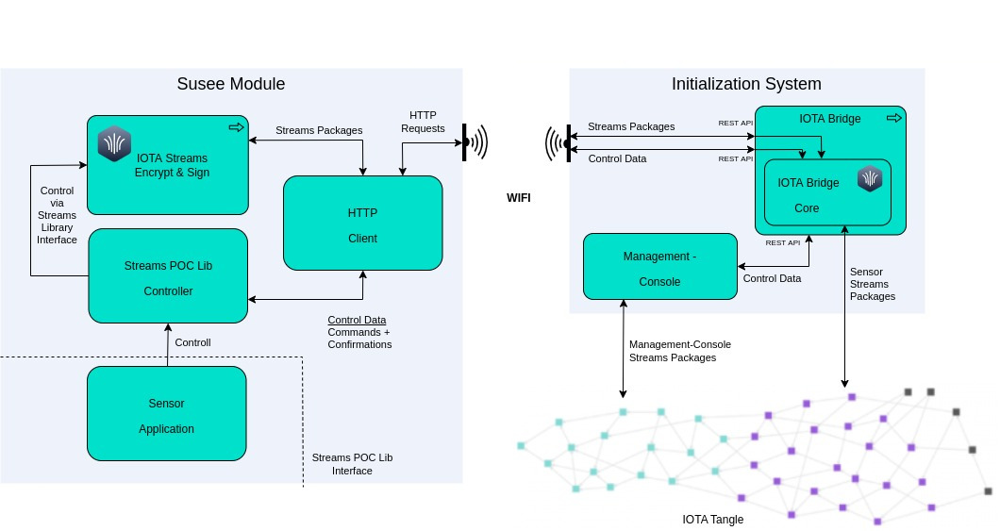
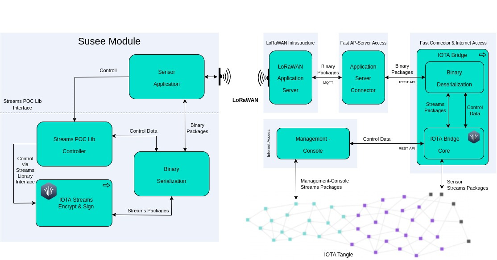

# SUSEE Streams POC

## About
This project contains five test applications providing command line interfaces (CLI) to evaluate the *IOTA Streams*
functionality that is used in the SUSEE project. Additionally, the static library *streams-poc-lib* provides C bindings for the most relevant *Sensor* 
specific functionality for the SUSEE project.

Following test applications are contained. For more details regarding the general workflows, actors,
roles and modules of the SUSEE project please see below in the 
<a href="#workflow-model">Workflow Model</a> section:

* [IOTA Bridge](iota-bridge)<br>
  * Needed by all Sensor applications to access the IOTA Tangle
    * Provides an http rest api used by the *Sensor* applications to access the tangle<br>
    * Attaches the *Streams* packages received from the *Sensor* applications to the tangle
  * Forwards remote control commands from the *x86/PC Sensor* or *Management Console* to the Sensor applications
  * Forwards command confirmations from Sensor applications to the *x86/PC Sensor* or *Management Console*
* [ESP32 Sensor](sensor/main-rust-esp-rs)<br>
  * Imitates the processes running in the smart meter (a.k.a. *Sensor*)
  * Runs on ESP32-C3 devices
  * Can be remote controlled by the *x86/PC Sensor*
* [streams-poc-lib](sensor/streams-poc-lib)<br>
  * Provides C bindings for most functionalities of the *ESP32 Sensor*
  * Can be used with Espressifs ESP-IDF build process for ESP32-C3 devices
  * Includes a test application written in C to test the library functionality using a WIFI socket instead of
    a LoRaWAN connection
  * Provides most features of the *ESP32 Sensor* via its library interface
* [LoraWan AppServer Mockup Tool](lora-app-srv-mock)<br>
  * Acts as *Application Server Connector* for the *streams-poc-lib* test application
  * Receives & sends binary packages from/to the streams-poc-lib test application via a socket
    connection and transmits these packages to the *IOTA-Bridge* via its `lorawan-rest` API functions.
  * A real world service would run on the LoRaWAN Application Server (or tightly connected to it).
* [x86/PC Sensor](sensor/main-rust)<br>
  * Runs on x86/PC
  * Used to send commands to the *ESP32 Sensor* or *streams-poc-lib* test app
  * Can also be used to imitate an *ESP32 Sensor* on x86/PC platforms including
    the possibility to be remote controlled
* [Management Console](management-console)<br>
  * Imitates the processes needed for *Initialization* of the *Sensor* and the monitoring of *Sensor Processing*
  * Manages the *Add/Remove Subscriber* workflows
  * Manages multiple channels resp. *Sensors* using a local SQLite3 database

###### How is IOTA Streams used?
The *Streams* channel used for the SUSEE project generally can be described as follows:
* One single branch per *Sensor*
* The Sensor will be a subscriber and will be the only publishing actor in the single branch
* The energy provider will be the author of the *Streams* channel
* Additional stakeholders (e.g. home owner) could be added as reading subscribers to the single branch
* Handshake:
  * The *Sensor* initialization (initial handshake consisting of announcement/subscription/keyload) between
    *Sensor* and the channel author will be done before a *Sensor* is installed in a home, which means for
    the initial handshake the limitations of LoRaWAN don't apply
  * If anything changes in the single branch channel setup, e.g. the addition of a new reading subscriber,
    the *Sensor* will have to be able to receive new keyload information downstream via LoRaWAN 

## Prerequisites

### For x86/PC

To build the applications for x86/PC platforms, you need the following:
- Rust - Please use the [official install script from rust-lang.org](https://www.rust-lang.org/tools/install)
  to have an up to date rust compiler (rustc). Do not use install packages provided with you OS because your
  rustc could be too old to build this project.

- (Optional) An IDE that supports Rust autocompletion. We recommend [Visual Studio Code](https://code.visualstudio.com/Download) with the [rust-analyzer](https://marketplace.visualstudio.com/items?itemName=matklad.rust-analyzer) extension

We also recommend updating Rust to the [latest stable version](https://github.com/rust-lang/rustup.rs#keeping-rust-up-to-date):

```bash
rustup update stable
```

### For ESP32

Please follow the steps described in the ESP32 specific application projects:
* [ESP32 Sensor](sensor/main-rust-esp-rs#prerequisites)
* [streams-poc-lib](sensor/streams-poc-lib#prerequisites)
* [PlatformIO Example for streams-poc-lib](sensor/main-streams-poc-lib-pio#prerequisites-and-build)

## Build

### For x86/PC

Build as usual using `build` or `run` with or without `--release`.

In the workspace root folder:
```bash
cargo build
```

Every application has its own crate so you might want to build only one application like this:

In the workspace root folder:
```bash
cargo build --package management-console  # alternatively 'sensor' or "iota-bridge"
```
All built applications are located in the `target/debug` or `target/release` subfolders of 
the workspace root folder.

The *ESP32 Sensor* is not build if `cargo build` is started in the workspace root folder.
The next section describes how to build it.

### For ESP32

Please follow the steps described in the ESP32 specific application projects:
* [ESP32 Sensor](sensor/main-rust-esp-rs#build)
* [streams-poc-lib](sensor/streams-poc-lib#build)
* [PlatformIO Example for streams-poc-lib](sensor/main-streams-poc-lib-pio#prerequisites-and-build)

## CLI API reference

### Common CLI options and i/o files

Using the --help option of all four x86/PC applications will show the app specific help text:
```bash
target/release/management-console --help # Use 'sensor', 'lora-app-srv-mock' or "iota-bridge" instead of 'management-console' for the other apps
```

*Management Console* and *Sensor* provide the following options.
*IOTA-Bridge* and *LoraWan AppServer Mockup Tool* are using the same options expect `--wallet-file`
as these applications do not need a wallet:

    -h, --help
            Print help information

    -V, --version
            Print version information

    -w, --wallet-file <WALLET_FILE_PATH_AND_NAME>
            Specifies the wallet file to use.
            Set this to path and name of the wallet file.
            If this option is not used:
            * A file 'wallet-<APPLICATION-NAME>.txt' is used if existing
            * If 'wallet-<APPLICATION-NAME>.txt' does not exist:
              A new seed is created and written into a new file
              'wallet-<APPLICATION-NAME>.txt'.

*Management Console* and *Sensor* use the following files for persistence
* Wallet for the user seed<br><br>
  *x86/PC*<br>
  The applications are using a plain text wallet that stores the automatically generated seed in a text file.
  If option '--wallet-file' is not used, a default filename 'wallet-<APPLICATION-NAME>.txt' is used.
  If the file does not exist, a new seed is created and stored in a new wallet file. Otherwise the seed stored
  in the wallet file is used.<br>
  
  As the wallet file contains the plain text seed (not encrypted) make absolutely sure to<br>
  **DO NOT USE THIS WALLET FOR PRODUCTION PURPOSES**<br>
  Instead implement the [SimpleWallet trait](streams-tools/src/plain_text_wallet.rs)
  using a secure wallet library like [stronghold](https://github.com/iotaledger/stronghold.rs).
  <br><br>
  The *Management Console* uses the seed to derive seeds for each managed channel.
  The channel seed is derived from the main seed, stored in the wallet file, and a seed-derivation-phrase,
  stored in the local SQLite3 database file.<br>
  
  *ESP32 Sensor*<br>
  Currently a dummy wallet providing a static seed phrase is used. For production purposes this needs to be
  replaced with a randomly generated seed that is stored in
  [encrypted flash or NVM storage](https://docs.espressif.com/projects/esp-jumpstart/en/latest/security.html).  

* User state<br>
  *x86/PC*<br>
  On application start the current user state is loaded from a file named 'user-state-[APPLICATION-NAME].bin'.
  On application exit the current user state is written into this file.
  <br><br>
  The *Management Console* stores the user states of all managed channels in the local SQLite3 database file.
  <br><br>
  *ESP32*<br>
  The *ESP32 Sensor* reads and persists its user state every time a command is received from the *IOTA-Bridge*.
  The state is persisted in a FAT partition located in the SPI flash memory of the ESP32 board.
  This way the user state is secured against power outages of the ESP32.
  
* The *IOTA Bridge* stores a map of LoraWAN DevEUIs and *Streams* channel IDs in a local SQLite3
  database "lora-wan-nodes-iota-bridge.sqlite3". More details can be found in the 
  [Compressed Streams Messages](sensor/README.md#deveuis-and-compressed-streams-messages)
  section.

### Application specific CLIs

Please have a look at the application specific README files:

* [Management Console CLI](management-console/README.md#management-console-cli)
* [CLI of the Sensor Applications](sensor/README.md#cli-of-the-sensor-applications)
* [IOTA-Bridge Console CLI](iota-bridge/README.md#iota-bridge-console-cli)
* [LoraWan AppServer Mockup Tool CLI](lora-app-srv-mock/README.md#lorawan-appserver-mockup-tool-cli)

## Test

The folder [test/scripts](test/scripts) contains script files to perform automatic
tests for the *SUSEE Streams POC* applications and libraries. Have a look into the
[test scripts README](test/scripts/README.md) for more details.

The *Sensor* test applications can also used manually. This is described in the
<a href="#sensor-initialization">"Sensor Initialization"</a>
and <a href="#send-messages-using-the-sensor">"Send messages using the Sensor"</a> section.

As all built applications are located in the `target/debug` or `target/release`
subfolders of the workspace root folder the easiest way is to use one of these
folders as working directory for manually tests.

We recommend using the release build of the applications because the proof of work,
done in the *IOTA Bridge*, is very time-consuming otherwise.

#### Restrictions of the provided tests

A LoRaWAN communication infrastructure for test purposes is often not available.
Therefore the current POC *Sensor* applications (*ESP32 Sensor*, *x86/PC Sensor* and the 
*streams-poc-lib* test application) are using WiFi to connect to the *IOTA Bridge*
or the *LoraWan AppServer Mockup Tool*. This implies that the provided test
applications can not simulate a real world system due to the different
communication channel behaviors.  

###### Regarding *Sensor Initialization*:
* As described <a href="#initialization">below</a> the *Sensor* connection speed for the
  *Sensor Initialization* can be assumed as *"normal online connection"*.
  A WiFi connection therefore provides typical communication channel behavior and the tests
  should be close to real world usage.
* A WiFi connection is similar to a wired SLIP (Serial Line Internet
  Protocol) connection that might be used for automated hardware tests.
  
###### Regarding *Sensor Processing*:
The LoRaWan connection used in a real world scenario is different from the WiFi connection used
for the POC tests:
  * LoRaWan is much slower resp. the package transfer time can be of seconds magnitude.
  * Large packages will be split and automatically rejoined by the SUSEE LoRaWAN communication
    software stack. Although this allows larger packet sizes than using plain LoRaWAN connections, the payload
    size should be as low as possible.<br>
    As a rule of thumb:
    * Smaller than 512 bytes
    * Better are packages smaller than 256 bytes
    * Ideally smaller than 128 bytes
  * The [LoRaWAN Duty Cycle is restricted](https://www.thethingsnetwork.org/docs/lorawan/duty-cycle/)
    to allow public and permissionless usage of the used radio channels.
    [The *Fair Use Policy* of *The Things Network*](https://www.thethingsnetwork.org/docs/lorawan/duty-cycle/#fair-use-policy)
    provides a simplified rule to well behave as a a user of these radio channels:
    * Uplink Airtime is limited to 30 seconds per day (24 hours) per *Sensor*
    * Downlink messages are limited to 10 messages per day (24 hours) per *Sensor*.
* *streams-poc-lib* test application:<br>
  The slower connection speed is handled by the LoRaWAN network, so that the payload data can be assumed
  to be available at the *LoRaWAN Application Server* in one binary package (BLOB) at an unknown time in
  the future.<br>
  As long as the time span between the *Sensor Send Process* and the finished *LoRaWAN Application Server Receive
  Process* are not relevant for the overall information process, the poorer LoRaWAN communication speed
  has no impact on the *IOTA Bridge* and *Management Console*, and on the *streams-poc-lib* functionality.


## Sensor Initialization
There are two ways to initialize a *Sensor*. The easiest way is to use the
[`--init-sensor` option](management-console/README.md#automatic-sensor-initialization)
of the *Management Console* application which will perform an automatic *Sensor* initialization.

If you prefer to have more insights into the initialization process you can do the *Sensor* initialization
manually using the *Management Console* application CLI.

### Automatic Sensor Initialization

To automatically initialize a *Sensor* we need to use the
[`--init-sensor` option](management-console/README.md#automatic-sensor-initialization)
of the *Management Console* application.
As the *Sensor* applications communicate with the *Management Console* via the *IOTA Bridge*
we need to start three applications.

*Management Console* and *IOTA Bridge* are started in their own command shells and will run
in parallel. If you use the *x86/PC Sensor*, it will be launched in an additional
command shell that runs parallel to the other two programs.

Follow these steps to automatically initialize a *Sensor*:
* Make sure that the *Streams* channel is not already initialized.
  The *Sensor* test applications will only perform a *Sensor Initialization*
  in case there is no existing initialized streams channel.
  * *x86/PC Sensor* and *ESP32 Sensor*:<br>
    If the *Sensor* has already been initialized use the ` --clear-client-state` option of the
    *Sensor* app to set its state back to an uninitialized state (use the `--act-as-remote-control`
    option in case of an *ESP32 Sensor*).
  * *streams-poc-lib* test application:<br>
    If the *Sensor* has already been initialized you need to run `idf.py erase-flash` and to flash the
    *streams-poc-lib* test application again.
* Start the *IOTA Bridge*
  * *x86/PC Sensor* and *ESP32 Sensor*:<br>
    Start the *IOTA Bridge* as been described in the
    <a href="#subscribe-the-sensor---x86pc-version">Subscribe the Sensor - x86/PC version</a> or
    <a href="#subscribe-the-sensor---esp32-version">Subscribe the Sensor - ESP32 version</a>
    section
  * *streams-poc-lib* test application:<br>
    Start the *IOTA Bridge* as been described in the
    <a href="#subscribe-the-sensor---esp32-version">Subscribe the Sensor - ESP32 version</a>
    section
* Start the *x86/PC Sensor*, *ESP32 Sensor* or *streams-poc-lib* test application
  to listen for remote commands:
  * *x86/PC Sensor*:<br>
    In an additional shell in the `/target/debug` or `/target/release` folder:<br>
    `> ./sensor --act-as-remote-controlled-sensor`
  * *ESP32 Sensor*:<br>
    In an additional shell in the folder `/sensor/main-rust-esp-rs`<br>
    `> cargo espmonitor --chip=esp32c3 /dev/ttyYOURPORT`
  * *streams-poc-lib* test application:<br>
    In an additional shell in the root folder of the *streams-poc-lib*
    [sensor/streams-poc-lib](./sensor/streams-poc-lib) start the *Sensor*
    using `idf.py monitor`. We don't need to run the *LoraWan AppServer Mockup Tool* here
    because the *streams-poc-lib* directly communicates with the *IOTA Bridge* as been described
    in the [*streams-poc-lib* README](./sensor/streams-poc-lib#using-the-test-application)
* Run the *Management Console* with the following options
  In an additional shell in the `/target/debug` or `/target/release` folder:<br>
  `> ./management-console --init-sensor --iota-bridge-url "http://192.168.47.11:50000"`<br>
  In case the *x86/PC Sensor* is used on the same PC as the *Management Console* the `--iota-bridge-url`
  argument must be set to `"http://localhost:50000"`.

The *Management Console* then will perform all the steps described below fully automatically.
See the [CLI help for the `--init-sensor` option](management-console/README.md#automatic-sensor-initialization)
of the *Management Console* for further details.

### Manual Sensor Initialization

#### Create the channel using the *Management Console*

In the `/target/debug` or `/target/release` folder:
```bash
    > ./management-console --create-channel
    >
    > [Management Console] Using node 'https://chrysalis-nodes.iota.org' for tangle connection
    > [Management Console] A channel has been created with the following announcement link:
    >                      Announcement Link: c67551dade4858b8d1e7ff099c8097e0feda9c8584489ccdbdd046d1953798500000000000000000:56bc12247881ff94606daff2
    >                           Tangle Index: 491e1459e1bc6200b741fdc90fac8058bacc9c37f6c56ed4d1ce38ef3493f13e
```
#### Subscribe the *Sensor* - x86/PC version

To use a *Sensor* application we need to start the *IOTA Bridge* first. To use it together with a local x86/PC
*Sensor* start it like this:
```bash
    > ./iota-bridge
    > 
    > [IOTA Bridge] Using node 'https://chrysalis-nodes.iota.org' for tangle connection
    > Listening on http://127.0.0.1:50000
```

Now the subscription message can be created using the announcement link from the console log of the *Management Console* above.<br>
Using a local x86/PC *Sensor* app just enter this in a second command shell in the `/target/debug` or `/target/release` folder:
```bash
    > ./sensor --subscribe-announcement-link\
             "c67551dade4858b8d1e7ff099c8097e0feda9c8584489ccdbdd046d1953798500000000000000000:56bc12247881ff94606daff2"
    > 
    > [Sensor] Using node 'https://chrysalis-nodes.iota.org' for tangle connection
    > [HttpClient.new_from_url()] Initializing instance with options:
    > HttpClientOptions: http_url: http://localhost:50000
    > 
    > [HttpClient.recv_message] Receiving message with 151 bytes tangle-message-payload:
    > @c67551dade4858b8d1e7ff099c8097e0feda9c8584489ccdbdd046d1953798500000000000000000:56bc12247881ff94606daff2[000000010400000000000000000000000000c67551dade4858b8d1e7ff099c8097e0feda9c8584489ccdbdd046d1953798500e000001c67551dade4858b8d1e7ff099c8097e0feda9c8584489ccdbdd046d195379850003cfa4c38fe060b13252e5b89cc00b893c127ea716a387e5b035e029fc2141e009c080e08b3d6214383ad27718581b60cf36935b5a3e23825d0ceb0afe6aa8c0d]->00000000000000000000000000000000000000000000000000000000000000000000000000000000:000000000000000000000000
    > 
    > [HttpClient.send_message] Sending message with 279 bytes tangle-message-payload:
    > @c67551dade4858b8d1e7ff099c8097e0feda9c8584489ccdbdd046d1953798500000000000000000:aa5fc8814ca5a81c0dbf2b7e[00005001040000000134c67551dade4858b8d1e7ff099c8097e0feda9c8584489ccdbdd046d195379850000000000000000056bc12247881ff94606daff2000000000000000000399dc641cec739093ef6f0ecbac881d5f80b049fe1e2d46bc84cb5aff505f66b0e00000156bc12247881ff94606daff2d874444633bd857b36bb47869a5b52e4ff212d21c4394aecb4db93a9fc2f29050352c3d6c34136614cd5003f43ef470bc8b65d8e908fa21a41d2dbeabfbb8aa9011692c14ff33a4d7bf71b0d77d352dc5ed93ff04660dfc3eda84ab9665586c517a12e5900aa39878aee3c259cecc464a647277d3e30ed937d5deea44aff1bb7161dcaf1006e3339ae9ead4b35a47d422fd5b0cf0a66f83852f9b593869f650e]->00000000000000000000000000000000000000000000000000000000000000000000000000000000:000000000000000000000000
    > 
    > [Sensor] A subscription with the following details has been created:
    >              Subscription Link:     c67551dade4858b8d1e7ff099c8097e0feda9c8584489ccdbdd046d1953798500000000000000000:aa5fc8814ca5a81c0dbf2b7e
    >                   Tangle Index:     744935bae3a2e42acf0c9b2bf89cb42ef09351b40f92e4791438049a54a2ef4d
    >              Subscriber public key: 399dc641cec739093ef6f0ecbac881d5f80b049fe1e2d46bc84cb5aff505f66b
```

The *IOTA-Bridge* also logs every data package that is transferred. Regarding absolute length of transferred binary packages
only take the *IOTA-Bridge* log into account as these are the correct packages sizes. *Sensor* and *Management-Console* only
log the sizes of the tangle-message-payload: 
```bash
    [IOTA Bridge] Using node 'https://chrysalis-nodes.iota.org' for tangle connection
    Listening on http://127.0.0.1:50000
    -----------------------------------------------------------------
    [IOTA Bridge] Handling request /message?addr=c67551dade4858b8d1e7ff099c8097e0feda9c8584489ccdbdd046d1953798500000000000000000:56bc12247881ff94606daff2
    
    [HttpClientProxy - DispatchStreams] receive_message_from_address() - Received Message from tangle with absolut length of 255 bytes. Data:
    @c67551dade4858b8d1e7ff099c8097e0feda9c8584489ccdbdd046d1953798500000000000000000:56bc12247881ff94606daff2[0000000104000000000000000000000000006f5aa6cb462dad3d8b84820bdda1fa62aa6aeeaab36cf2d0a58adde074f7807d0e0000016f5aa6cb462dad3d8b84820bdda1fa62aa6aeeaab36cf2d0a58adde074f7807d00f834f535075f4aa802dfa8a31074f8c4cd8f27e37c6afb90a0508bedac6f501a0c47daaed785cd09b3400f7ec4f6f07b54be2c3728a20e99eb4106e0870f0806]->00000000000000000000000000000000000000000000000000000000000000000000000000000000:000000000000000000000000
    
    -----------------------------------------------------------------
    [IOTA Bridge] Handling request /message/send
    
    [HttpClientProxy - DispatchStreams] send_message() - Incoming Message to attach to tangle with absolut length of 383 bytes. Data:
    @c67551dade4858b8d1e7ff099c8097e0feda9c8584489ccdbdd046d1953798500000000000000000:aa5fc8814ca5a81c0dbf2b7e[000050010400000001346f5aa6cb462dad3d8b84820bdda1fa62aa6aeeaab36cf2d0a58adde074f7807d00000000000000001ee77d9fb6f0a1b65ec853aa0000000000000000002a61cce46327e1f7abf2ec842c20952057c037fcdd8e2636c93b13e2f1ee36e20e0000011ee77d9fb6f0a1b65ec853aae4d48f2f2d7fd7d1669a90d84e0ba1bc967869f019ea1d6a2b91d9c4fbe16c431912540f5ea95775cc19c848ccd06cfd3a7b6e16af2074414870bcd2584ccb527b1253727a999a1c0de13557b3e00867a881f0c6dcae21d894bb532098800e03e95c67cff559715ec577eaaab78c89069dd4d919acab32cc6a8b8b3c7c64122569a00e73536bfa27513e6849e14aa862028212442f89307f28f57a449e72dd08]->00000000000000000000000000000000000000000000000000000000000000000000000000000000:000000000000000000000000
```

The subscription link and public key then must be used with the management-console to accept the subscription
```bash
    > ./management-console\
      --subscription-link "c67551dade4858b8d1e7ff099c8097e0feda9c8584489ccdbdd046d1953798500000000000000000:aa5fc8814ca5a81c0dbf2b7e"\
      --subscription-pub-key "399dc641cec739093ef6f0ecbac881d5f80b049fe1e2d46bc84cb5aff505f66b"
    >
    > [Management Console] Using node 'https://chrysalis-nodes.iota.org' for tangle connection
    > [Management Console] A keyload message has been created with the following keyload link:
    >                      Keyload link: c67551dade4858b8d1e7ff099c8097e0feda9c8584489ccdbdd046d1953798500000000000000000:dc4567247bbb6396057bfba9
    >                      Tangle Index: 4ec4d90ef85ef06fb32617a7730b6e8f21029d7a1f59820da538fe5b9c26f105
```

To finalize the subscription the keyload message link has to be registered by the *Sensor* because it is the root message
of the branch used by the *Sensor* to publish its messages.
```bash
    > ./sensor --register-keyload-msg "c67551dade4858b8d1e7ff099c8097e0feda9c8584489ccdbdd046d1953798500000000000000000:dc4567247bbb6396057bfba9"
    > 
    > [Sensor] Using node 'https://chrysalis-nodes.iota.org' for tangle connection
    > [SubscriberManager.subscribe()] - Replacing the old previous message link with new keyload message link
    >                                   Old previous message link: 00000000000000000000000000000000000000000000000000000000000000000000000000000000:000000000000000000000000
    >                                   Keyload message link: c67551dade4858b8d1e7ff099c8097e0feda9c8584489ccdbdd046d1953798500000000000000000:dc4567247bbb6396057bfba9
    > 
    > [Sensor] Messages will be send in the branch defined by the following keyload message:
    >          Keyload  msg Link:     c67551dade4858b8d1e7ff099c8097e0feda9c8584489ccdbdd046d1953798500000000000000000:dc4567247bbb6396057bfba9
    >               Tangle Index:     4ec4d90ef85ef06fb32617a7730b6e8f21029d7a1f59820da538fe5b9c26f105
    >          Subscriber public key: 399dc641cec739093ef6f0ecbac881d5f80b049fe1e2d46bc84cb5aff505f66b
```

#### Subscribe the *Sensor* - ESP32 version

If we run an *ESP32 Sensor* the *IOTA-Bridge* must be started this way:
```bash
    > ./iota-bridge -l "192.168.47.11:50000"
    > 
    > [IOTA Bridge] Using node 'https://chrysalis-nodes.iota.org' for tangle connection
    > Listening on http://192.168.47.11:50000
```

Please replace the ip address used in this example with the ip address of the network interface of your computer.
You need also to make sure that the used port is opened in the firewall of your OS. After having startet the
*IOTA-Bridge* you can use telnet from another machine in your LAN to verify that the *IOTA-Bridge* can be accessed
from within in the LAN.

Before we can send the `subscribe-announcement-link` command to the *ESP32 Sensor* you need to
connect the serial port of your ESP32 board to your computer. After the ESP32 has bootet the
*ESP32 Sensor* will poll commands from the *IOTA-Bridge* every 5 seconds.
 
To see the console log output of the *ESP32 Sensor* you need to start a serial port monitor application like
`idf.py monitor` or [cargo espmonitor](https://github.com/esp-rs/espmonitor).
 ```bash
    cargo espmonitor --chip=esp32c3 /dev/ttyYOURPORT
 ```

The console output will contain a lot of boot and WiFi initialization messages. The most important messages
are the following ones:
 ```bash
    Wifi connected
    I (4087) sensor_lib::esp_rs::main: [Sensor] process_main_esp_rs - Using iota-bridge url: http://192.168.47.11:50000
    I (5244) HTTP_CLIENT: Body received in fetch header state, 0x3fcb52ff, 1
    I (5246) sensor_lib::esp_rs::main: [Sensor] process_main_esp_rs - Received Command::NO_COMMAND.
    Fetching next command in 5 secs
    Fetching next command in 4 secs
    Fetching next command in 3 secs
    Fetching next command in 2 secs
    Fetching next command in 1 secs
    I (11183) HTTP_CLIENT: Body received in fetch header state, 0x3fcb52ef, 1
    I (11185) sensor_lib::esp_rs::main: [Sensor] process_main_esp_rs - Received Command::NO_COMMAND.
    Fetching next command in 5 secs
    ...
 ```
Now we can the send the `subscribe-announcement-link` command to the *ESP32 Sensor* using the x86/PC version of the
*Sensor* app. The CLI command is almost the same as used in the
<a href="#subscribe-the-sensor---x86pc-version">Subscribe the *Sensor* x86/PC version</a> section.
We only need to add the `--act-as-remote-control` and `--iota-bridge-url` command to use the *Sensor* app 
as remote control for the *ESP32 Sensor*:
 ```bash
     > ./sensor -c -b "http://192.168.47.11:50000" --subscribe-announcement-link\
              "c67551dade4858b8d1e7ff099c8097e0feda9c8584489ccdbdd046d1953798500000000000000000:56bc12247881ff94606daff2"
 ```

The *IOTA-Bridge* then will confirm that it has received the subscribe-announcement-link command and that the command is
delivered to the *ESP32 Sensor*:
 ```bash
    > Listening on http://192.168.47.11:50000
    -----------------------------------------------------------------
    [IOTA Bridge] Handling request /command/subscribe_to_announcement
    
    [HttpClientProxy - DispatchCommand] subscribe_to_announcement() - Received command SUBSCRIBE_TO_ANNOUNCEMENT_LINK.
    Binary length: 110
    Queue length: 1
    -----------------------------------------------------------------
    [IOTA Bridge] Handling request /command/next
    
    [HttpClientProxy - DispatchCommand] fetch_next_command() - Returning command SUBSCRIBE_TO_ANNOUNCEMENT_LINK.
    Blob length: 110
    Queue length: 0
 ```
As with the x86/PC version of the *Sensor* app the console log of *IOTA-Bridge* and the *ESP32 Sensor* will contain the
length of transferred binary data (*IOTA-Bridge*) and the subscription link and subscriber public key (*ESP32 Sensor*).  

The subscription link and public key then must be used with the management-console to accept the subscription as being
described in the x86/PC section above.

To finalize the subscription the keyload message link has to be registered by the *ESP32 Sensor*. Again the CLI command
is almost the same as used in the
<a href="#subscribe-the-sensor---x86pc-version">Subscribe the *Sensor* x86/PC version</a> section:
```bash
    > ./sensor -c -b "http://192.168.47.11:50000" --register-keyload-msg "c67551dade4858b8d1e7ff099c8097e0feda9c8584489ccdbdd046d1953798500000000000000000:dc4567247bbb6396057bfba9"
```


### Send messages using the *Sensor*

Make sure that the *IOTA Bridge* is up and running in another shell. The folder `test/payloads` contains several message files that can be
send like this:
```bash
    > ./sensor --file-to-send "../../test/payloads/meter_reading_1_compact.json"
    > 
    > [Sensor] Using node 'https://chrysalis-nodes.iota.org' for tangle connection
    > [Sensor] Message file '../../test/payloads/meter_reading-1-compact.json' contains 136 bytes payload
    > 
    > [HttpClient.recv_message] Receiving message with 298 bytes payload:
    > @c67551dade4858b8d1e7ff099c8097e0feda9c8584489ccdbdd046d1953798500000000000000000:dc4567247bbb6396057bfba9[00001001040000000134c67551dade4858b8d1e7ff099c8097e0feda9c8584489ccdbdd046d195379850000000000000000056bc12247881ff94606daff2000000000000000200c67551dade4858b8d1e7ff099c8097e0feda9c8584489ccdbdd046d1953798500e00000156bc12247881ff94606daff2ab2ee4a2ef69cc77508565156273038e010181ad4173c18805a62e4ce1a1296a7a184456fc9c22ebc79e8c406057f0e30f39a433d81038d16f742b3b32853f40f0499a5474f011c56f36cff88e4911b8ed033819684a59e1c4ca3ac5e7116d269616ff89107be9a487d45e091ed647a33b8c65c4fd9ef46f678ffe4ebe6ef76eba233144b44a210926561c391d6991591f36d7926d3360f3021e7cb80c13a48fc42e1b0a7f97c03cf75559569d2eee8729260b]->00000000000000000000000000000000000000000000000000000000000000000000000000000000:000000000000000000000000
    > 
    > [HttpClient.send_message] Sending message with 354 bytes payload:
    > @c67551dade4858b8d1e7ff099c8097e0feda9c8584489ccdbdd046d1953798500000000000000000:b387f1dcf73e24ff466c493c[00003001040000000134c67551dade4858b8d1e7ff099c8097e0feda9c8584489ccdbdd046d1953798500000000000000000dc4567247bbb6396057bfba9000000000000000300399dc641cec739093ef6f0ecbac881d5f80b049fe1e2d46bc84cb5aff505f66b0e000001dc4567247bbb6396057bfba9399dc641cec739093ef6f0ecbac881d5f80b049fe1e2d46bc84cb5aff505f66b009836483f6d4f669a143d31c440a51f558173b51945a957eab424178e3be8785fe4faca5ba1aa5a53c8d3cfda3c666326c4f82bf071fd1aa56bf8d3347034b19e04ebadef5dc07a1109b2d1aecd571a20a060c445f49886b9c13eb6056dc715182e344626270951acfade220a72a87e4c2b430ae0be9a9dd9c4c178f6c73c152962035aea461d3dc27df1e8b5afe2faf4d758293b20bc03032a2f387373157ceff3dc996de7b67db89910b0ac4f5081dd516be8c4fed7034b434281fe5eb9c09d8cb2bdac3a0dc52e8e07]->00000000000000000000000000000000000000000000000000000000000000000000000000000000:000000000000000000000000
    > 
    > [Sensor] Sent msg from file '../../test/payloads/meter_reading-1-compact.json': c67551dade4858b8d1e7ff099c8097e0feda9c8584489ccdbdd046d1953798500000000000000000:b387f1dcf73e24ff466c493c, tangle index: b583f1f2c64c00af178892cb52e113ea340469efffdc5b934af5a75e49022d20
    > 
    > [Sensor] A subscription with the following details has already been created:
    >          Subscription Link:     c67551dade4858b8d1e7ff099c8097e0feda9c8584489ccdbdd046d1953798500000000000000000:aa5fc8814ca5a81c0dbf2b7e
    >               Tangle Index:     744935bae3a2e42acf0c9b2bf89cb42ef09351b40f92e4791438049a54a2ef4d
    >          Subscriber public key: 399dc641cec739093ef6f0ecbac881d5f80b049fe1e2d46bc84cb5aff505f66b
    > 
    > [Sensor] The last previously used message link is: c67551dade4858b8d1e7ff099c8097e0feda9c8584489ccdbdd046d1953798500000000000000000:b387f1dcf73e24ff466c493c
```

Using the *ESP32 Sensor* we can send these files using the following remote control execution:
```bash
    > ./sensor -c -b "http://192.168.47.11:50000" --file-to-send "meter_reading_1_compact.json"
```

Here the filename acts as a key or identifier for the file content that is hardcodet in the *ESP32 Sensor* application.
If you want to add additionally files you need to add those files to `test/payloads/lib.rs` and recompile the
*ESP32 Sensor* app.

## Workflow Model

In the SUSEE project the *Sensor* lifecycle consists of the following workflows:
* [Sensor Initialization](#initialization)
* [Sensor Processing](#sensor-processing)
* [Add/Remove Subscriber](#addremove-subscriber)

In the next sections these workflows, the roles of the participating actors
and the software used to fulfill the associated activities are described in more detail. As this README focuses on the technical
implementation using the *IOTA Streams* library, only those aspects that
have an impact on the way *IOTA Streams* is used are described.    

### Actors

* End Customer<br>
  Energy consumer that can also be an energy producer (a.k.a. Prosumer).
  Has a contract with an energy provider or metering point operator.
  Usually the *Sensor* (a.k.a. smart meter) is located at the facility
  (house, company site, ...) of the *End Customer*.
* Energy provider or metering point operator<br>
  The company that runs the smart meter at the facility of the *End Customer*
  and is responsible that the metering complies to all regulatory standards. 
* Sensor Manufacturer<br>
  Produces the Sensor hardware.

### Roles

Here are the roles of the *SUSEE Workflows* that are impacted by *IOTA Streams*:
* *Sensor*
  * Sends meter data messages as encrypted *IOTA Streams* packages via LoRaWAN
  * Is the only participant in an *IOTA Streams* channel
    that sends meter data, so it uses a communication channel that is dedicated to it
  * Stores the identity of the *End Customer*
  * Allows the *End Customer* to directly manage the participation in the data transfer
    (e.g. to activate or cancel the participation)
  * Sends and receives control data (*Commands* and *Confirmations*)
    to participate in the management of the used *IOTA Streams* channel (these
    control data are not transfered via the *IOTA Streams* channel) 
* *Read Only Participant*<br>
  Can read meter data messages from a *Sensor* specific *IOTA Streams* channel
  (this could be for example the *End Customer* where the *Sensor* is installed)
* *Admin*
  * Administrates the *IOTA Streams* channel for each *Sensor*
  * Inserts or removes *Sensors* from the administrative system and creates
    dedicated *IOTA Streams* channels for them
  * Inserts or removes *Read Only Participants* to/from the Sensor dedicated *IOTA Streams* channel

### Modules

The following modules are needed for the SUSEE system to implement the workflows:

* *Sensor*
  * Behaves as been described for the *Sensor* role (see above)
  * Runs on an embedded MCU which can be the smart meter device itself, or a
    closely connected extension unit (e.g. the SUSEE Module)
* *Management Console*
  * Application used by the *Admin* role, providing all needed functionality
    (described for the *Admin* role) to manage the *IOTA Streams* channels
    of all *Sensors* of an *Energy provider or metering point operator*
  * Runs at the *Energy provider or metering point operator*
* *LoRaWAN Application Server*
  * Handles the LoRaWAN application layer payloads from and to the Sensor
  * Provides data received via LoRaWAN from a *Sensor*
  * Sends data to a *Sensor* via LoRaWAN
  * Part of the LoRaWAN infrastructure that is run by the
    *Energy provider or metering point operator*
  * End point of the LoRaWAN network infrastructure from application layer perspective
    resp. *IOTA Streams* usage perspective
* *IOTA Bridge*
  * Receives encrypted Streams packages and sends them into the *IOTA Tangle*
  * Receives Tangle messages from the *IOTA Tangle* and sends them to the Sensor
  * Transfers control data between the Sensor
    and the *Management-Console*
  * When used for [Sensor Processing](#sensor-processing):<br>
    * Closely connected to the *Application Server Connector*
      (same device or intranet or at least a very fast connection to it)
    * Receives meter data messages as encrypted *IOTA Streams* packages
      from the *Sensor* via the *LoRaWAN Application Server* and the
      *Application Server Connector* and sends *IOTA Tangle* messages in
      the opposite direction vice versa
    * Transfers control data in the same way as *IOTA Streams* packages and
      *IOTA Tangle* messages are transferred 
    * Offers a REST API for the *Application Server Connector*
      to manage the *IOTA Streams* package and *IOTA Tangle* message transfer
  * When used for [Sensor Initialization](#initialization):<br>
    * Runs at the actor which is responsible for the *Sensor Initialization*
      (energy provider, metering point operator, *Sensor* producer, ...)
    * Offers a REST API to receive *IOTA Streams* packages and send
      *IOTA Tangle* messages directly from resp. to the *Sensor* 
    * Offers a REST API to transfer control data directly from resp. to
      the *Sensor* and the *Management Console*
* *Application Server Connector*
  * A service connecting the *LoRaWAN Application Server* and the *IOTA Bridge*
  * Only used for the [Sensor Processing](#sensor-processing) workflow
  * Closely connected to the *LoRaWAN Application Server*
    (same device or intranet or at least a very fast connection to it)
  * Receives LoRaWAN payloads from the *LoRaWAN Application Server*
    (e.g. via MQTT) and provides the data to the *IOTA Bridge* using the
    REST API provided by the *IOTA Bridge* for this purpose
  * Sends LoRaWAN payloads to the *LoRaWAN Application Server* (e.g. via MQTT)
    that it has received by the *IOTA Bridge*
* [IOTA Tangle](https://wiki.iota.org/learn/about-iota/tangle/)
  * A distributed ledger consisting of a Directed Acyclic Graph (DAG)
    of [messages](https://wiki.iota.org/learn/about-iota/messages/)
    (a.k.a. blocks) that can bee accessed via *IOTA Nodes*

This code repository provides [console applications](#about) for several of the
modules listed above (*Sensor*, *Management Console* and *IOTA Bridge*) to evaluate
the needed functionality in terms of technical feasibility.
Additionally, the [LoraWan AppServer Mockup Tool](lora-app-srv-mock) is provided to
act as an *Application Server Connector* for *Streams POC Library* tests.

Due to different target platforms and online access the roles resp. applications
underlay the following restrictions:

* *Sensor*
  * Connectivity
    * *Initialization*: Wifi or wired using peripherals (e.g. usb).
    * *Sensor Processing*: Wireless via LoRaWAN.
    * *Add/Remove Subscriber*: Wireless via LoRaWAN.
  * Platform: Embedded low cost MCU.
    * Low processing capabilities.<br>
      Due to the low processing capabilities the *Sensor* does not send the streams packages
      to the tangle directly but sends the packages to the *IOTA Bridge*.
      This way it does not need to process the adaptive POW.<br>
      *Streams* packages coming from the tangle are also received via the *IOTA Bridge*.<br>
      This applies to all workflows (*Initialization*, *Sensor Processing*, *Add/Remove Subscriber*)
      and for incoming and outgoing packages.
 * *Management Console*
    * Connectivity:<br>
      Fast (typical office online access).
    * Platform: X86/PC, standard PC hardware.
    * No hardware or performance restrictions for all workflows.
 * *IOTA Bridge*
   * Connectivity:<br>
     * For connections to the *Application Server Connector* and *Management Console*:<br>
       Fast (at least typical office online access).
     * For connections to the *Sensor*:<br>
       For *Sensor Processing* and *Add/Remove Subscriber* workflows, the *IOTA Bridge*
       and the *Sensor* communicate via the *LoRaWAN Application Server* and the
       *Application Server Connector*. Therefore the
       [LoRaWAN restrictions](#restrictions-of-the-provided-tests)
       regarding payload size, message count and message delays apply here.<br>
       As the communication with the *Application Server Connector* is fast,
       the time needed to transfer request- and response-packages is normal.
       Long lasting connections can be a problem for web servers in general,
       as the server needs to handle each request in a dedicated thread
       (e.g. GPRS mobile clients).
       Due to the fast connection to the *Application Server Connector*
       no measures have to be taken to handle slow clients
       (e.g. no nginx proxy needed).
       For the *IOTA Bridge* the connection timespan is mainly impacted
       by the communication with the *IOTA Tangle*.<a>
       During the *Initialization* workflow a fast Wifi or wired connection
       is given.
    * Platform: X86/PC, standard server or edge computing hardware depending
      on the chosen topology. 
    * In the current POC implementation the *IOTA-Bridge* forwards remote 
      control data (*Commands* and *Confirmations*) from the *Sensor*
      to the remote control (*x86/PC Sensor* or *Management Console*).
      In a later production system for the *Sensor Processing* workflow
      this service will probably be implemented as an independent service
      while for the *Initialization* workflow an integration
      of Tangle- and Command-Communication can be of advantage.

### Workflows

Following workflows will exist for each *IOTA Streams*
channel. Every *Sensor* uses its own exclusive channel:

#### Initialization

The *Sensor* initialization is the initial handshake between *management-console*
and *Sensor*. It will be done before a *Sensor* is installed in an
*End Customers* facility.

Regarding the *IOTA Streams* channel used to manage the communication between
all participants following *Streams* specific actions have to be performed:

| Module               | Streams Action                |
| -------------------- | ------------------------------| 
| *Management Console* | Create new *IOTA Streams* Channel |
| *Sensor*             | Subscribe to the Channel using an Announcement Link |
| *Management Console* | Add Sensor to the Channel using its *Subscription Link* and *Public Key* |
| *Sensor*             | Register the *Keyload Message* cteated by the *Management Console* |

Dataflow of the *Initialization Workflow*:

  
#### Sensor Processing

Smart meter messages are created and encrypted in streams packages by the *Sensor*.
The packages are send via LoRaWAN to the application server.

Dataflow of the *Sensor Processing Workflow*:


#### Add/Remove Subscriber

Adding or removing subscribers from the channel.
Here LoRaWAN is also used for a back channel from application server
to the *Sensor*.

The dataflow is the same as the dataflow of the *Sensor Processing Workflow*.
