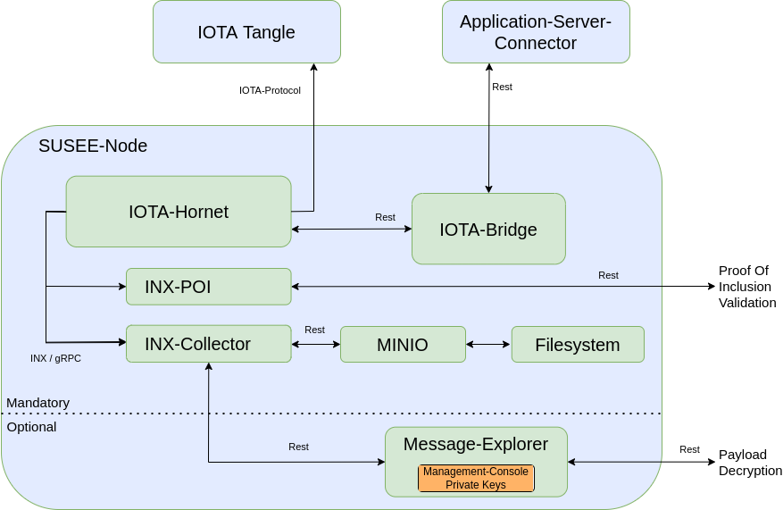

# *SUSEE Node* Resources

This folder contains resources to run a *SUSEE Node*.
A *SUSEE Node* provides several services that are needed to 
use the susee-streams-poc applications with the
[Stardust update](https://wiki.iota.org/learn/protocols/stardust/introduction/) of the IOTA protocol
([IOTA mainnet](https://wiki.iota.org/get-started/introduction/iota/introduction/)
or [Shimmer Network](https://wiki.iota.org/get-started/introduction/shimmer/introduction/)).

The *SUSEE Node* provides the following web services that
are run using docker virtualization and docker-compose:

* A [Hornet](https://wiki.iota.org/hornet/welcome/) node
* An [INX Collector](https://github.com/teleconsys/inx-collector) plugin
* An [INX Proof of Inclusion](https://github.com/iotaledger/inx-poi) plugin

One of the main purposes of the *SUSEE Node* is to provide a fully functional
[inx-collector](https://github.com/teleconsys/inx-collector)
service. The inx-collector maps Streams addresses to IOTA block-ids and additionally acts as a selective
permanode for all indexed blocks.

Additionally the following web services, implemented by susee-streams-poc applications,
are run using the docker-compose setup described in the
[docker](../docker/README.md) section of this repository:

* [*IOTA Bridge* REST API](../iota-bridge/README.md#iota-bridge-rest-api)
* [*Message Explorer* REST API](../management-console/README.md#run-message-explorer)
  implemented by the *Management Console* 
  


We cover two different usage scenarios, production and development.
This is described in the sections 
[Use in production](#use-in-production)
and
[Private tangle for development purposes](private-tangle-for-development-purposes)
in more detail.

## Use in production

As the inx-collector system includes a Hornet Node which communicates with other Nodes in the IOTA- or Shimmer-network
the system needs a publicly available domain name or static ip.

The minimum specs for the virtual or physical server are described on the Hornet
[Getting Started](https://wiki.iota.org/hornet/getting_started/) page.

We recommend to use the **Ubuntu 22.04** operating system as the following installation
steps have been tested with this OS version.

As your host system will be part of a permissionless peer to peer network its ip address
can be easily found. Therefore, please take special care on securing your host system
and follow best praxis security recommendations:
* https://www.digitalocean.com/community/tutorials/initial-server-setup-with-ubuntu-22-04
* https://blog.devolutions.net/2017/04/10-steps-to-secure-open-ssh/

After having created an admin user (named 'admin' in this readme) with sudo privilege (step 1 till 3 in 
[this initial server setup howto](https://www.digitalocean.com/community/tutorials/initial-server-setup-with-ubuntu-22-04)) 
please login as admin user via ssh.

Install ufw to configure the firewall as been described below. A more detailed description of the
ufw install and basic config steps can be found
[in this ufw firewall howto](https://www.digitalocean.com/community/tutorials/how-to-set-up-a-firewall-with-ufw-on-ubuntu-22-04)
.

```bash
  # in the admin home folder of your host system
  > sudo apt-get update
  > sudo apt-get install ufw
  > sudo ufw app list
  
  # Make sure that OpenSSH is listed in the 'Available applications' list
  
  > sudo ufw allow OpenSSH
  # ufw will ask you if you want to 'Proceed with operation'  - please press 'y' to proceed 
  > sudo ufw enable
  Command may disrupt existing ssh connections. Proceed with operation (y|n)? y
  Firewall is active and enabled on system startup
  # Check ufw status
  > sudo ufw status
  Status: active
  
  To                         Action      From
  --                         ------      ----
  OpenSSH                    ALLOW       Anywhere                  
  OpenSSH (v6)               ALLOW       Anywhere (v6)
```
Now we can start to install docker. A more detailed description of the
docker install and config steps can be found
[in this docker install howto for Ubuntu](https://www.digitalocean.com/community/tutorials/how-to-install-and-use-docker-on-ubuntu-22-04).

**IMPORTANT**: If you are **not using Ubuntu, do not proceed with the docker install steps
described below**, but open the page linked above and use the OS switch to choose your OS.
Follow the instructions described there.

**IMPORTANT**: If your **host system is a VPS** please check the IPv4 network address
of your system. If the **network address is** in the range **"172.16.0.1/16"** or **"172.17.0.1/16"**
please follow the
[instructions given in this proxmox help thread](https://forum.proxmox.com/threads/docker-under-lxc-change-default-network.122634/)
and this
[serverfault discussion](https://serverfault.com/questions/916941/configuring-docker-to-not-use-the-172-17-0-0-range)
, to configure the **docker daemon to use an ip range of "172.30.0.1/16"**
for the docker bridge. Make sure to create the needed config file `/etc/docker/daemon.json`
before you execute `sudo apt-get install docker-ce`.
Otherwise, your  might be faced with a disabled network device
and your SSH connection will get lost. In this case you will need access to the 
virtualization hypervisor to access your system again after docker has been installed
or after docker compose up has been used,
to create the needed config file after the docker install.
A `docker_daemon_example.json` file is located in the `hornet-install-resources` folder. 

```bash
  # ---> ONLY FOR UBUNTU - See notes above <---
  
  # in the admin home folder of your host system
  > sudo apt update
  > sudo apt-get install apt-transport-https ca-certificates curl software-properties-common
  > curl -fsSL https://download.docker.com/linux/ubuntu/gpg | sudo gpg --dearmor -o /usr/share/keyrings/docker-archive-keyring.gpg
  
  > echo "deb [arch=$(dpkg --print-architecture) signed-by=/usr/share/keyrings/docker-archive-keyring.gpg] https://download.docker.com/linux/ubuntu $(lsb_release -cs) stable" | sudo tee /etc/apt/sources.list.d/docker.list > /dev/null
  > sudo apt update
  # Check which docker-ce install package candidate is selected by apt for an docker-ce install.
  # Please have a look into the docker install howto linked above for more details.
  > apt-cache policy docker-ce
  
  # After having checked that the right candidate will be installed, we install docker here
  # IMPORTANT: ---> See above notes, if your host system is a VPS <--
  > sudo apt-get install docker-ce
  
  # Check the docker status after installation has been completed
  > sudo systemctl status docker
  # add the 'admin' user to the docker user group
  > sudo usermod -aG docker ${USER}
  > exit
```

The inx collector uses [minio](https://min.io) as object database. To access the
[minio console](https://min.io/docs/minio/linux/administration/minio-console.html)
via the host domain you need to configure a subdomain in the DNS system of your
[VPS](https://en.wikipedia.org/wiki/Virtual_private_server) (or physical server)
hoster. You need to add an 
[A record](https://en.wikipedia.org/wiki/List_of_DNS_record_types) or 
[CNAME record](https://en.wikipedia.org/wiki/CNAME_record)
for the subdomain "minio" that points to the ip-address resp. domainname of your host system.
Most VPS hoster provide a web-ui for DNS settings.
For example if your VPS can be accessed via the domain `example.com` the minio console
shall be accessible via `minio.example.com` after the installation steps have been finished.

Upload the content of the `inx-collector/hornet-install-resources` folder to your host system.
Please replace `<NODE_HOST>` with the domain name or static ip of your host system and enter the password for the
admin user when scp is executed.
```bash
  # In the folder where this README.md is located (inx-collector folder)
  > scp hornet-install-resources/* admin@<NODE_HOST>:~
```
Please login as admin user via ssh. The following steps are equivalent 
to the steps described in the
[Install HORNET using Docker](https://wiki.iota.org/hornet/how_tos/using_docker/)
howto.

```bash
  # in the admin home folder of your host system, check the folder content
  > ls -l
  # Make sure the following files exist:
  # * docker-compose-https.patch
  # * docker-compose.hornet.patch
  # * docker_daemon_example.json   
  # * prepare_docker.sh.patch  
  # * setup-hornet-node.sh
  
  # Execute the setup-hornet-node.sh script
  > ./setup-hornet-node.sh
```

In the hornet folder created by `setup-hornet-node.sh`, create a password hash and salt for the hornet dashboard
as been described in the
[wiki](https://wiki.iota.org/hornet/how_tos/using_docker/#1-generate-dashboard-credentials).

Copy the output of the hornet pwd-hash tool into a temporary file or editor because
it will be needed during our next steps.

```bash
  > cd hornet

  # generate a password hash and salt for the hornet dashboard
  # see https://wiki.iota.org/hornet/how_tos/using_docker/#5-set-dashboard-credentials  
  > docker compose run hornet tool pwd-hash
  
  # Enter a passwort and store it in your passwort safe (keepass or similar) for later use.
  # Choose a secure password because your server is part of a peer to peer network
  # and is seen by a lot of peers.
  #
  # As many VPS systems come with a preinstalled and running apache server
  # you may have problems because port 80 is already in use.
  # To disable and stop an already installed apache server:
  # > sudo systemctl disable apache2 && sudo systemctl stop apache2
```

Edit the following values in the
`env_template` file, that has been previously downloaded by the bash script.
You'll find more details about the edited variables in the `env_template` file.

```bash
  # Edit the env_template file using an editor of your choice
  # and implement the changes described below
  > nano env_template
```
Uncomment and edit the variables of the https section
* `COMPOSE_FILE`=docker-compose.yml:docker-compose-https.yml
* `ACME_EMAIL`
* `NODE_HOST`

Please also uncomment and edit the following variables:
* `HORNET_CONFIG_FILE` - Choose the correct network by uncommenting one of the provided lines
* `COMPOSE_PROFILES`- Search for the line defining the value `=${COMPOSE_PROFILES},monitoring` and uncomment it
* `DASHBOARD_USERNAME` - Use "susee-admin" for example
* `DASHBOARD_PASSWORD` - Enter the previously created hash value here
* `DASHBOARD_SALT` - Enter the previously created salt value here

You may also want to have a look into the
[setup-your-environment](https://wiki.iota.org/hornet/how_tos/using_docker/#2-setup-your-environment)
wiki page for Hornet to dive deeper into Hornet configuration.

Before storing the `env_template` file please append the following lines and
edit the values for `MINIO_ROOT_USER` and `MINIO_ROOT_PASSWORD`:

```dotenv
    ###############################
    # INX Collector Minio section #
    ###############################
    
    # Edit the storage credentials for the minio object storage used by the inx-collector
    MINIO_ROOT_USER=minio-admin
    MINIO_ROOT_PASSWORD=minio-password-goes-here
```

After having saved the `env_template` file in your editor
create an `.env` file from it.
```bash
  > cp env_template .env
```

Now we are able to prepare the data folder and to start the docker compose system:
```bash
  # Execute the prepare_docker.sh script in the hornet folder
  > sudo ./prepare_docker.sh
   
  # We are now ready to start the services in the background
  > docker compose up -d
```

**After starting your node for the first time, please change the default 
grafana credentials.**<br>
Use the initial credentials User: `admin` Password: `admin` for the first login.

You should now be able to access the following endpoints:

* API: https://your-domain.com/api/routes
* HORNET Dashboard: https://your-domain.com/dashboard
* Grafana: https://your-domain.com/grafana
* Minio: https://minio.your-domain.com
* INX-Collector: http://your-domain.com:9030/block/block/block-id-goes-here

Please note: The REST API of the inx-collector is accessed via http and is not protected
by authentication so that anybody can use the API without restrictions.
This also applies to the REST API of the Hornet service.

Please note: For instructions on deploying the used
[object database minio](https://min.io)
to production environments as distributed system,
see the [Deploy MinIO: Multi-Node Multi-Drive](https://min.io/docs/minio/linux/operations/install-deploy-manage/deploy-minio-multi-node-multi-drive.html#deploy-minio-distributed)
documentation page.

### Update Hornet Images

```bash
  # in the hornet folder in your host system
  > docker compose pull
  > docker compose up -d
```

### Deploy *IOTA Bridge* and *Message Explorer*

Please follow the instructions described in the section
[Start IOTA Bridge and Message Explorer as public available service](../docker/README.md#start-iota-bridge-and-message-explorer-as-public-available-service)
of the [docker folder](../docker/README.md).

## Private tangle for development purposes

As a production system will be too expensive for development purposes we use a private tangle
with docker-compose instead. The system will be accessible on the development machine via localhost
or in the intranet.

The bash script `setup-private-tangle.sh` will process all needed steps to run a system as been
described on the [Run a Private Tangle](https://wiki.iota.org/shimmer/hornet/how_tos/private_tangle/)
page together with an [inx-collector](https://github.com/teleconsys/inx-collector) instance.

**The bash script shall only be used for test purposes**. Do not expose the ports
to the public internet.

The bash script will
[download a private tangle package](https://github.com/iotaledger/hornet/releases/download/v2.0.0-rc.6/HORNET-2.0.0-rc.6-private_tangle.tar.gz)
containing the latest docker-compose files that will be unpacked into a new subdirectory called `priv_tangle`.

After the `setup-private-tangle.sh` script has finished,
you can use the `priv_tangle` folder as root folder for the docker-compose-cli. Instead of using `docker compose up`
directly, please use the convenience script `run.sh` instead:

```bash
  # in the 'priv_tangle' subfolder:
  > ./run.sh
```

The connectivity of most of the provided services is documented in the
[privat tangle README file](./priv_tangle/README.md)
which is located in the created `priv_tangle` folder.

The SUSEE-POC applications *IOTA Bridge* and *Management Console* need to know the
domain of the IOTA-Node which can be specified by the CLI `--node` argument. The domain
name is needed to build the URL of the IOTA-Node-API.
When the default value - '127.0.0.1' - for the `--node` argument is used, the
standard port of the IOTA-Node-API 14265 is automatically used to build the
URL of the IOTA-Node-API. This will work together with the private tangle for development
purposes.

If you are using the private tangle for development purposes and need to specify
the `--node` argument for a SUSEE-POC application explicitly, please use the
value `127.0.0.1`.

Also use the value `http://127.0.0.1:50000` for the `--iota-bridge` argument
of SUSEE-POC applications, in case it needs to be specified explicitly.
This should occur seldom as this is the default value.

The REST api of the inx collector is available via localhost:9030.
For example, you can fetch a specific block using the api like this:
http://localhost:9030/block/block/block-id-goes-here

The [minio object database](https://min.io) can be accessed via http://127.0.0.1:9001
with username `your_access_id` and password `your_password`.