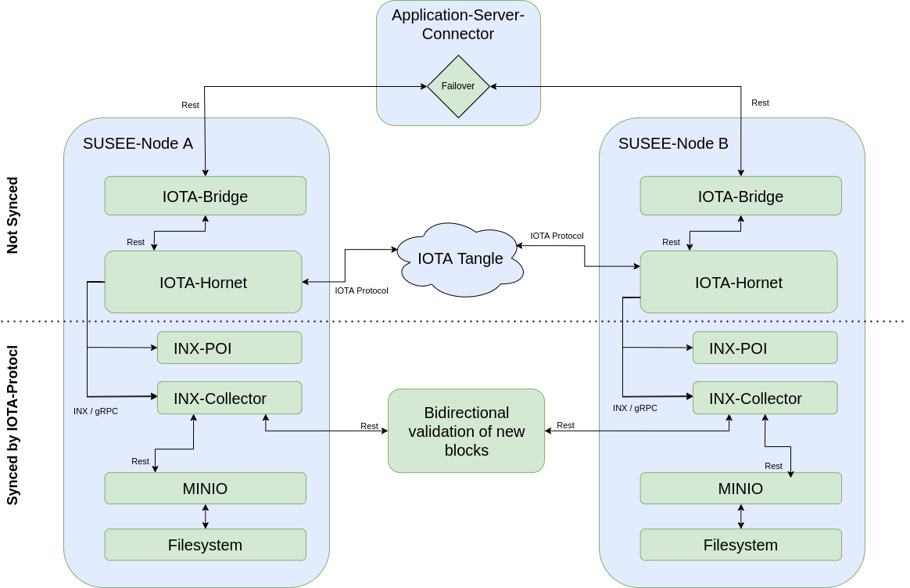

# *SUSEE Node* Resources

## About

This folder contains resources to run single *SUSEE Node*
instance and redundant *SUSEE Node* setups.

A *SUSEE Node* provides all web services needed to 
run the *SUSEE Streams POC* and send *Sensor*
messages via a LoRaWAN communication infrastructure.

The *SUSEE Node* provides the following web services that
are run using docker virtualization and docker-compose.

*SUSEE Streams POC* applications:
* [*IOTA Bridge* REST API](../iota-bridge/README.md#iota-bridge-rest-api)
* [*Message Explorer* REST API](../management-console/README.md#run-message-explorer)
  implemented by the *Management Console* 
* [*AppServer Connector Mockup Tool*](../app-srv-connector-mock)

*IOTA Node* and *Selective Permanode* services:  
* [IOTA Hornet Node](https://wiki.iota.org/hornet/welcome/) node
* [INX Collector](https://github.com/teleconsys/inx-collector) plugin
* [INX Proof of Inclusion](https://github.com/iotaledger/inx-poi) plugin
* [Minio](https://min.io/) object database

Since the
[Stardust update](https://wiki.iota.org/learn/protocols/stardust/introduction/)
of the IOTA protocol in the
[IOTA mainnet](https://wiki.iota.org/get-started/introduction/iota/introduction/),
*IOTA Streams* can only be used with a self deployed *Tag Indexing Service*.
This *Tag Indexing Service* used for *SUSEE* is a modified version of the
[inx-collector](https://github.com/teleconsys/inx-collector)
by [Teleconsys](https://www.teleconsys.it/)
which also acts as a *Selective Permanode*.
The modified *INX Collector* stores *IOTA* blocks using
hashed *IOTA Streams* addresses (called *message index*)
as *Block Storage Keys*.

The source code of the modified *INX Collector* can be found here:
https://github.com/chrisgitiota/inx-collector/tree/streams-collector

Because data blocks being send via the *IOTA Tangle* without providing a
[Storage Deposit](https://wiki.iota.org/learn/protocols/stardust/core-concepts/storage-deposit/)
will be pruned after some time from *IOTA Nodes*,
data centric applications need a *Selective Permanode* functionality
which is also provided by the *INX Collector*.

A *Selective Permanode* filters application specific blocks
out of the *IOTA Tangle* and stores these blocks in a self
owned database. The *INX Collector* for *SUSEE* filters
*SUSEE* specific blocks by a configurable
[block tag](https://wiki.iota.org/tips/tips/TIP-0023/)
prefix and stores these blocks together with a *Proof of Inclusion*
in a [Minio](https://min.io/) object database.

Using the *Proof of Inclusion* that has been stored with the data block,
the authenticity and broadcasting time of the data payload contained in the
block can be proved any time in the future even when the
blocks have been pruned from the *IOTA Nodes*.
More details about *Proof of Inclusion* can be found in the
[main README](../README.md#proof-of-inclusion-or-why-is-iota-distributed-ledger-used).

Creating and validating a *Proof of Inclusion* is done using an
[INX Proof of Inclusion](https://github.com/iotaledger/inx-poi) plugin
which is also included in the *SUSEE Node*.

*INX Collector* and *INX Proof of Inclusion* are *INX Plugins*.
*INX Plugins* communicate with an *IOTA Node* via the
[INX Interface](https://github.com/iotaledger/inx)
which allows the plugins to have fast and extensive access to the
nodes internal *Tangle* data structures and *IOTA*
protocol communication.

To run *INX Plugins* the deployment of an own 
*IOTA Node* is obligatory. 
The *SUSEE Node* therefore also runs an
[IOTA Hornet Node](https://wiki.iota.org/hornet/welcome/)
and several additional *INX Plugins* that are needed for its use.

Here is an overview of the services contained in the
*SUSEE Node* and the communication between internal and 
external services: 

<br/>


<br/>

The following sections describe how to run single *SUSEE Node*
instances for production and develop purposes and how to
configure
[multiple *SUSEE Node* instances](#redundant-susee-node-setup)
to build a small and simple *SUSEE Node* 'cluster'.

## How to Deploy a SUSEE Node

We cover two different usage scenarios, production and development.
This is described in the sections 
[Use in production](#use-in-production)
and
[Private tangle for development purposes](private-tangle-for-development-purposes)
in more detail.

For the production scenario, the setup of the *SUSEE Node*
appliance and the *IOTA Node* + *Selective Permanode* services
is described below.
As services implemented by *SUSEE Streams POC* applications
are run using a *Docker Compose* setup described in the
[docker folder](../docker/README.md) of this repository,
the deploment of these services is described
[there](../docker/README.md#start-iota-bridge-and-message-explorer-as-public-available-service).

### Use in production

As the inx-collector system includes a Hornet Node which communicates with other Nodes in
the IOTA- or Shimmer-network,
the system needs a publicly available domain name.
All test systems have been run using an IPv4 address, so we recommend using an
IPv4 address, although it could be possible to use a IPv6 address.

The minimum specs for the virtual or physical server are:
* Virtual appliance (VPS) or physical server
* 4 virtual or phisical CPU Cores
* 16 GB RAM
* 50 GB SSD Diskspace
* accessible via a domain name

We recommend to use the **Ubuntu 22.04** operating system as the following installation
steps have been tested with this OS version.

#### Initial Server Setup

As your host system will be part of a permissionless peer to peer network its ip address
can be easily found. Therefore, please take special care on securing your host system
and follow best praxis security recommendations:
* https://www.digitalocean.com/community/tutorials/initial-server-setup-with-ubuntu-22-04
* https://blog.devolutions.net/2017/04/10-steps-to-secure-open-ssh/

After having created an admin user (named 'admin' in this readme) with sudo privilege (step 1 till 3 in 
[this initial server setup howto](https://www.digitalocean.com/community/tutorials/initial-server-setup-with-ubuntu-22-04)) 
please login as admin user via ssh.

Install ufw to configure the firewall as been described below. A more detailed description of the
ufw install and basic config steps can be found
[in this ufw firewall howto](https://www.digitalocean.com/community/tutorials/how-to-set-up-a-firewall-with-ufw-on-ubuntu-22-04)
.

```bash
  # in the admin home folder of your host system
  > sudo apt-get update
  > sudo apt-get install ufw
  > sudo ufw app list
  
  # Make sure that OpenSSH is listed in the 'Available applications' list
  
  > sudo ufw allow OpenSSH
  # ufw will ask you if you want to 'Proceed with operation'  - please press 'y' to proceed 
  > sudo ufw enable
  Command may disrupt existing ssh connections. Proceed with operation (y|n)? y
  Firewall is active and enabled on system startup
  # Check ufw status
  > sudo ufw status
  Status: active
  
  To                         Action      From
  --                         ------      ----
  OpenSSH                    ALLOW       Anywhere                  
  OpenSSH (v6)               ALLOW       Anywhere (v6)
```

#### Docker install

Now we can start to install docker. A more detailed description of the
docker install and config steps can be found
[in this docker install howto for Ubuntu](https://www.digitalocean.com/community/tutorials/how-to-install-and-use-docker-on-ubuntu-22-04).

**IMPORTANT**: If you are **not using Ubuntu, do not proceed with the docker install steps
described below**, but open the page linked above and use the OS switch to choose your OS.
Follow the instructions described there.

**IMPORTANT**: If your **host system is a VPS** please check the IPv4 network address
of your system. If the **network address is** in the range **"172.16.0.1/16"** or **"172.17.0.1/16"**
please follow the
[instructions given in this proxmox help thread](https://forum.proxmox.com/threads/docker-under-lxc-change-default-network.122634/)
and this
[serverfault discussion](https://serverfault.com/questions/916941/configuring-docker-to-not-use-the-172-17-0-0-range)
, to configure the **docker daemon to use an ip range of "172.30.0.1/16"**
for the docker bridge. Make sure to create the needed config file `/etc/docker/daemon.json`
before you execute `sudo apt-get install docker-ce`.
Otherwise, your  might be faced with a disabled network device
and your SSH connection will get lost. In this case you will need access to the 
virtualization hypervisor to access your system again after docker has been installed
or after docker compose up has been used,
to create the needed config file after the docker install.
A `docker_daemon_example.json` file is located in the `hornet-install-resources` folder. 

```bash
  # ---> ONLY FOR UBUNTU - See notes above <---
  
  # in the admin home folder of your host system
  > sudo apt update
  > sudo apt-get install apt-transport-https ca-certificates curl software-properties-common
  > curl -fsSL https://download.docker.com/linux/ubuntu/gpg | sudo gpg --dearmor -o /usr/share/keyrings/docker-archive-keyring.gpg
  
  > echo "deb [arch=$(dpkg --print-architecture) signed-by=/usr/share/keyrings/docker-archive-keyring.gpg] https://download.docker.com/linux/ubuntu $(lsb_release -cs) stable" | sudo tee /etc/apt/sources.list.d/docker.list > /dev/null
  > sudo apt update
  # Check which docker-ce install package candidate is selected by apt for an docker-ce install.
  # Please have a look into the docker install howto linked above for more details.
  > apt-cache policy docker-ce
  
  # After having checked that the right candidate will be installed, we install docker here
  # IMPORTANT: ---> See above notes, if your host system is a VPS <--
  > sudo apt-get install docker-ce
  
  # Check the docker status after installation has been completed
  > sudo systemctl status docker
  # add the 'admin' user to the docker user group
  > sudo usermod -aG docker ${USER}
  > exit
```

#### Prepare subdomains for Minio and *INX Collector*

To run the *SUSEE Node* the following subdomains are needed to access specific services via https:

| Subdomain | Purpose |
|-----------|---------|
| minio | Minio API that can be used with the [Minio MC](https://min.io/docs/minio/linux/reference/minio-mc.html#create-an-alias-for-the-s3-compatible-service) or other Minio Clients. |
| minioui | [Minio Admin WebUI Console](https://min.io/docs/minio/linux/administration/minio-console.html) |
| collector | API of the *INX Collector* |

To configure the subdomains you need to add an 
[A record](https://en.wikipedia.org/wiki/List_of_DNS_record_types) or 
[CNAME record](https://en.wikipedia.org/wiki/CNAME_record)
for each subdomain that points to the ip-address resp. domainname of your host system.
Most VPS hoster provide a web-ui for DNS settings.
For example if your VPS can be accessed via the domain `example.com` the minio services
shall be accessible via the following subdomains after the installation steps have been
finished:

* `minioui.example.com`<br>
* `minio.example.com`<br>
* `collector.example.com`<br>

#### Install the Hornet docker environment 

Upload the content of the `inx-collector/hornet-install-resources` folder to your host system.
Please replace `<NODE_HOST>` with the domain name or static ip of your host system and enter the password for the
admin user when scp is executed.
```bash
  # In the folder where this README.md is located (inx-collector folder)
  > scp hornet-install-resources/* admin@<NODE_HOST>:~
```
Please login as admin user via ssh. The following steps are equivalent 
to the steps described in the
[Install HORNET using Docker](https://wiki.iota.org/hornet/how_tos/using_docker/)
howto.

**Important Note**: The setup-hornet-node.sh script that needs to be executed now will download all
needed resources to use the IOTA mainnet. If you want to use a different network
(for example Shimmernet) please edit the setup-hornet-node.sh file using an editor of
your choice and follow these steps:
* Search for the line `curl -L https://node-docker-setup.iota.org/iota | tar -zx`
* Replace the term `iota` in the path of the download url with one of the following
  network identifiers: `shimmer`,`testnet`, `iota-testnet`

After you have eventually edited the setup-hornet-node.sh script we are ready to run the
script:

```bash
  # in the admin home folder of your host system, check the folder content
  > ls -l
  # Make sure the following files exist:
  # * docker-compose-https.patch
  # * docker-compose-minio-client.yml
  # * docker-compose.hornet.patch
  # * docker_daemon_example.json   
  # * prepare_docker.sh.patch  
  # * setup-hornet-node.sh

  # If you want to use the Shimmer network instead of the IOTA Mainnet
  # Please edit the setup-hornet-node.sh as described above
  #  
  #    > nano setup-hornet-node.sh
  
  # Execute the setup-hornet-node.sh script
  > ./setup-hornet-node.sh
```

In the hornet folder created by `setup-hornet-node.sh`, create a password hash and salt for the hornet dashboard
as been described in the
[wiki](https://wiki.iota.org/hornet/how_tos/using_docker/#1-generate-dashboard-credentials).

Copy the output of the hornet pwd-hash tool into a temporary file or editor because
it will be needed during our next steps.

```bash
  > cd hornet

  # generate a password hash and salt for the hornet dashboard
  # see https://wiki.iota.org/hornet/how_tos/using_docker/#1-generate-dashboard-credentials  
  > docker compose run hornet tool pwd-hash
  
  # Enter a passwort and store it in your passwort safe (keepass or similar) for later use.
  # Choose a secure password because your server is part of a peer to peer network
  # and is seen by a lot of peers.
  #
  # As many VPS systems come with a preinstalled and running apache server
  # you may have problems because port 80 is already in use.
  # To disable and stop an already installed apache server:
  # > sudo systemctl disable apache2 && sudo systemctl stop apache2
```

Edit the following values in the
`hornet/env_template` file, that has been previously downloaded by the bash script.
You'll find more details about the edited variables in the `env_template` file.

```bash
  # Edit the env_template file using an editor of your choice
  # and implement the changes described below
  > nano env_template
```
If you are using https, uncomment and edit the variables of the https section.
If you are not using https, make sure the first line below is commented out.
* `COMPOSE_FILE`=docker-compose.yml:docker-compose-https.yml
* `ACME_EMAIL`
* `NODE_HOST`

Please also uncomment and edit the following variables:
* `HORNET_CONFIG_FILE=config.json` - Nothing to edit here, just uncomment
* `COMPOSE_PROFILES`- Search for the line defining the value `=${COMPOSE_PROFILES},monitoring` and uncomment it
   if you want to use grafana monitoring
* `DASHBOARD_USERNAME` - Use "susee-admin" for example
* `DASHBOARD_PASSWORD` - Enter the previously created hash value here
* `DASHBOARD_SALT` - Enter the previously created salt value here

You may also want to have a look into the
[setup-your-environment](https://wiki.iota.org/hornet/how_tos/using_docker/#2-setup-your-environment)
wiki page for Hornet to dive deeper into Hornet configuration.

Before storing the `env_template` file please append the following lines and
edit the values for `MINIO_ROOT_USER`, `MINIO_ROOT_PASSWORD` and `PEERCOLLECTOR_URL`
(more details regarding the `PEERCOLLECTOR_URL` can be found in the 
[Primary+Secondary *SUSEE-Node* Setup](#primarysecondary-susee-node-setup)
section below):

```dotenv
   ###################################
    # INX Collector and Minio section #
    ###################################
    
    # Edit the storage credentials for the minio object storage used by the inx-collector
    MINIO_ROOT_USER=minio-admin
    MINIO_ROOT_PASSWORD=minio-password-goes-here

    # Bucket name used to store streams messages by the inx-collector
    # Use a meaningfull name like one of these:
    #   * iota-mainnet
    #   * shimmernet-mainnet
    #   * acme-corp-private-testnet
    STORAGE_DEFAULT_BUCKET=iota-mainnet

    # Uncomment and edit the following line, if you are using a 'Primary+Secondary SUSEE-Node' setup.
    # The URL must include the "http" or "https" scheme.
    # Examples:
    #        PEERCOLLECTOR_URL=https://my-other-susse-node.org
    #        PEERCOLLECTOR_URL=http://127.0.0.1:9030
    #PEERCOLLECTOR_URL=https://my-other-susse-node.org
```

After having saved the `env_template` file in your editor
create an `.env` file from it.
```bash
  > cp env_template .env
```

Now we are able to prepare the data folder and to start the docker compose system:
```bash
  # Execute the prepare_docker.sh script in the hornet folder
  > sudo ./prepare_docker.sh
   
  # We are now ready to start the services in the background
  > docker compose up -d
```

**After starting your node for the first time, please change the default 
grafana credentials.**<br>
Use the initial credentials User: `admin` Password: `admin` for the first login.

You should now be able to access the following endpoints:

* API: https://your-domain.com/api/routes
* HORNET Dashboard: https://your-domain.com/dashboard
* Grafana: https://your-domain.com/grafana
* Minio: https://minio.your-domain.com
* INX-Collector: http://your-domain.com:9030/block/block/block-id-goes-here

Please note: The REST API of the inx-collector is accessed via http and is not protected
by authentication so that anybody can use the API without restrictions.
This also applies to the REST API of the Hornet service.

Please note: For instructions on deploying the used
[object database minio](https://min.io)
to production environments as distributed system,
see the [Deploy MinIO: Multi-Node Multi-Drive](https://min.io/docs/minio/linux/operations/install-deploy-manage/deploy-minio-multi-node-multi-drive.html#deploy-minio-distributed)
documentation page.

#### Deploy *IOTA Bridge* and *Message Explorer*

Please follow the instructions described in the section
[Start IOTA Bridge and Message Explorer as public available service](../docker/README.md#start-iota-bridge-and-message-explorer-as-public-available-service)
of the [docker folder](../docker/README.md).

#### Update Docker Images

```bash
  # in the `hornet` or `susee-poc` folder of your SUSEE-Node
  > docker compose pull
  > docker compose up -d
```

### Private tangle for development purposes

As a production system will be too expensive for development purposes we use a private tangle
with docker-compose instead. The system will be accessible on the development machine via localhost
or in the intranet.

The bash script `setup-private-tangle.sh` will process all needed steps to run a system as been
described on the [Run a Private Tangle](https://wiki.iota.org/shimmer/hornet/how_tos/private_tangle/)
page together with an [inx-collector](https://github.com/teleconsys/inx-collector) instance.

**The bash script shall only be used for test purposes**. Do not expose the ports
to the public internet.

The bash script will
[download a private tangle package](https://github.com/iotaledger/hornet/releases/download/v2.0.0-rc.6/HORNET-2.0.0-rc.6-private_tangle.tar.gz)
containing the latest docker-compose files that will be unpacked into a new subdirectory called `priv_tangle`.

After the `setup-private-tangle.sh` script has finished,
you can use the `priv_tangle` folder as root folder for the docker-compose-cli. Instead of using `docker compose up`
directly, please use the convenience script `run.sh` instead:

```bash
  # in the 'priv_tangle' subfolder:
  > ./run.sh
```

The connectivity of most of the provided services is documented in the
[privat tangle README file](./priv_tangle/README.md)
which is located in the created `priv_tangle` folder.

The SUSEE-POC applications *IOTA Bridge* and *Management Console* need to know the
domain of the IOTA-Node which can be specified by the CLI `--node` argument. The domain
name is needed to build the URL of the IOTA-Node-API.
When the default value - '127.0.0.1' - for the `--node` argument is used, the
standard port of the IOTA-Node-API 14265 is automatically used to build the
URL of the IOTA-Node-API. This will work together with the private tangle for development
purposes.

If you are using the private tangle for development purposes and need to specify
the `--node` argument for a SUSEE-POC application explicitly, please use the
value `127.0.0.1`.

Also use the value `http://127.0.0.1:50000` for the `--iota-bridge` argument
of SUSEE-POC applications, in case it needs to be specified explicitly.
This should occur seldom as this is the default value.

The REST api of the inx collector is available via localhost:9030.
For example, you can fetch a specific block using the api like this:
http://localhost:9030/block/block/block-id-goes-here

The [minio object database](https://min.io) can be accessed via http://127.0.0.1:9001
with username `your_access_id` and password `your_password`.

To shut down the docker compose environment open a a second shell in the priv_tangle
folder and type:
```bash
  # in the 'priv_tangle' subfolder:
  > docker compose --profile "2-nodes" down
```

#### Profile using two minio instances

To test [Primary+Secondary *SUSEE-Node* Setup](#primarysecondary-susee-node-setup)
scenarios, two separated minio instances are needed. The docker-compose.yml
file provides a profile for this, called `2-minio`.

To start the private tangle using the `2-minio` profile:
```bash
  # in the 'priv_tangle' subfolder:
  > docker compose --profile "2-minio" up
```

The service 'minio-1' can be accessed as usual via http://127.0.0.1:9000 (API)
and http://127.0.0.1:9001 (Console).

The service 'minio-2' can be accessed via http://127.0.0.1:9002 (API)
and http://127.0.0.1:9003 (Console).

To stop the private tangle using the `2-minio` profile:
```bash
  # in the 'priv_tangle' subfolder:
  > docker compose --profile "2-minio" down
```

## Redundant SUSEE Node setup

Deployed to cost effective usual appliances (cloud hosted or onpremise,
VPS or physical), a *SUSEE Node* will often suffer from service outages
due to appliance downtimes of several minutes per week or due to
temporarily reduced appliance performance.

The service outages can be reduced by a simple redundancy architecture
using a primary and a secondary *SUSEE Node* deployed to two different
data centers. This will be called *Primary+Secondary Setup* in the following.

The available *SUSEE Node* can be run behind a load balancer, or the
*Application Server Connector* can do a simple
[failover](https://www.cloudflare.com/learning/performance/what-is-server-failover/).

The failover strategy used for the *Primary+Secondary Setup*
can be very simple and depends on the implementation of the
*Application Server Connector*.
The strategy must be chosen to take into account, which appliances,
networks and storage capabilities are available at each datacenter.

Following strategies can be considered. Mixing the strategies is also possible:
* *Prefer Primary Node*<br>
  In case the *IOTA Bridge* of the primary *SUSEE Node* 
  returns an error, the *Application Server Connector* will
  try to use the *IOTA Bridge* of the secondary *SUSEE Node*.
  The secondary *SUSEE Node* is only
  used in case of errors and only once (per error).
* *Spread Load*<br>
  The *Application Server Connector* distributes the work load
  using a simple round robin logic.
  In case an *IOTA Bridge* returns an error, the
  *Application Server Connector* tries to use the other
  *IOTA Bridge* instance. If both *IOTA Bridge* instances
  return errors, the *Application Server Connector* could
  retry to successfully transmit the request until a timeout
  is exceeded.
* *Use a dedicated Loadbalancer*<br>
  A [Loadbalancer](https://en.wikipedia.org/wiki/Load_balancing_(computing))
  would allow dynamic horizontal scaling but would introduce
  additional complexity and costs.

### Primary+Secondary *SUSEE-Node* Setup

The *SUSEE Node* is prepared to be used in a *Primary+Secondary Setup*.

<br/>



<br/>

#### Node Synchronisation

The *SUSEE Node* uses two technologies providing synchronisation mechanisms:

* *IOTA Network*<br>
  The *INX Collector* of each *SUSEE Node* will receive every data block
  that is send via the *IOTA Tangle*, regardless which *SUSEE Node* has been
  used to send the block. In theory, given the *IOTA Nodes*, *INX Collectors*
  and *Minio Databases* of all *SUSEE Nodes* would have no outages, no additional
  synchronization would be needed to have identical database contents.
* *Minio Database*<br>
  The *Minio Database* provides several synchronization features which can be
  mainly differentiated in:
  * [Server-Side Bucket Replication](https://min.io/docs/minio/linux/administration/bucket-replication.html)
  * [Client-Side Bucket Replication](https://min.io/docs/minio/linux/reference/minio-mc/mc-mirror.html#command-mc.mirror)

Applying two independent and not aligned synchronization mechanisms in parallel,
can result in access failures or performance issues, caused by unnecessary
processing due to the poorly aligned algorithms.
 
The *SUSEE Nodes* therefore use a synchronisation mechanism, tightly
aligned to the *IOTA Network* synchronization and the
([above decribed](#about)) *SUSEE Node* service
architecture.

We call this synchronisation mechanism '*Cluster wide block validation*'.

##### Cluster wide block validation

At the end of the block sending process of a *SUSEE* node,
every *Sensor* message, received by the *IOTA Bridge* and send via
the *IOTA Tangle*, must be stored as a block in the *Minio Database*.
For each `send-message` request, the *IOTA Bridge*
[validates](../iota-bridge/README.md#iota-bridge-error-handling-for-lorawan-node-endpoints)
the existence of the block, before the request is finished.

Validating the existence of the block in the *Minio Database*
is done via the *INX Collector*.

The *INX Collector* also provides
the option to configure a peer *INX Collector* instance in its
configuration using the `--peercollector.hostUrl` start parameter.
*Cluster wide block validation* is based on two simple principles:
* a block being validated in the local *Minio Database* will also
  be validated in the *Minio Database* of the *Peer INX Collector*
* a block that can't be found in the *Peer INX Collectors* *Minio*
  database, is fetched by the *Peer INX Collector* from the original
  *INX Collector*

The current implementation involves the primary and secondary
*SUSEE Node*. In general, these principles could be applied to an
arbitrary number of nodes.

To securely manage the *Block Storage Keys* that need to
be validated in the cluster, these keys are stored in the
*Minio Database* in the following *Minio Buckets*:
* `keys-to-send-to-peer-collector`<br>
  Used by the original *INX Collector* to store *Block Storage Keys*
  that could not be communicated to the *Peer INX Collector*
  due to a *Peer INX Collector* service outage.<br>
  The original *INX Collector* will try to communicate these
  keys later on and in case of success, remove the keys from the
  bucket.
* `objects-inspection-list`<br>
  Used by the *Peer INX Collector* to store *Block Storage Keys*
  that need to be validated in the local *Minio Database*.
  After the block-existence has been successfully validated, the
  *Block Storage Key* is removed. If the block can not be found
  in the local *Minio Database*, the block is fetched from the
  original *INX Collector*, stored in the local *Minio Database*
  and finally (on success) the *Block Storage Key* is removed
  from the bucket.
  
Please note that the association between original *INX Collector*
and *Peer INX Collector* is bidirectional.
The *INX Collector* of the secondary *SUSEE Node* is the *Peer INX Collector*
for the primary *SUSEE Node* and vice versa.

The *Cluster wide block validation* has been working reliably
and with less performance impact during all work load tests so far.

##### Minio Database synchronization

Although the synchronization features of the *Minio Database*
are not used to synchronize the primary and secondary *SUSEE Nodes*,
these features can be used for synchronization tasks of optional
additional nodes, for example for backup purposes.

#### Log files

TODO: How logs can be viewed and archived

#### Manual Node Health Check  

TODO: How to manually find out if the *SUSEE Node* is healthy

### Minio client service for backup tasks

TODO:
* explain docker-compose-minio-client.yml
* Data backup with minio mc mirror

### SUSEE Node for Message Explorer

### Node trouble shooting

TODO: What to do if hornet gets unsynched

### Heterogeneous Example System 

TODO:
* Redundant example system, consisting of three
  *SUSEE-Nodes* that are differently configured
    * Explain role of each SUSEE-Node
    * Which service runs where
    * lifecycles of iota-mainnet buckets
