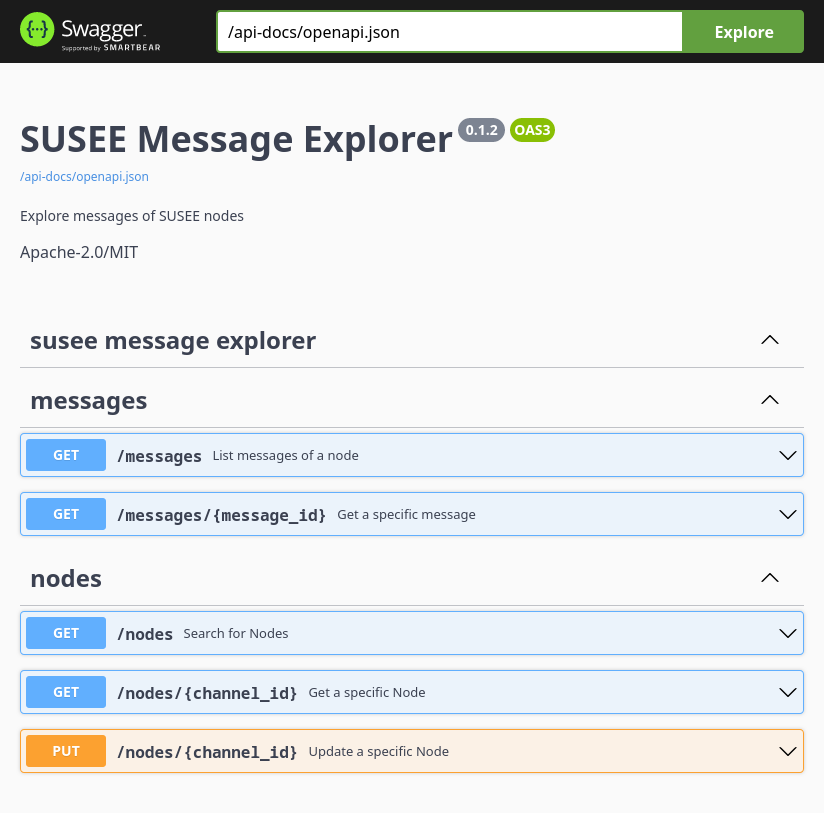
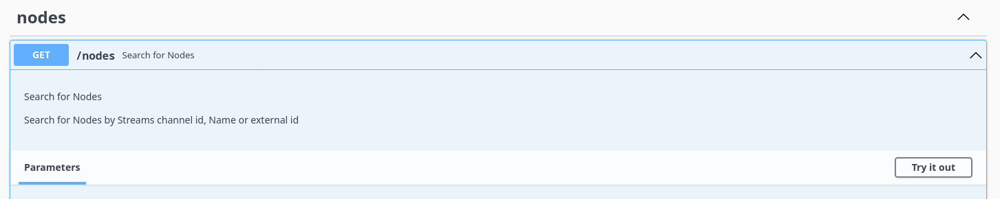

# Tests

This folder contains documentation and resources to facilitate manual and automated tests. 
The documentation includes step by step descriptions of all tasks needed to perform manual
tests.  

Here is an overview of the contained sub-folders:

* [scripts](./scripts)<br>
  Contains script files to perform automatic
  tests for the *SUSEE Streams POC* applications and libraries. Have a look into the
  [test scripts README](./scripts/README.md) for more details.
* [iota-bridge](./iota-bridge) <br>
  Contains several curl scripts for manual testing of the *IOTA Bridge* API endpoints
  that are dedicated for public use.
  Have a look into the [*IOTA Bridge* README](../iota-bridge/README.md) for more details.
* [payloads](./payloads)<br>
  Contains several message files that can be used to test the *Sensors* send
  functionality (--file-to-send` argument of the *Sensor* application CLI).
  See [below](#send-messages-using-the-sensor) for more details.
  
The *Sensor* test applications can be tested manually by using the CLI of the applications.
This is described in the [Sensor Initialization](#sensor-initialization)
and [Send messages using the Sensor](#send-messages-using-the-sensor)
section below.

Please note that the tests provided here underlie
[several restrictions](../README.md#restrictions-of-the-provided-tests) that are described in
the main README.

Please also note that you may also process the tests described in this README,
using the docker images for the SUSEE applications as been described in the
[docker folder](../docker/README.md).

## Test workspace
As all built applications are located in the `target/debug` or `target/release`
sub-folder of the *susee-streams-poc* repository root folder, the easiest way
to run the tests described below is, to use one
of these folders as *test workspace* for manual testing.

We recommend using the release build of the applications because the proof of work,
done in the *IOTA Bridge*, is very time-consuming otherwise.

In the following test descriptions we presume that the working directory of the
command shell is the folder where all used test applications are stored. This is
called *test workspace* in the following. For example, to use the `target/release`
folder as *test workspace* you need to open a command shell and enter
```bash
    > cd ~/path-to-my-susee-streams-poc-repository/target/release
```  

Feel free to use a different folder as *test workspace*.
Just copy the needed test applications into the folder before you start your tests.
All files created by the test applications will be created locally in the
working directory from where the application has been started.
Following the definition of our *test workspace*, this is the folder where the applications
are stored.

## SUSEE Node

As described in the repository 
[main README](../README.md#reliable-susee-node-backend) 
a [*SUSEE Node*](../susee-node/README.md)
needs to be run before any *SUSEE Streams POC* Application
can be used.

For test purposes a 
[private tangle](../susee-node/README.md#private-tangle-for-development-purposes)
together with a locally running *IOTA Bridge* instance will usually be the best option.

If a physical or virtual appliance and a domain name
for the appliance is available, a
[production like test SUSEE Node](../susee-node/README.md#use-in-production)
may be the better option for you (or you team).

If a local *IOTA Bridge* instance with private tangle is used, the 
*SUSEE Streams POC* Applications
can be used without any additional CLI arguments.

If a production like *SUSEE Node* for test purposes is used,
* the domain name of the *SUSEE Node* and/or
* the full URL of the nodes *IOTA Bridge* service

will need to be specified using the proper CLI arguments.
In the test steps described below, we will use the domain
`iotabridge.example.com` resp. the *IOTA Bridge* URL
`http://iotabridge.example.com:50000` for this purpose.

If you are using an *IOTA Bridge* with private tangle, don't forget to start it first:
```bash
  # in the 'susee-node/priv_tangle' subfolder:
  > ./run.sh
```

After the tests have been finished stop the private tangle using:
```bash
  # in the 'priv_tangle' subfolder:
  > docker compose --profile "2-nodes" down
```

Please have a look into the 
[Private tangle for development purposes](../susee-node/README.md#private-tangle-for-development-purposes)
section of the [SUSEE Node README](../susee-node) for more tips how to setup and run the
private tangle.

## Sensor Initialization
There are two ways to initialize a *Sensor*. The easiest way is to use the
[`--init-sensor` option](../management-console/README.md#automatic-sensor-initialization)
of the *Management Console* application which will perform an automatic *Sensor Initialization*.

If you prefer to have more insights into the initialization process you can do the *Sensor Initialization*
manually, using the *Management Console* application CLI.

Depending on the *Sensor* app (x86/PC, streams-poc-lib test application) the steps
to initialize the sensor are different. In the following sections the *Sensor Initialization* is therefore
described for each *Sensor* application seperately.

Here are some general hints and aspects that apply to all *Sensor* applications:

* As described [above](#test-workspace) we recommend using the
  `target/release` folder as *test workspace*.

* Initialization vs. Reinitialization<br>
  In the tests described below we will do a *Sensor Initialization*, and therefore
  we will make sure the *Sensor* application does not already own
  an *IOTA Streams* client state and wallet file (in the used filesystem and/or
  defined by
  [Streams Client Data Storage](../sensor/streams-poc-lib/README.md#configuring-the-test-application)).

  For more details regarding the differences between *Initialization* and *Reinitialization*,
  have a look into the descriptions of the 
  [Initialization](../README.md#initialization) and the
  [Reinitialization](../README.md#sensor-reinitialization) workflow, and into the
  [initialization-count documentation](../sensor/README.md#initialization-count)
  in the Sensor README.

  In the
  [Sensor Initialization vs Reinitialization](../sensor/streams-poc-lib/README.md#sensor-initialization-vs-reinitialization)
  section of the *Streams POC Library* README you will find more details about the
  handling of *Sensor* applications using real world LoRaWAN DevEUIs.
  
  In the [Sensor Reinitialization](#sensor-reinitialization) section below,
  the *Reinitialization* of the *streams-poc-lib test application* and the
  *x86/PC Sensor* is described.

* In case a SUSEE POC application is listening to an external ip address,
  the example ip `192.168.47.11` is used in the test descriptions below.
  Please replace the ip address with the ip address of the network interface of your computer.
  You need also to make sure, the used port is opened in the firewall of your OS.
  After having started the application (e.g. the *IOTA-Bridge*) you can use telnet from another
  machine in your LAN to verify that the application can be accessed
  from within the LAN.

### Automatic Sensor Initialization

To automatically initialize a *Sensor* we need to use the
[`--init-sensor` option](../management-console/README.md#automatic-sensor-initialization)
of the *Management Console* application.
As the *Sensor* applications communicate with the *Management Console* via the *IOTA Bridge*
we need to start three applications.

*Management Console* and *IOTA Bridge* are started in their own command shells and will run
in parallel. If you use the *x86/PC Sensor*, it will be launched in an additional
command shell running parallel to the other two programs. In case a Sensor application
running on an ESP32 device is used, the log monitor utility will run in the third command shell.

#### Automatic Sensor Initialization - streams-poc-lib test application

To perform the initialization you'll need the *Espressif IDF SDK* installed. Please have a look into
the [streams-poc-lib README prerequisites section](../sensor/streams-poc-lib#prerequisites) for further details.

In the following test steps we asume that the `SENSOR_MANAGER_CONNECTION_TYPE` in the test application
[main.c file](../sensor/streams-poc-lib/main/main.c) has **not** been set to
`SMCT_CALLBACK_VIA_APP_SRV_CONNECTOR_MOCK`. Using one of the other *sensor manager connection types*,
we don't need to run the [*AppServer Connector Mockup Tool*](../app-srv-connector-mock)
because the *streams-poc-lib* directly communicates with the *IOTA Bridge* as been described
in the [*streams-poc-lib* README](../sensor/streams-poc-lib#using-the-test-application).

If `SENSOR_MANAGER_CONNECTION_TYPE` has been set to `SMCT_CALLBACK_VIA_APP_SRV_CONNECTOR_MOCK`
the *AppServer Connector Mockup Tool* needs to be run in an additional command shell which is described
in a [separated section](#automatic-sensor-initialization---streams-poc-lib-test-application-with-appserver-connector)
below.

As the test application always uses WiFi to connect to the LAN you will also
need to define the following precompiler macros in the test application
[main.c](../sensor/streams-poc-lib/main/main.c) file:
* STREAMS_POC_LIB_TEST_WIFI_SSID
* STREAMS_POC_LIB_TEST_WIFI_PASS,
* STREAMS_POC_LIB_TEST_IOTA_BRIDGE_URL
* STREAMS_POC_LIB_TEST_APP_SRV_CONNECTOR_MOCK_ADDRESS

If you are using a production like *SUSEE Node*, set 
`STREAMS_POC_LIB_TEST_IOTA_BRIDGE_URL` to "http://iotabridge.example.com:50000"
and `STREAMS_POC_LIB_TEST_APP_SRV_CONNECTOR_MOCK_ADDRESS` to 
"iotabridge.example.com:50001".

If you are using a private tangle with a local *IOTA Bridge*, set 
`STREAMS_POC_LIB_TEST_IOTA_BRIDGE_URL` to "http://<your-ip-address.goes-here>:50000"
and `STREAMS_POC_LIB_TEST_APP_SRV_CONNECTOR_MOCK_ADDRESS` to 
"<your-ip-address.goes-here>:50001".

Please also have a look at the `Test CONFIG` section of the 
[main.c](../sensor/streams-poc-lib/main.c) file and the
[streams-poc-lib README](../sensor/streams-poc-lib/README.md) for more details.

When the streams-poc-lib test application has been
[build and flashed](../sensor/streams-poc-lib/README.md#build) and the
`idf.py` CLI is available, follow these steps to automatically initialize a
*streams-poc-lib test application sensor*:

* Depending on the state of the *Sensor* one of the following steps is needed to 
  properly manage the initialization status:
  * If the device has never been initialized: Move on to "Start the *IOTA Bridge*",
    to do a *Sensor Initialization*.
  * If the device has already been initialized and has been powered off thereafter,
    you need to erase the flash of the *Sensor* device to do an initialization
    ([why is this needed?](#sensor-reinitialization---streams-poc-lib-test-application)).<br>
    You can run `idf.py erase-flash` and flash the
    *streams-poc-lib test application* again as been described in the
    [streams-poc-lib README](../sensor/streams-poc-lib/README.md#build).<br>
    You also need to delete the
    [*IOTA Bridge* SQLite database file](../iota-bridge/README.md#caching-of-lorawan-deveuis-and-streams-channel-meta-data)
    `iota-bridge.sqlite3` in the [workspace folder](#test-workspace).<br>
    [Here](../sensor/streams-poc-lib/README.md#sensor-initialization-vs-reinitialization)
    you can find out why this is needed.
    <br><br>
* Start the *IOTA Bridge*<br>
  If you are using a production like *SUSEE Node*, you can proceed with
  the next step because you don't need a local *IOTA Bridge* instance.
  
  If you are using a private tangle, make sure the
  [docker-compose environment](../susee-node/README.md#private-tangle-for-development-purposes)
  has already been startet and start the local *IOTA Bridge* instance with
  ```bash
      > ./iota-bridge -l "192.168.47.11:50000"
  
        [INFO  iota_bridge] Using IotaBridgeOptions:
            iota_node: 127.0.0.1
            error_handling: always-return-errors
            use_tangle_transport: true
        [INFO  iota_bridge] Listening on http://192.168.47.11:50000
  ```
  <br>
* Start the *streams-poc-lib* test application to listen for remote commands<br>
  The *streams-poc-lib* test application will start immediately after the boot sequence
  of the *Sensor* device. If you are using a USB interface for power supply and serial
  communication, this means the *Sensor* application will start several seconds
  after you have plugged in the USB cable.<br>
  To review the boot process and application start, you should **prepare** the
  IDF log monitoring tool in an additional shell in the root folder of the *streams-poc-lib*
  ([/sensor/streams-poc-lib](../sensor/streams-poc-lib)).<br>
  To **prepare** means that you just type, but don't enter the last statement of the
  following commands. After preparing the log monitoring tool you power on the *Sensor* device
  and then you press enter:
  ```bash
      > cd ~/path-to-my-susee-streams-poc-repository/sensor/streams-poc-lib
      > get_idf
      > idf.py monitor                    # just type it - press enter after device power on
  ```
  <br>
* Run the *Management Console* with the following options
  in an additional shell<br><br>
  If you are using a private tangle:
  ```bash
  > ./management-console --init-sensor --iota-bridge-url "http://192.168.47.11:50000"
  ```
  If you are using a production like *SUSEE Node*:
  ```bash
  > ./management-console --init-sensor --iota-bridge-url "http://iotabridge.example.com:50000" --node "iotabridge.example.com"
  ```

The *Management Console* then will perform all the initialization steps fully automatically.
See the [CLI help for the `--init-sensor` option](../management-console/README.md#automatic-sensor-initialization)
of the *Management Console* for further details.

#### Automatic Sensor Initialization - streams-poc-lib test application with AppServer Connector

In case the `SENSOR_MANAGER_CONNECTION_TYPE` in the test application
[main.c file](../sensor/streams-poc-lib/main/main.c) has been set to
`SMCT_CALLBACK_VIA_APP_SRV_CONNECTOR_MOCK`,
and you are using a private tangle with local *IOTA Bridge* instance,
the [*AppServer Connector Mockup Tool*](../app-srv-connector-mock) needs to be run in an
additional shell to perform the test steps described above:
```bash
    > ./app-srv-connector-mock -l 192.168.47.11:50001`
```  
The *AppServer Connector Mockup Tool* communicates with the *IOTA Bridge* via localhost therefore
the local *IOTA Bridge* instance needs to be started without any command line arguments:
```bash
    > ./iota-bridge
    [INFO  iota_bridge] Using IotaBridgeOptions:
       iota_node: 127.0.0.1
       error_handling: always-return-errors
       use_tangle_transport: true
    [INFO  iota_bridge] Listening on http://127.0.0.1:50000
``` 
The *Management Console* also needs to access the *IOTA Bridge* via localhost:
```bash
    > ./management-console --init-sensor --iota-bridge-url "http://127.0.0.1:50000"
``` 

If you are using a production like *SUSEE Node* for your tests, you don't need to start
a local *AppServer Connector Mockup Tool* instance as the *SUSEE Node* provides this
service also, if the relevant configuration section has been uncommented in the
[docker compose.yml file](../docker/README.md#start-iota-bridge-and-message-explorer-as-public-available-service).

The *Management Console* is started with a production like *SUSEE Node* like this:
```bash
    > ./management-console --init-sensor --iota-bridge-url "http://iotabridge.example.com:50000" --node "iotabridge.example.com"
```

#### Automatic Sensor Initialization - x86/PC

Follow the steps described in this section to automatically initialize an *x86/PC Sensor*.

**Please Note**: If the *x86/PC Sensor* has already been initialized before,
it's easier and usually more reasonable to do a
*Sensor Reinitialization for x86/PC Sensors*
([See below](#sensor-reinitialization---x86pc)).

Doing an *Initialization* as been described here, you might want to use the
[--dev-eui](../sensor/README.md#static-deveui)
argument of the *Sensor* CLI, to specify a static DevEUI
facilitating a later *Sensor Reinitialization*.
Have a look into the `Initialization vs. Reinitialization` hints
in the [Sensor Initialization](#sensor-initialization) section above,
and the 
[Sensor Reinitialization - x86/PC](#sensor-reinitialization---x86pc) 
section below for more details.

* Make sure the *Streams Channel* has not been already initialized<br>
  If the *Sensor* has been initialized before,
  delete the `wallet-sensor.txt` and `client-state-sensor.bin`
  files in the [workspace folder](#test-workspace).
  
  You also need to delete the
  [*IOTA Bridge* SQLite database file](../iota-bridge/README.md#caching-of-lorawan-deveuis-and-streams-channel-meta-data)
  `iota-bridge.sqlite3` in the [workspace folder](#test-workspace).
  The reason for this is equivalent to the reason that applies to the
  *Streams POC Library* test application described
  [here](../sensor/streams-poc-lib/README.md#sensor-initialization-vs-reinitialization).
  
* If you are using a production like *SUSEE Node*, proceed with the next step,
  otherwise (means you are using a private tangle) you need to start the
  *IOTA Bridge*.<br>
  
  As your *x86/PC Sensor* will run on the same machine as the *IOTA Bridge*
  both applications can communicate via localhost wich is the default setting:
  ```bash
  > ./iota-bridge
  [INFO  iota_bridge] Using IotaBridgeOptions:
         iota_node: 127.0.0.1
         error_handling: always-return-errors
         use_tangle_transport: true
  [INFO  iota_bridge] Listening on http://127.0.0.1:50000
  ``` 
* Start the *x86/PC Sensor* to listen for remote commands
  In an additional shell.
  <br><br>
  If you are using a private tangle:<br>
  ```bash
  > ./sensor --act-as-remote-controlled-sensor
  [2INFO  streams_tools::remote::command_processor] [fn run_command_fetch_loop()] DevEUI: 13145628835347543691 - Received Command::NO_COMMAND
  ``` 
  If you are using a production like *SUSEE Node*:<br>
  ```bash
  > ./sensor --act-as-remote-controlled-sensor --iota-bridge-url "http://iotabridge.example.com:50000"
  [2INFO  streams_tools::remote::command_processor] [fn run_command_fetch_loop()] DevEUI: 13145628835347543691 - Received Command::NO_COMMAND
  ```
* Run the *Management Console* in an additional shell
  <br><br>
  If you are using a private tangle:<br>
  ```bash
  > ./management-console --init-sensor
  [INFO  management_console] Using node '127.0.0.1' for tangle connection
  [INFO  management_console] Initializing remote sensor
  [INFO  management_console] Using http://127.0.0.1:50000 as iota-bridge url
  [INFO  management_console] DevEUI: ANY - Sending dev_eui_handshake command to remote sensor.
  ```
  If you are using a production like *SUSEE Node*:<br>
  ```bash
  > ./management-console --init-sensor --node "iotabridge.example.com" --iota-bridge-url "http://iotabridge.example.com:50000"
  [INFO  management_console] Using node 'iotabridge.example.com' for tangle connection
  [INFO  management_console] Initializing remote sensor
  [INFO  management_console] Using http://iotabridge.example.com:50000 as iota-bridge url
  [INFO  management_console] DevEUI: ANY - Sending dev_eui_handshake command to remote sensor.
  ```

The *Management Console* then will perform all the initialization steps fully automatically.

### Sensor Reinitialization

The [above described test steps](#sensor-initialization)
perform a *Sensor Initialization*. Here we explain how to do a *Sensor Reinitialization*.

During a [Sensor Reinitialization](../README.md#sensor-reinitialization)
the DevEUI of the Sensor
is maintained, and the
[initialization-count](./sensor/README.md#initialization-count)
of the *Sensor* is incremented.
This is described in more detail in the
[Sensor README](../sensor/README.md#initialization-count).

#### Sensor Reinitialization - streams-poc-lib test application

As been described in the
[streams-poc-lib README](../sensor/streams-poc-lib/README.md#sensor-initialization-vs-reinitialization),
currently it is not possible to test a *Sensor Reinitialization*
with the *Streams POC Library* test application.

Nevertheless, a reinitialization of your *Sensor* Application using the
*Streams POC Library*, can be achieved easily as been described
[here](../sensor/streams-poc-lib/README.md#use-reinitialization-instead)

#### Sensor Reinitialization - x86/PC

Repeating the steps described in the
[Automatic Sensor Initialization](#automatic-sensor-initialization---x86pc)
section, after the *Sensor* has already been initialized
WITHOUT deleting any file in the file system, will result in a *Sensor Reinitialization*.
 
Because the `wallet-sensor.txt` and `client-state-sensor.bin` are not deleted,
the *x86/PC Sensor* will recognize the already existing *Streams Channel*,
and store the increased initialization count in the `wallet-sensor.txt` file. 
The `client-state-sensor.bin` will be replaced by the *x86/PC Sensor* with a
new version of the file containing the *Streams Client State* of the new
*Streams Channel*.

The DevEUI will is maintained automatically because it is stored in the
`wallet-sensor.txt` file. 

If you need to reuse a DevEUI for repetitive tests, where the `wallet-sensor.txt` file
is not guarantied to be maintained you can use the
[--dev-eui](../sensor/README.md#static-deveui)
*x86/PC Sensor* CLI argument to specify a static DevEUI.

### Manual Sensor Initialization

The recommended way to initialize a *Sensor* is the
[automatic initialization](#automatic-sensor-initialization).
The manual *Sensor Initialization* described here may be usefull 
to have more insights into the initialization process.
 
The process uses the *Sensor* and *Management Console* CLI to process each
initialization step.

Depending on the *Sensor* app (x86/PC, streams-poc-lib test application) the steps
to initialize the sensor are different. In the following
we only describe the *Sensor Initialization* for the *x86/PC Sensor* and the
[streams-poc-lib test application](#subscribe-the-sensor---streams-poc-lib-test-application).

For the sake of simplicity the below described steps use a local *IOTA Bridge* and private
tangle. If you want to use a production like *SUSEE Node* you need to add the CLI argument
`--node "iotabridge.example.com"`
to all management-console executions in this section.

#### Start the private tangle

As been described in 
[docker-compose environment](../susee-node/README.md#private-tangle-for-development-purposes)
the private tangle is started like this:

```bash
  # in the 'susee-node/priv_tangle' subfolder:
  > ./run.sh
```

#### Create the channel using the *Management Console*

In the [workspace](#test-workspace) folder:
```bash
    > ./management-console --create-channel --dev-eui 12345678

    [INFO  management_console] Using node '127.0.0.1' for tangle connection
    [WARN  streams_tools::user_manager::channel_manager] No binary streams_client_state or serial_file_name for the Streams Client State provided.
        Will use empty Streams Client State.
    [INFO  management_console] [Management Console] A channel has been created with the following announcement link:
                                    Announcement Link: fed80116a0d8c9d0c661ef7bbaa26d581b039c7481d243f3b6ca1b308d4495afa26af3e10009f5af:132369f378d7b97973f7d831
                                         Tangle Index: "c92de9662ca4c4da85323e38956d6803526600115cf41bac918274aaee609f58"
```

#### Subscribe the *Sensor* - x86/PC version

If you use a local *IOTA Bridge* and private tangle, we need
to start the *IOTA Bridge* first, before we can
use the *x86/PC Sensor* application.

In an additional shell in the [workspace](#test-workspace) start *IOTA Bridge* like this:
```bash
    > ./iota-bridge
    [INFO  iota_bridge] Using IotaBridgeOptions:
           iota_node: 127.0.0.1
           error_handling: always-return-errors
           use_tangle_transport: true
    [INFO  iota_bridge] Listening on http://127.0.0.1:50000
```

Now the subscription message can be created using the announcement link from the console log of the
*Management Console* above. Just enter the following in a command shell in the
 [workspace](#test-workspace) folder:
```bash
    > ./sensor --subscribe-announcement-link fed80116a0d8c9d0c661ef7bbaa26d581b039c7481d243f3b6ca1b308d4495afa26af3e10009f5af:132369f378d7b97973f7d831 --dev-eui 12345678
    [INFO  streams_tools::streams_transport::streams_transport_socket] [fn new()] Initializing instance with options:
        StreamsTransportSocketOptions:
                      http_url:          http://127.0.0.1:50000,
                      failover_http_url: None,
                      dev_eui:           12345678,
                      use_lorawan_rest:  false
        
    [INFO  streams_tools::streams_transport::streams_transport_socket] [fn recv_message()] Receiving message with 199 bytes tangle-message-payload:
        0002000004000000002bbd714fc82f455b64f782c2d5c19d11003ad0aff873d65f4605e2c77a3a4a5f60b4b5f255e5679e83c995c7e09bedb72f00e30086e2540cdd04d8a543be1166daec13faa5285fffe5214d177560bf2ece490e000001bc4897b121751b671d2f520e3ba8029284e7568827e858ef12821292f3b726e66106345a7c9f62009f680280e21d8f25780b08e16e173992bb12fe07ffef860c2ab1d05ba2eeb5551f610c7723d9851768338208f6471ef96ad7406c429449995e5b127bc132ed0b
        
    [INFO  streams_tools::streams_transport::streams_transport_socket] [fn send_message()] Sending message with 269 bytes tangle-message-payload:
        000250000400000001132369f378d7b97973f7d8312bbd714fc82f455b64f782c2d5c19d1100920e9cc16b7a46bb26ce6f31b4b9ce6b15024b37b61e40061f232c80d9e6168f00cb5f4a3366d39ae41fa354bc0d2d01a67706ebdbcddded7d7ac4479035ff5b160e000001fa317176f2e46009932518ed6b33b4e70a09eab5f4dceed9e15f66a36aab9c4fd59c465cdc1300456e4cbecabdc9473f21a954562710c8f710d257f191523739879c69d82ffe9b5bcc6bd3b12f864ec3cb29832ed0c81d67f74852859b3c23790c00d363ecbdd1543e779cd9ae47583cfe4127b334d7189bf6413d134a907f33828c9f00368eae9f35403d3628e8189c4d260978e036e0821e8f9811b38018d9ba05
        
    [INFO  sensor_lib::std::sensor_manager] [Sensor] A subscription with the following details has been created:
                     Subscription Link:     fed80116a0d8c9d0c661ef7bbaa26d581b039c7481d243f3b6ca1b308d4495afa26af3e10009f5af:4de5c29740525dda11f4664a
                          Tangle Index:     "a249336fb8fe2778d51f5b73170393daf371f9c6f5ee5ef40ad1586f53f93be6"
                     User public key: 920e9cc16b7a46bb26ce6f31b4b9ce6b15024b37b61e40061f232c80d9e6168f
                     Initialization count:  0
```

The *IOTA-Bridge* also logs every data package that is transferred. Regarding absolute length of transferred binary packages
only take the *IOTA-Bridge* log into account as these are the correct package sizes. *Sensor* and *Management-Console* only
log the sizes of the tangle-message-payload: 
```bash
[INFO  iota_bridge] Handling request from client address 127.0.0.1:43212 - URI: /message?addr=fed80116a0d8c9d0c661ef7bbaa26d581b039c7481d243f3b6ca1b308d4495afa26af3e10009f5af:132369f378d7b97973f7d831
[INFO  streams_tools::iota_bridge::server_dispatch_streams] [fn receive_message_from_address()] Received Message from tangle with absolut length of 251 bytes. Data:
    0002000004000000002bbd714fc82f455b64f782c2d5c19d11003ad0aff873d65f4605e2c77a3a4a5f60b4b5f255e5679e83c995c7e09bedb72f00e30086e2540cdd04d8a543be1166daec13faa5285fffe5214d177560bf2ece490e000001bc4897b121751b671d2f520e3ba8029284e7568827e858ef12821292f3b726e66106345a7c9f62009f680280e21d8f25780b08e16e173992bb12fe07ffef860c2ab1d05ba2eeb5551f610c7723d9851768338208f6471ef96ad7406c429449995e5b127bc132ed0b
    
[INFO  iota_bridge] Handling request from client address 127.0.0.1:43212 - URI: /message?addr=fed80116a0d8c9d0c661ef7bbaa26d581b039c7481d243f3b6ca1b308d4495afa26af3e10009f5af:4de5c29740525dda11f4664a
[INFO  streams_tools::iota_bridge::server_dispatch_streams] Address msg_index is: a249336fb8fe2778d51f5b73170393daf371f9c6f5ee5ef40ad1586f53f93be6
[ERROR streams_tools::iota_bridge::helpers] [IOTA-Bridge - receive_message_from_address] Error: Transport error for address fed80116a0d8c9d0c661ef7bbaa26d581b039c7481d243f3b6ca1b308d4495afa26af3e10009f5af:4de5c29740525dda11f4664a: No message found
[INFO  iota_bridge] Handling request from client address 127.0.0.1:43212 - URI: /message/send
[INFO  streams_tools::iota_bridge::server_dispatch_streams] [fn println_send_message_for_incoming_message()] Incoming Message to attach to tangle with absolut length of 321 bytes. Data:
    000250000400000001132369f378d7b97973f7d8312bbd714fc82f455b64f782c2d5c19d1100920e9cc16b7a46bb26ce6f31b4b9ce6b15024b37b61e40061f232c80d9e6168f00cb5f4a3366d39ae41fa354bc0d2d01a67706ebdbcddded7d7ac4479035ff5b160e000001fa317176f2e46009932518ed6b33b4e70a09eab5f4dceed9e15f66a36aab9c4fd59c465cdc1300456e4cbecabdc9473f21a954562710c8f710d257f191523739879c69d82ffe9b5bcc6bd3b12f864ec3cb29832ed0c81d67f74852859b3c23790c00d363ecbdd1543e779cd9ae47583cfe4127b334d7189bf6413d134a907f33828c9f00368eae9f35403d3628e8189c4d260978e036e0821e8f9811b38018d9ba05
```

The subscription link and public key then must be used with the management-console to accept the subscription
```bash
    > ./management-console\
            --dev-eui 12345678\
            --subscription-link "fed80116a0d8c9d0c661ef7bbaa26d581b039c7481d243f3b6ca1b308d4495afa26af3e10009f5af:4de5c29740525dda11f4664a"\
            --subscription-pub-key "920e9cc16b7a46bb26ce6f31b4b9ce6b15024b37b61e40061f232c80d9e6168f"

    [INFO  management_console] Using node '127.0.0.1' for tangle connection
    [INFO  management_console] A keyload message has been created with the following keyload link:
                             Keyload link: fed80116a0d8c9d0c661ef7bbaa26d581b039c7481d243f3b6ca1b308d4495afa26af3e10009f5af:d5321d18f1c59370dd52bd7e
                             Tangle Index: "3be1f4251da5b33ab5b9f5a19c4fa95a1db89700ac8b176df96df91d790b4062"
```

To finalize the subscription the keyload message link has to be registered by the *Sensor* because it is the root message
of the *Stream Branch* used by the *Sensor* to publish its messages.
```bash
    > ./sensor --register-keyload-msg "fed80116a0d8c9d0c661ef7bbaa26d581b039c7481d243f3b6ca1b308d4495afa26af3e10009f5af:d5321d18f1c59370dd52bd7e"
      
    [INFO  streams_tools::streams_transport::streams_transport_socket] [fn new()] Initializing instance with options:
        StreamsTransportSocketOptions:
                      http_url:          http://127.0.0.1:50000,
                      failover_http_url: None,
                      dev_eui:           12345678,
                      use_lorawan_rest:  false
        
    [INFO  streams_tools::streams_transport::streams_transport_socket] [fn recv_message()] Receiving message with 291 bytes tangle-message-payload:
        000220000400000001132369f378d7b97973f7d8312bbd714fc82f455b64f782c2d5c19d11003ad0aff873d65f4605e2c77a3a4a5f60b4b5f255e5679e83c995c7e09bedb72f0102913e235e5d095092612c22dd2ff3f641225cab4c816e50a02fa4d4c379f013ce0e0000012b58d02681d7fa4fdad70a95c91a6b9c010180f4094b0633270d58136e31e1b741da3168fd8f3c96498382b7f4b67a08174ef54e015f8f1982722de4ddcaef883c08ab4896412feb52f2ca6633ccf222f8044a96115be82c7d5c302f3f5f0d1bbfc04a685fa399784619ef28e7a1ca21403b21d6be000029925913eb7a3651148099380484c1e8497b1652dc2a40133b871704c619f4f297d6a2ad776751fa58925b1966ad737943e7f1e4385eec2e555411e9dcf75109
        
    [INFO  streams_tools::user_manager::subscriber_manager] [fn register_keyload_msg()] Replacing the old previous message link with new keyload message link
                                          Old previous message link: 00000000000000000000000000000000000000000000000000000000000000000000000000000000:000000000000000000000000
                                          Keyload message link: fed80116a0d8c9d0c661ef7bbaa26d581b039c7481d243f3b6ca1b308d4495afa26af3e10009f5af:d5321d18f1c59370dd52bd7e
        
    [INFO  sensor_lib::std::sensor_manager] [Sensor] Messages will be send in the branch defined by the following keyload message:
                     Keyload  msg Link:     fed80116a0d8c9d0c661ef7bbaa26d581b039c7481d243f3b6ca1b308d4495afa26af3e10009f5af:d5321d18f1c59370dd52bd7e
                          Tangle Index:     "3be1f4251da5b33ab5b9f5a19c4fa95a1db89700ac8b176df96df91d790b4062"
                     User public key: 920e9cc16b7a46bb26ce6f31b4b9ce6b15024b37b61e40061f232c80d9e6168f
                     Initialization count:  0
```

#### Subscribe the *Sensor* - streams-poc-lib test application

The *Streams POC Library* test application
in the [uninitialized mode](../sensor/streams-poc-lib/README.md#uninitialized-mode)
can be manually initialized using the *x86/PC Sensor* used as
[remote control](../sensor/README.md#remote-control-cli-commands). 

Without describing all test steps in detail here, the process 
to subscribe the *Streams POC Library* test application *Sensor*
is equivalent to subscribing the *x86/PC Sensor*
[described above](#subscribe-the-sensor---x86pc-version).

Before we can send the `subscribe-announcement-link` command to the *test application* you need to
connect the serial port of your ESP32 board to your computer. Given the *Sensor* is in the 
[uninitialized mode](../sensor/streams-poc-lib/README.md#uninitialized-mode) the
test application will poll commands from the *IOTA-Bridge* every 5 seconds after it has been powered up.
 
To see the console log output of the *test application* you need to start a serial port monitor application like
`idf.py monitor`.
```bash
    > get_idf
    > idf.py monitor
```

The console output will contain a lot of boot and WiFi initialization messages. The most important messages
are the following ones:
 ```bash
    I (1447) test_streams_poc_lib: [fn process_test] Streams channel for this sensor has not been initialized. Going to initialize the sensor
    I (1449) test_streams_poc_lib: [fn process_test] Calling prepare_lwip_socket_based_sensor_processing() to use start_sensor_manager() later on
    ...
    ...
    I (4982) esp_netif_handlers: sta ip: 192.168.0.100, mask: 255.255.255.0, gw: 192.168.0.254
    I (4983) test_streams_poc_lib: [fn wifi_init_event_handler] Got ip:192.168.0.100
    I (4989) test_streams_poc_lib: [fn wifi_init_sta] connected to wifi SSID:Susee Demo password:susee-rocks
    I (4999) test_streams_poc_lib: [fn prepare_lwip_socket_based_sensor_processing] Preparing netif and creating default event loop
    
    I (5011) test_streams_poc_lib: [fn init_sensor_via_callback_io] Starting sensor_manager using IOTA-Bridge: http://192.168.0.101:50000
    I (5024) streams_poc_lib: [fn start_sensor_manager()] Starting
    I (5031) sensor_lib::esp_rs::main: [fn print_heap_info] heap_caps_get_free_size(MALLOC_CAP_8BIT): 149036
    I (5041) sensor_lib::esp_rs::main: [fn process_main_esp_rs] Using callback functions to send and receive binary packages
    I (5638) HTTP_CLIENT: Body received in fetch header state, 0x3fcbc437, 7
    Received Command::NO_COMMAND    
    Fetching next command in 2 secs
    ...
 ```

Now we can the send the `subscribe-announcement-link` command to the *test application* using the
*x86/PC Sensor* app. The CLI command is almost the same as used in the
[Subscribe the *Sensor* x86/PC version](#subscribe-the-sensor---x86pc-version) section.
We only need to add the `--act-as-remote-control` and `--iota-bridge-url` command to use the
*Sensor* app as remote control for the test application:
 ```bash
     > ./sensor -c -b "http://192.168.47.11:50000" --subscribe-announcement-link\
              "9d507222fb77bb5980509d8224250932691cdfdac6e61b8048da6c7274f10b760000000000000000:b95d1456eac7595be498fa87"

    [Sensor] Acting as remote sensor using http://192.168.47.11 as iota-bridge url
    [Sensor] Sending subscribe_announcement_link command to remote sensor. announcement_link: 9d507222fb77bb5980509d8224250932691cdfdac6e61b8048da6c7274f10b760000000000000000:b95d1456eac7595be498fa87
    Received Confirmation::NO_CONFIRMATION    
    [Sensor] Remote sensor confirmed Subscription: Subscription:
        subscription_link: 9d507222fb77bb5980509d8224250932691cdfdac6e61b8048da6c7274f10b760000000000000000:5d4b48fa2045f727dea5e63f
        pup_key: 4a905c7963f9c9d3e6e98b7b5e210eefb8b2456bd3ae05bed12ec35f8e632b11
        initialization_cnt: 0
 ```

The whole communication between the *x86/PC Sensor* remote control and the 
*streams-poc-lib test application* can be reviewed in the *IOTA-Bridge* log.

Please note that during the process the *Sensor* and the *IOTA Bridge* switched from
[uncompressed messages](../sensor/README.md#deveuis-and-compressed-streams-messages) to compressed
messages (search for `208 Already Reported` in the log output above).
After the *IOTA Bridge* responded the `208 Already Reported` status, the *Sensor* uses the
'message/compressed' endpoints of the *IOTA Bridge*.

As with the x86/PC version of the *Sensor* app the console log of *IOTA-Bridge* and the test application will
contain the length of transferred binary data (*IOTA-Bridge*) and the subscription link and subscriber
public key (*Streams POC Library* test application).  

The subscription link and public key then must be used with the management-console to accept the subscription as being
described in the x86/PC section above.

To finalize the subscription the keyload message link has to be registered by the *streams-poc-lib test application*.
Again the CLI command is almost the same as used in the
[Subscribe the *Sensor* x86/PC version](#subscribe-the-sensor---x86pc-version):
```bash
    > ./sensor -c -b "http://192.168.47.11:50000" --register-keyload-msg "9d507222fb77bb5980509d8224250932691cdfdac6e61b8048da6c7274f10b760000000000000000:dc4567247bbb6396057bfba9"
```

## Send messages using the *Sensor*

The following sections show how to send messages using a *streams-poc-lib test application* and *x86/PC Sensor*. 

### Send messages - streams-poc-lib test application

A *streams-poc-lib test application* in the [initialized mode](../sensor/streams-poc-lib/README.md#initialized-mode)
will start sending messages after the device has booted.

Before we start the *Sensor* we need to start the
[*AppServer Connector Mockup Tool*](../app-srv-connector-mock)
in a command shell in the [workspace](#test-workspace) folder.

If you are using a local *IOTA Bridge* with private tangle (don't forget to start the 
docker compose environment for the private tangle first):
```bash
    > ./app-srv-connector-mock -l 192.168.47.11:50001
```

If you are using a production like *SUSEE Node* for your tests, you don't need to start
a local *AppServer Connector Mockup Tool* instance as the *SUSEE Node* provides this
service also, if the relevant configuration section has been uncommented in the
[docker compose.yml file](../docker/README.md#start-iota-bridge-and-message-explorer-as-public-available-service).

If you are using a local *IOTA Bridge* with private tangle,
the *IOTA Bridge* is started in an additional command shell in
the [workspace](#test-workspace) folder.
The *AppServer Connector Mockup Tool* communicates with the
*IOTA Bridge* via localhost therefore
the *IOTA Bridge* needs to be started without any command line arguments:
```bash
    > ./iota-bridge
```

Now we are ready to boot the *Sensor* device. To view the log output of 
the *test application* start
the monitoring tool in a command shell in the 
[workspace](#test-workspace) folder right after the
device has powered on:
```bash
    > get_idf
    > idf.py monitor
```

After successfully connecting to the WiFi the Sensor starts to 
send messages every 5 seconds.
 
### Send messages - x86/PC Sensor

If you are using a local *IOTA Bridge* with private tangle (don't forget to start the 
docker compose environment for the private tangle first),
we need to start the *IOTA Bridge* before we can send messages using the *x86/PC Sensor*:
```bash
    > ./iota-bridge
```

The folder [test/payloads](./payloads) contains several message files that can be
sent like this. In this example we assume that the [workspace](#test-workspace) folder
is the `target/release` folder:
```bash
    > ./sensor --file-to-send "../../test/payloads/meter_reading_1_compact.json"
```

## View Sensor messages using the *Message Explorer*

Messages that have been send by *Sensors* can be explored using the *Message Explorer* which can
be started using the
[--run-explorer-api-server](../management-console/README.md#run-message-explorer)
argument of the *Management-Console* CLI.

If you are using a private tangle (don't forget to start the 
docker compose environment for the private tangle first):
```bash
    > ./management-console --run-explorer-api-server
      [INFO  management_console] Using node '127.0.0.1' for tangle connection
      [INFO  management_console] listening on 127.0.0.1:8080
      ...
```

If you are using a production like *SUSEE Node* for your tests, you don't need to start
a local *Management Console* instance as the *SUSEE Node* provides this
service also, if the relevant configuration section has been uncommented in the
[docker compose.yml file](../docker/README.md#start-iota-bridge-and-message-explorer-as-public-available-service).

The REST API of the *Message Explorer* can be tested using the swagger-ui which is provided by the
*Message Explorer* also, and can be opened using the following links:
* Local *Management Console* instance: http://127.0.0.1:8080/swagger-ui
* Production like *SUSEE Node*: http://iotabridge.example.com:50002/swagger-ui



Using the `Try it out` buttons of the swagger-ui, you can list messages of a specific Sensor.
Please note that a *Sensor* is called *Node* here (used in the sense of LoRaWAN Node).



Click on the links provided below to open the endpoint
specific swagger-ui form of a local *Management Console* instance, which allows to edit
and execute API requests after you have pressed `Try it out`:

* List all existing *Nodes* using the
  [GET /nodes](http://127.0.0.1:8080/swagger-ui/#/nodes/nodes_index) endpoint. After pressing the `Try it out`
  and `Execute` buttons, the *Message Explorer* will respond to the request with a list of all existing *Nodes*
  resp. *Sensors*.
  
* Copy the channel-id of the *Sensor* of interest from the *Node* result list.
  
* List all messages of the *Node* using the
  [GET /messages](http://127.0.0.1:8080/swagger-ui/#/messages/messages_index) endpoint.
  You need to paste the copied channel-id into the `channel_id` form field before you can execute this
  request.

You can also use the *Message Explorer* to set the `name` and `external_id` field of a specific *Node*.
This can be done using the [PUT nodes/{channel_id}](http://127.0.0.1:8080/swagger-ui/#/nodes/nodes_put)
endpoint.
